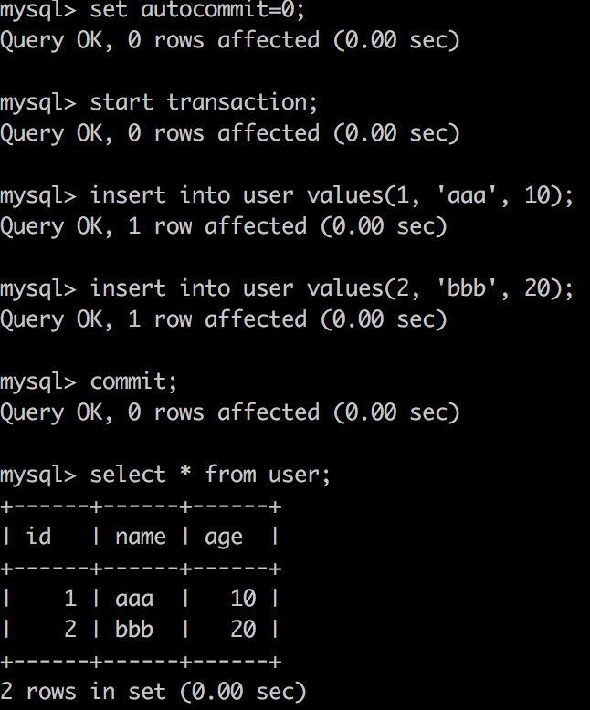
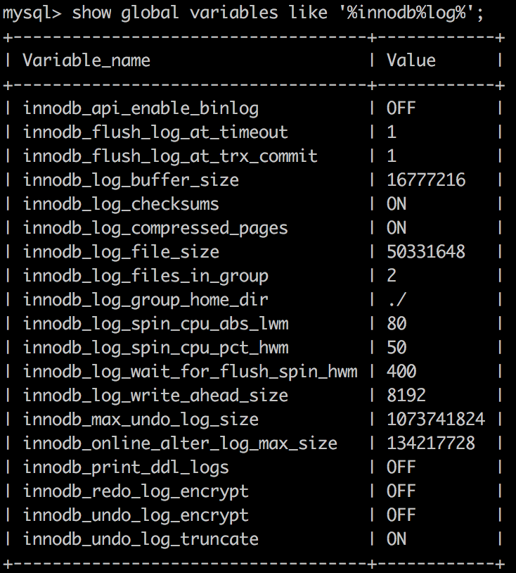

## MySQL 中怎么实现事务
### MySQL 中事务相关的语句
#### autocommit
autocommit 设置事务是否自动提交(MySQL 默认为自动提交)
```sql
## 查看事务是否自动提交
show global variables like 'autocommit%';
show session variables like 'autocommit%';
## 设置是否自动开启事务提交
set autocommit = 0; -- 手动提交
set autocommit = 1; --自动提交
```
#### start transaction 或 begin
开始一个事务，需要注意虽然 start transaction 和 begin 都表示开启事务，但是在存储过程中将 begin 识别为和 end 搭配使用，所以存储过程中只能使用 start transaction;
#### commit 或 commit work
提交一个事务，从 begin/start transaction 到 commit 之间的 sql 语句都会被执行
#### rollback 或者 rollback work
表示回滚事务，将会撤销所有未提交的修改并结束当前事务
#### savepoint 标识符
savepoint XX，表示创建一个事务的保存点 XX，以便回滚到当前保存点，而不是回滚整个事务
#### rollback to 标识符
rollback to XX，把事务回滚到标记点，而不回滚在此标记点之前的任何工作。需要和 SAVEPOINT 命令一起使用，例如可以发出两条 UPDATE 语句，后面跟一个 SAVEPOINT，然后又是两条 DELETE 语句。如果执行 DELETE 语句期间出现了某种异常情况，而且你捕获到这个异常，并发出 ROLLBACK TO SAVEPOINT 命令，事务就会回滚到指定的 SAVEPOINT，撤销 DELETE 完成的所有工作，而 UPDATE 语句完成的工作不受影响
#### release savepoint 标识符
release savepoint XX，表示删除事务保存点 XX
### 实例
使用的表 sql 如下：
```sql
CREATE TABLE `user` (
  `id` int(11) NOT NULL AUTO_INCREMENT,
  `name` varchar(12) DEFAULT '',
  `age` int(11) DEFAULT '0',
  PRIMARY KEY (`id`)
) ENGINE=InnoDB AUTO_INCREMENT=1 DEFAULT CHARSET=utf8mb4 COLLATE=utf8mb4_0900_ai_ci
```
#### 正常事务提交

开启了一个事务，然后向 user 表插入了 2 条数据，提交，数据持久化到表中；
#### 回滚

开启了一个新的事务，删除了插入的 2 条数据，然后 rollback 了，最终数据仍然在表中；
#### 回滚到保存点

1. 删除了 id 为 1 的记录，创建了保存点 delete1
2. 插入了 id 为 3 的记录，创建了保存点 insert1
3. 删除了 id 为 2 的记录
回滚到保存点 delete1，步骤 2、3 中的操作回滚，delete1 之前的操作保留

## MySQL 事务实现原理
在 MySQL 中，InnoDB 存储引擎是支持事务的，一个事务必须满足 4 大特性：
原子性：整个事务的所有操作要么全部成功，要么全部失败，在 MySQL 中通过 redo log 日志实现
一致性：数据库总是从一个一执行状态变为另一个一致性状态，在 MySQL 中通过 undo log 实现
隔离型：一个事务在提交之前所做出的操作是否能为其他事务可见，有不同的隔离级别，在 MySQL 中通过锁及 MVCC 来实现
持久性：事务一旦提交，事务所做的修改会被永久保存，即使数据库崩溃，修改的数据也不会丢失，在 MySQL 中通过 redo log 日志实现

### MySQL 事务日志参数
```sql
show global variables like '%innodb%log%';
```

**innodb_log_file_size**：表示每个 redo log file 文件的大小，单位为 byte
**innodb_log_files_in_group**：表示每个 redo log group 中有几个 redo log file
**innodb_log_group_home_dir**：表示 redo log group 的文件所在路径，默认./ 表示在数据库的数据目录下（默认情况下，对应的物理文件位于数据库的 data 目录下的 ib_logfile1&ib_logfile2）
**Innodb_flush_log_at_trx_commit**：表示当事务提交之后是否立即将 redo log 从 log buffer 刷新到 redo log file 中，此配置可以配置 3 个值
默认值为 1，表示事务提交时必须将 redo log 从 log buffer 中写入到 redo log file 中（事务提交 -> redo log buffer -> os buffer -> log file）
如果值设置为 0，事务提交时并不会将 redo log 从 redo log buffer 刷新到 redo log file 中，但是会每秒钟自动将 redo log 从 redo log buffer 刷新到 redo log file 中，可以理解为当事务提交时，redo log 存在于 redo log buffer，每秒钟 redo log 从 redo log buffer 中经过 os buffer 刷新到 redo log file 中一次，这种情况下，如果数据库崩溃，最多丢失 1s 的 redo log。
如果值设置为 2，表示在事务提交时，只会将 redo log 写入到系统缓存（os buffer）中，但是不会立即写入到 redo log file 中，而是每秒中从 os buffer 中刷新到 redo log file 中，可以理解为当日志提交时，redo log 存在于 redo log buffer 和 os buffer 中，每秒钟 redo log 从 os buffer 中刷新到 redo log file 中 1 次，这种情况下，如果只是数据库宕机，操作系统未宕机，数据不会丢失，如果此时操作习题哦那个宕机，重启数据库后会丢失还未从 os buffer 中刷新到 redo log file 中的事务操作；

### redo log
MySQL 会将事务中的 sql 语句涉及的所有数据操作先记录到 redo log 中，然后再将操作从 redo log 同步到相应数据文件中，即在事务提交成功，修改数据文件中的记录之前，要保证对应的所有修改操作都已经记录到了 redo log 中，所以，即使数据文件中的数据被修改到一半时被打断，也能依靠 redo log 中的日志将剩余部分的操作再次同步到相应的数据文件中。redo log 是物理日志，记录的是数据库对页的操作，而不是逻辑上的增删改查，具有幂等性。
使用 redo log，能够确保持久性和原子性，即事务中的所有 sql 被当成一个执行单元。
redo log 由 2 部分组成：redo log buffer(重做日志缓冲)和 redo log file(重做日志文件)，redo log buffer 存于内存之中，redo log file 永久存储于磁盘。
事务操作执行：
1. 事务修改操作记录到 redo log buffer
2. 事务修改操作记录到 redo log file
3. 事务修改操作更新到数据库数据文件中
步骤 1 的速度很快，但是因为内存中的数据是易失的，无法满足持久性的要求，为了满足持久性，需要进行第 2 步，将 redo log buffer 中的日志写入到 redo log file 中，相当于从内存中同步到磁盘上，再执行第 3 步操作将日志记录的操作同步到数据文件中；

### undo log
undo log 理解为数据被修改前的备份，如果事务进行了一半，有 1 条 sql 没有执行成功，数据库可以依据 undo log 进行撤销，undo 并不能将数据库物理地恢复到执行语句或者事务之前的样子，它是逻辑日志，当回滚日志被使用时，它只会按照日志逻辑地将数据库中的修改撤销掉，可以理解为，我们在事务中使用的每一条 INSERT 都对应了一条 DELETE，每一条 UPDATE 也都对应一条相反的 UPDATE 语句，MySQL 使用 redo log 实现事务的持久性。

### log group
Log  group 为重做日志组，其中有多个重做日志文件（redo log file）,当日志组中的第 1 个 logfile 被写满，会写下一个重做日志文件，当日志组中所有 redo log file 被写满，将 redo log 覆盖写入第一个 redo log file.。