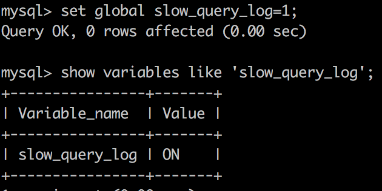
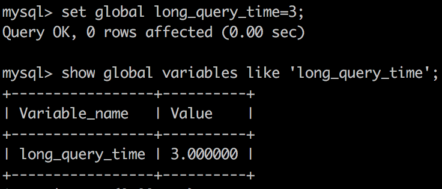

## 引言
对查询进行优化，应尽量避免全表扫描，首先应考虑在 where 及 order by 涉及的列上建立索引；

## 索引优化 Tips

+ 尽量避免在 where 子句中对字段进行 null 值判断，否则将导致引擎放弃使用索引而进行全表扫描；
  ``select id from t where num is null;``
  可以在 num 上设置默认值 0，确保表中 num 列没有 null 值，然后这样查询：
  ``select id from t where num = 0;``
+ 应尽量避免在 where 子句中使用 `!=` 或 `<>` 操作符，否则将引擎放弃使用索引而进行全表扫描；
+ 应尽量避免在 where 子句中使用 or 来连接条件，否则将导致引擎放弃使用索引而进行全表扫描；
  ``select id from t where num = 10 or num = 20;``
  可以这样查询：
  ``select id from t where num = 10 union all select id from t where num = 20;``
+ in 和 not in 也要慎用，否则会导致全表扫描，如：
  ``select id from t where num in(1, 2, 3);``
+ 对于连续的数值，能用 between 就不要用 in 了：
  ``select id from t where num between 1 and 3;``
  下面的查询也将导致全表扫描：
  ``select id from t where name like '%c%';``
  若要提高效率，可以考虑全文检索。
+ 在 where 子句中使用参数，也会导致全表扫描。因为 SQL 只有在运行时才会解析局部变量，但优化程序不能将访问计划的选择推迟到运行时，它必须在编译时进行选择。
  然而，如果在编译时建立访问计划，变量的值还是未知的，因而无法作为索引选择的输入项。
  如下面语句将进行全表扫描：
  ``select id from t where num = @num;``
  可以改为强制查询使用索引：
  ``select id from t with(index(索引名)) where num = @num;``
+ 尽量避免在 where 子句中对字段进行表达式操作，这将导致引擎放弃使用索引而进行全表扫描；
  ``select id from t where num / 2 = 100;``
  可以这样查询：
  ``select id from t where num = 100 * 2;``
+ 尽量避免在 where 子句中对字段进行函数操作，这将导致引擎放弃使用索引而进行全表扫描；
  如：
  ``select id from t where substring(name, 1, 3) = 'abc';``
  应改为：
  ``select id from t where name like 'abc%';``
+ 不要在 where 子句中的 “=” 左边进行函数、算术运算或其他表达式运算，否则系统将可能无法正确使用索引；
  在使用索引字段作为条件时，如果该索引是复合索引，那么必须使用到该索引中的第一个字段作为条件时才能保证系统使用该索引，否则该索引将不会被使用，并且应尽可能的让字段顺序与索引顺序相一致；
+ 不要写一些没有意义的查询，如需要生成一个空表结构：
  ``select col1, col2 into #t from t where 1 = 0;``
  这类代码不会返回任何结果集，但是会消耗系统资源的，应改成这样：
  ``create table #t(...);``
+ 很多时候用 exists 代替 in 是一个好的选择：
  ``select num from a where num in (select num from b);``
  用下面的语句替换：
  ``select num from a where exists (select 1 from b where num = a.num);``
+ 不是所有索引对查询都有效，SQL 是根据表中数据来进行查询优化的，当索引列有大量数据重复时，SQL 查询可能不会去利用索引，
  如一表中有字段 *, male、female 几乎各一半，那么即使在*上建了索引也对查询效率起不了作用；
+ 索引并不是越多越好，索引固然可以提高相应的 select 的效率，但同时也降低了 insert 及 update 的效率，因为 insert 或 update 时有可能会重建索引，
  所以怎样建索引需要慎重考虑，视具体情况而定。一个表的索引数最好不要超过 6 个，若太多则应考虑一些不常使用到的列上建的索引是否有必要；
+ 尽可能的避免更新 clustered 索引数据列，因为 clustered 索引数据列的顺序就是表记录的物理存储顺序，一旦该列值改变将导致整个表记录的顺序的调整，会耗费相当大的资源。
  若应用系统需要频繁更新 clustered 索引数据列，那么需要考虑是否应将该索引建为 clustered 索引；
+ 尽量使用数字型字段，若只含数值信息的字段尽量不要设计为字符型，这会降低查询和连接的性能，并会增加存储开销。
  这是因为引擎在处理查询和连接时会逐个比较字符串中每一个字符，而对于数字型而言只需要比较一次就够了；
+ 尽可能的使用 varchar/nvarchar 代替 char/nchar，因为首先变长字段存储空间小，可以节省存储空间，其次对于查询来说，在一个相对较小的字段内搜索效率显然要高些；
+ 任何地方都不要使用 select * from t，用具体的字段列表代替 “*”，不要返回用不到的任何字段；
+ 尽量使用表变量来代替临时表。如果表变量包含大量数据，请注意索引非常有限(只有主键索引)；
+ 避免频繁创建和删除临时表，以减少系统表资源的消耗；
+ 临时表并不是不可使用，适当地使用它们可以使某些例程更有效，例如，当需要重复引用大型表或常用表中的某个数据集时。但是，对于一次性事件，最好使用导出表；
+ 在新建临时表时，如果一次性插入数据量很大，那么可以使用 select into 代替 create table,避免造成大量 log,以提高速度;如果数据量不大，为了缓和系统表的资源，应先 create table， 然后 insert；
+ 如果使用到了临时表，在存储过程的最后务必将所有的临时表显式删除，先 truncate table，然后 drop table，这样可以避免系统表的较长时间锁定；
+ 尽量避免使用游标，因为游标的效率较差，如果游标操作的数据超过 1 万行，那么就应该考虑改写；
+ 使用基于游标的方法或临时表方法之前，应先寻找基于集的解决方案来解决问题，基于集的方法通常更有效；
+ 与临时表一样，游标并不是不可使用。对小型数据集使用 FAST_FORWARD 游标通常要优于其他逐行处理方法，尤其是在必须引用几个表才能获得所需的数据时。
  在结果集中包括“合计”的例程通常要比使用游标执行的速度快。如果开发时间允许，基于游标的方法和基于集的方法都可以尝试一下，看哪一种方法的效果更好；
+ 在所有的存储过程和触发器的开始处设置 SET NO COUNTON,在结束时设置 SET NO COUNT OFF。无需在执行存储过程和触发器的每个语句后向客户端发送 DONE_IN_PROC 消息。
+ 尽量避免大事务操作，提高系统并发能力。
  sql 优化方法使用索引来更快地遍历表，缺省情况下建立的索引是非群集索引，但有时它并不是最佳的。
  在非群集索引下，数据在物理上随机存放在数据页上。
  合理的索引设计要建立在对各种查询的分析和预测上。
  一般来说：
  a.有大量重复值、且经常有范围查询 (`>`, `<`, `>=`, `<=`) 和 orderby、groupby 发生的列，可考虑建立集群索引；
  b.经常同时存取多列，且每列都含有重复值可考虑建立组合索引；
  c.组合索引要尽量使关键查询形成索引覆盖，其前导列一定是使用最频繁的列。索引虽有助于提高性能但不是索引越多越好，恰好相反过多的索引会导致系统低效。用户在表中每加进一个索引，维护索引集合就要做相应的更新工作；

## 表优化 Tips
+ 定期分析表和检查表：
  分析表的语法: ANALYZE [LOCAL | NO_WRITE_TO_BINLOG] TABLE tab1name [,tab1name]...
  以上语句用于分析和存储表的关键字分布，分析的结果将可以使得系统得到准确的统计信息，使得 SQL 能够生成正确的执行计划。如果用户感觉实际执行计划并不是预期的执行计划，执行一次分析表可能会解决问题。
  在分析期间，使用一个读取锁定对表进行锁定。这对于 MyISAM，DBD 和 InnoDB 表有作用。
  例如分析一个数据表:ayalyze table table_name
  检查表的语法:CHECK TABLE tab1name [,tab1name]...[option]...option = \{QUICK | FAST | MEDIUM | EXTENDED | CHANGED \}
  检查表的作用是检查一个或多个表是否有错误，CHECK TABLE 对 MyISAM 和 InnoDB 表有作用，对于 MyISAM 表，关键字统计数据被更新
  CHECK TABLE 也可以检查视图是否有错误，比如在视图定义中被引用的表不存在。
+ 定期优化表：
  优化表的语法: OPTIMIZE [LOCAL | NO_WRITE_TO_BINLOG] TABLE tab1name [,tab1name]...
  如果删除了表的一大部分，或者如果已经对含有可变长度行的表(含有 VARCHAR、BLOB 或 TEXT 列的表进行更多更改，则应使用 OPTIMIZETABLE 命令来进行表优化。
  这个命令可以将表中的空间碎片进行合并，并且可以消除由于删除或者更新造成的空间浪费，但 OPTIMIZETABLE 命令只对 MyISAM、BDB 和 InnoDB 表起作用。
  例如 optimize table table_name;
  注意：analyze、check、optimize 执行期间将对表进行锁定，因此一定注意要在 MySQL 数据库不繁忙的时候执行相关的操作。

## 补充
  1、在海量查询时尽量少用格式转换；
  2、ORDER BY 和 GROPU BY：使用 ORDER BY 和 GROUP BY 短语，任何一种索引都有助于 SELECT 的性能提高；
  3、任何对列的操作都将导致表扫描，它包括数据库教程函数、计算表达式等等，查询时要尽可能将操作移至等号右边；
  4、IN、OR 子句常会使用工作表，使索引失效。如果不产生大量重复值，可以考虑把子句拆开。拆开的子句中应该包含索引；
  5、只要能满足需求，应尽可能使用更小的数据类型：例如使用 MEDIUM INT 代替 INT；
  6、尽量把所有的列设置为 NOT NULL，如果要保存 NULL，手动去设置它，而不是把它设为默认值；
  7、尽量少用 VARCHAR、TEXT、BLOB 类型；
  8、如果数据只有少量的几个，最好使用 ENUM 类型；
  9、正如 graymice 所讲的那样，建立索引；
  10、合理用运分表与分区表提高数据存放和提取速度；

## ex 分析 sql 执行计划

ex 命令在解决数据库性能上是非常有效的命令，大部分的性能问题可以通过此命令来简单的解决，ex 可以用来查看 SQL 语句的执行效果，可以帮助选择更好的索引和优化查询语句，写出更好的优化语句。

ex 语法：ex select …… from … [where ……]

例如：ex select id, name from user;

输出：

下面对各个属性进行了解：

1. id：这是 SELECT 的查询序列号，id 越大，优先级越高，越先执行
2. select_type：select_type 就是 select 的类型，可以有以下几种：
    + SIMPLE：简单 SELECT(不使用 UNION 或子查询等)
    + PRIMARY：查询中若包含任何复杂的子查询，则最外层被标记为 primary
    + UNION：若第二个 select 出现在 union 之后，则被标记为 union；若 union 包含在 from 子句的子查询中，外层 select 将被标记为：derived
    + DEPENDENT UNION：UNION 中的第二个或后面的 SELECT 语句，取决于外面的查询
    + UNION RESULT：两种 union 结果的合并
    + SUBQUERY：在 select 或 where 列表包含了子查询
    + DEPENDENT SUBQUERY：子查询中的第一个 SELECT，取决于外面的查询
    + DERIVED：在 from 列表中包含的子查询被标记为 derived（衍生），MySQL 会递归执行这些子查询，把结果放在临时表
3. table：显示这一行的数据是关于哪张表的
4. partitions：匹配到的分区
5. type：显示了使用了哪种类别，有无使用索引，是使用 Ex 命令分析性能瓶颈的关键项之一
    + system：表仅有一行(=系统表)，这是 const 联接类型的一个特例。
    + const：表示通过索引一次就找到了，const 用于比较 primary key 或者 unique 索引。如将主键置于 where 列表中，MySQL 就能将该查询转换为一个常量
    + eq_ref：唯一性索引扫描，对于每个索引键，表中只有一条记录与之匹配。常见于 PRIMARY KEY 或 UNIQUE 索引扫描
    + ref：对于每个来自于前面的表的行组合，所有有匹配索引值的行将从这张表中读取。如果联接只使用键的最左边的前缀，或如果键不是 UNIQUE 或 PRIMARY KEY(换句话说，如果联接不能基于关键字选择单个行的话)，则使用 ref。如果使用的键仅仅匹配少量行，该联接类型是不错的。ref 可以用于使用`=`或`<=>`操作符的带索引的列。
    + ref_or_null：该联接类型如同 ref，但是添加了 MySQL 可以专门搜索包含 NULL 值的行。在解决子查询中经常使用该联接类型的优化。
    + index_merge：该联接类型表示使用了索引合并优化方法。在这种情况下，key 列包含了使用的索引的清单，key_len 包含了使用的索引的最长的关键元素。
    + unique_subquery：该类型替换了下面形式的 IN 子查询的 ref：value IN (SELECT primary_key FROMsingle_table WHERE some_expr);unique_subquery 是一个索引查找函数，可以完全替换子查询，效率更高。
    + index_subquery：该联接类型类似于 unique_subquery。可以替换 IN 子查询，但只适合下列形式的子查询中的非唯一索引：value IN (SELECT key_column FROM single_table WHERE some_expr)
    + range：只检索给定范围的行，使用一个索引来选择行。key 列显示使用了哪个索引。key_len 包含所使用索引的最长关键元素。在该类型中 ref 列为 NULL。当使用`=`、`<>`、`>`、`>=`、`<`、`<=`、IS NULL、`<=>`、BETWEEN 或者 IN 操作符，用常量比较关键字列时，可以使用 range
    + index：该联接类型与 ALL 相同，除了只有索引树被扫描。这通常比 ALL 快，因为索引文件通常比数据文件小。
    + all：对于每个来自于先前的表的行组合，进行完整的表扫描。如果表是第一个没标记 const 的表，这通常不好，并且通常在它情况下很差。通常可以增加更多的索引而不要使用 ALL，使得行能基于前面的表中的常数值或列值被检索出。
> 结果值从好到坏依次是：
> system > const > eq_ref > ref > fulltext > ref_or_null > index_merge > unique_subquery > index_subquery > range > index > ALL
> 一般来说，得保证查询至少达到 range 级别，最好能达到 ref，否则就可能会出现性能问题。
5. possible_keys：possible_keys 列指出 MySQL 能使用哪个索引在该表中找到行。注意，该列完全独立于 EX 输出所示的表的次序。这意味着在 possible_keys 中的某些键实际上不能按生成的表次序使用
6. key：key 列显示 MySQL 实际决定使用的键(索引)。如果没有选择索引，键是 NULL。要想强制 MySQL 使用或忽视 possible_keys 列中的索引，在查询中使用 FORCE INDEX、USE INDEX 或者 IGNORE INDEX
7. key_len：显示 MySQL 决定使用的键长度。如果键是 NULL，则长度为 NULL。使用的索引的长度。在不损失精确性的情况下，长度越短越好
8. ref：显示使用哪个列或常数与 key 一起从表中选择行。
9. rows：显示 MySQL 认为它执行查询时必须检查的行数。
10. filtered：表示此查询条件所过滤的数据的百分比
11. Extra：该列包含 MySQL 解决查询的详细信息。
    + Distinct：MySQL 发现第 1 个匹配行后，停止为当前的行组合搜索更多的行。
    + Not exists：MySQL 能够对查询进行 LEFT JOIN 优化，发现 1 个匹配 LEFT JOIN 标准的行后，不再为前面的的行组合在该表内检查更多的行。
    + range checked for each record (index map: #)：MySQL 没有发现好的可以使用的索引，但发现如果来自前面的表的列值已知，可能部分索引可以使用。对前面的表的每个行组合，MySQL 检查是否可以使用 range 或 index_merge 访问方法来索取行。
    + Using filesort：MySQL 需要额外的一次传递，以找出如何按排序顺序检索行。通过根据联接类型浏览所有行并为所有匹配 WHERE 子句的行保存排序关键字和行的指针来完成排序。然后关键字被排序，并按排序顺序检索行。
    + Using index：从只使用索引树中的信息而不需要进一步搜索读取实际的行来检索表中的列信息。当查询只使用作为单一索引一部分的列时，可以使用该策略。
    + Using temporary：为了解决查询，MySQL 需要创建一个临时表来容纳结果。典型情况如查询包含可以按不同情况列出列的 GROUP BY 和 ORDER BY 子句时。
    + Using where：WHERE 子句用于限制哪一个行匹配下一个表或发送到客户。除非你专门从表中索取或检查所有行，如果 Extra 值不为 Using where 并且表联接类型为 ALL 或 index，查询可能会有一些错误。
    + Using sort_union(...), Using union(...), Using intersect(...)：这些函数说明如何为 index_merge 联接类型合并索引扫描。
    + Using index for group-by：类似于访问表的 Using index 方式，Using index for group-by 表示 MySQL 发现了一个索引，可以用来查询 GROUP BY 或 DISTINCT 查询的所有列，而不要额外搜索硬盘访问实际的表。并且，按最有效的方式使用索引，以便对于每个组，只读取少量索引条目。

## 慢查询分析
### 慢查询日志开关
+ 查看开关状态

```sql
show variables like 'slow_query_log';
```


+ 开启慢查询

```sql
set global slow_query_log=1;
#此命令只对当前数据库有效，如果MySQL重启后，则会失效，如果要想一直有效，则要配置my.cnf文件，配置如下：
#修改my.cnf文件，[MySQLd]下增加或修改参数slow_query_log和slow_query_log_file后，然后重启MySQL服务器。
#即将如下两行配置进my.cnf文件([MySQLd]下配置)：
slow_query_log = 1;
slow_query_log_file = /usr/local/MySQL/data/slow.log;
long_query_time = 3;
```



### 慢查询时间阀值

设置超过多少秒的查询为慢查询

+ 查看慢查询时间阀值

```sql
show variables like 'slow_query_log'
```


+ 设置时间阀值

```sql
set global long_query_time=3;
```


### 慢查询日志文件

```sql
# 查看慢查询日志文件
show global variables like 'slow_query_log_file'
# 设置慢查询日志文件
set global slow_query_log_file='/usr/local/MySQL/data/slow.log'
```

### 查看多少条 SQL 语句超过了阙值

```sql
show global status like 'Slow_queries';
```


### 日志分析工具 MySQLdumpslow

示例：

```sql
# 得到返回记录集最多的10个sql
MySQLdumpslow -s r -t 10 slow.log	

# 得到访问次数最多的10个sql
MySQLdumpslow -s c -t 10 slow.log

# 得到按照时间排序的前10条里面含有左连接的查询语句
MySQLdumpslow -s t -t 10 -g "left join" slow.log
```

## show profile
Show profile 查询 SQL 语句在服务器中的执行细节和生命周期
Show Profile 是 MySQL 提供可以用来分析当前会话中语句执行的资源消耗情况，可以用于 SQL 的调优测量
默认关闭，并保存最近 15 次的运行结果
分析步骤
1. 查看状态：SHOW VARIABLES LIKE 'profiling';
2. 开启：set profiling=on;
3. 查看结果：show profiles;
4. 诊断 SQL：show profile cpu,block io for query 上一步 SQL 数字号码;
    + ALL：显示所有开销信息
    + BLOCK IO：显示 IO 相关开销
    + CONTEXT SWITCHES：显示上下文切换相关开销
    + CPU：显示 CPU 相关开销
    + IPC：显示发送接收相关开销
    + MEMORY：显示内存相关开销
    + PAGE FAULTS：显示页面错误相关开销
    + SOURCE：显示和 Source_function，Source_file，Source_line 相关开销
    + SWAPS：显示交换次数相关开销
   注意（遇到这几种情况要优化）
    + converting HEAP to MyISAM： 查询结果太大，内存不够用往磁盘上搬
    + Creating tmp table：创建临时表
    + Copying to tmp table on disk：把内存中的临时表复制到磁盘
    + locked