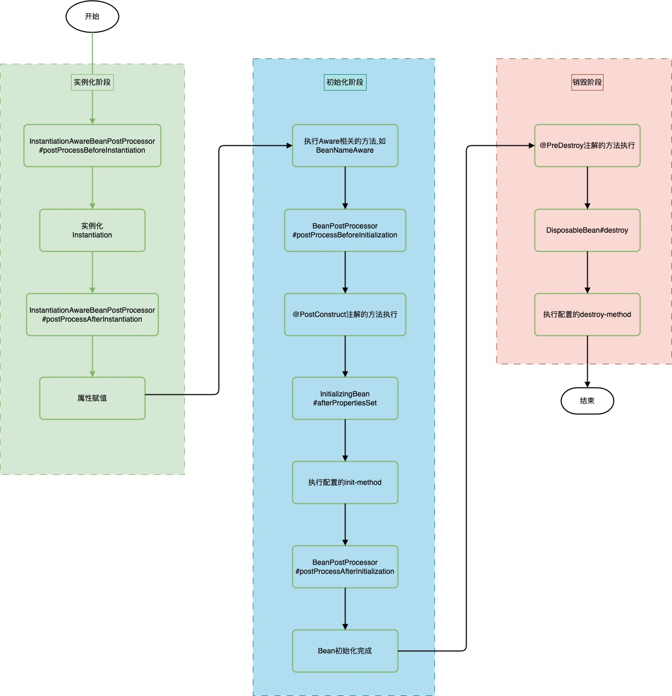

## 1.背景

本文旨在分析 Bean 生命周期的整体流程，Bean 就是一些 Java 对象，只不过这些 Bean 不是我们主动 new 出来的，而是交个 Spring IOC 容器创建并管理的，因此 Bean 的生命周期受 Spring IOC 容器控制，Bean 生命周期大致分为以下几个阶段：

1. Bean 的实例化(Instantiation) :

   Spring 框架会取出 BeanDefinition 的信息进行判断当前 Bean 的范围是否是 singleton 的，是否不是延迟加载的，是否不是 FactoryBean 等，最终将一个普通的 singleton 的 Bean 通过反射进行实例化

2. Bean 的属性赋值(Populate) :
	Bean 实例化之后还仅仅是个"半成品"，还需要对 Bean 实例的属性进行填充，Bean 的属性赋值就是指 Spring 容器根据 BeanDefinition 中属性配置的属性值注入到 Bean 对象中的过程。

3. Bean 的初始化(Initialization) :
对 Bean 实例的属性进行填充完之后还需要执行一些 Aware 接口方法、执行 BeanPostProcessor 方法、执行 InitializingBean 接口的初始化方法、执行自定义初始化 init 方法等。该阶段是 Spring 最具技术含量和复杂度的阶段，并且 Spring 高频面试题 Bean 的循环引用问题也是在这个阶段体现的；
4. Bean 的使用阶段:
经过初始化阶段，Bean 就成为了一个完整的 Spring Bean，被存储到单例池 singletonObjects 中去了，即完成了 Spring Bean 的整个生命周期，接下来 Bean 就可以被随心所欲地使用了。
5. Bean 的销毁(Destruction) ：
Bean 的销毁是指 Spring 容器在关闭时，执行一些清理操作的过程。在 Spring 容器中， Bean 的销毁方式有两种：销毁方法 destroy-method 和 DisposableBean 接口。


## 2. 生命周期接口方法分类

Bean 的完整生命周期经历了各种方法调用，这些方法可以划分为以下几类：

1. Bean 自身的方法:
包括了 Bean 本身调用的方法和通过配置文件中`<bean>`的 init-method 和 destroy-method 指定的方法
2. Bean 级生命周期接口方法:
包括了 BeanNameAware、BeanFactoryAware、InitializingBean 和 DiposableBean 这些接口的方法
3. 容器级生命周期接口方法:
包括了 InstantiationAwareBeanPostProcessor 和 BeanPostProcessor 这两个接口实现，一般称它们的实现类为“后处理器”。
4. 工厂后处理器接口方法:
包括了 AspectJWeavingEnabler, ConfigurationClassPostProcessor, CustomAutowireConfigurer 等等非常有用的工厂后处理器　　接口的方法。工厂后处理器也是容器级的。在应用上下文装配配置文件之后立即调用。


## 3. Bean 生命周期




## 4. 代码验证

### 4.1 引入依赖

```xml
<dependency>
    <groupId>org.springframework</groupId>
    <artifactId>spring-beans</artifactId>
    <version>5.3.20</version>
</dependency>
<dependency>
    <groupId>org.springframework</groupId>
    <artifactId>spring-context</artifactId>
    <version>5.3.20</version>
</dependency>
```

### 4.2 Bean 定义

```java
package com.example.bean.lifecycle;

import org.springframework.beans.BeansException;
import org.springframework.beans.factory.BeanNameAware;
import org.springframework.beans.factory.DisposableBean;
import org.springframework.beans.factory.InitializingBean;
import org.springframework.context.ApplicationContext;
import org.springframework.context.ApplicationContextAware;

import javax.annotation.PostConstruct;
import javax.annotation.PreDestroy;

public class Person implements BeanNameAware, ApplicationContextAware, InitializingBean, DisposableBean {
    private String name;

    public Person() {
        System.out.println("[构造器]调用Person的构造器实例化");
    }

    public String getName() {
        return name;
    }

    public void setName(String name) {
        System.out.println("[注入属性]注入属性name");
        this.name = name;
    }

    @Override
    public void setBeanName(String name) {
        System.out.println("[BeanNameAware接口]调用BeanNameAware#setBeanName");
    }

    @Override
    public void setApplicationContext(ApplicationContext applicationContext) throws BeansException {
        System.out.println("[ApplicationContextAware]调用ApplicationContextAware#setApplicationContext");
    }

    @Override
    public void afterPropertiesSet() throws Exception {
        System.out.println("[InitializingBean接口]调用InitializingBean#afterPropertiesSet");
    }

    @Override
    public void destroy() throws Exception {
        System.out.println("[DisposableBean接口]调用DisposableBean#destroy");
    }

    @PostConstruct
    public void postConstruct() {
        System.out.println("[PostConstruct接口]调用PostConstruct注解的方法");
    }

    @PreDestroy
    public void preDestroy() {
        System.out.println("[PreDestroy接口]调用了PreDestroy注解的方法");
    }

    public void selfInit() {
        System.out.println("[init-method]调用<bean>的init-method属性指定的初始化方法");
    }

    public void selfDestroy() {
        System.out.println("[destroy-method]调用<bean>的destroy-method属性指定的销毁方法");
    }
}

```

### 4.3 InstantiationAwareBeanPostProcessor 定义

```java
package com.example.bean.lifecycle;


import org.springframework.beans.BeansException;
import org.springframework.beans.factory.config.InstantiationAwareBeanPostProcessor;
import org.springframework.stereotype.Component;

@Component
public class MyInstantiationAwareBeanPostProcessor implements InstantiationAwareBeanPostProcessor {
    @Override
    public Object postProcessBeforeInstantiation(Class<?> BeanClass, String BeanName) throws BeansException {
        System.out.println("[InstantiationAwareBeanPostProcessor接口]调用InstantiationAwareBeanPostProcessor前置方法, BeanName:" + BeanName);
        return null;
    }

    @Override
    public boolean postProcessAfterInstantiation(Object Bean, String BeanName) throws BeansException {
        System.out.println("[InstantiationAwareBeanPostProcessor接口]调用InstantiationAwareBeanPostProcessor后置方法, BeanName:" + BeanName);
        return false;
    }
}


```


### 4.4 BeanPostProcessor 定义

```java
package com.example.bean.lifecycle;

import org.springframework.beans.BeansException;
import org.springframework.beans.factory.config.BeanPostProcessor;
import org.springframework.stereotype.Component;

@Component
public class MyBeanPostProcessor implements BeanPostProcessor {
    @Override
    public Object postProcessBeforeInitialization(Object bean, String beanName) throws BeansException {
        System.out.println("[BeanPostProcessor接口]调用了BeanPostProcessor的前置处理方法");
        return bean;
    }

    @Override
    public Object postProcessAfterInitialization(Object bean, String beanName) throws BeansException {
        System.out.println("[BeanPostProcessor接口]调用了BeanPostProcessor的后置处理方法");
        return bean;
    }
}

```

### 4.5 测试入口

```plain
package com.example.bean.lifecycle;

import org.springframework.context.annotation.AnnotationConfigApplicationContext;
import org.springframework.context.annotation.Bean;
import org.springframework.context.annotation.ComponentScan;
import org.springframework.context.annotation.Configuration;

@ComponentScan(basePackages = {"com.example.bean"})
@Configuration
public class AppConfig {
    @Bean(initMethod = "selfInit", destroyMethod = "selfDestroy")
    public Person person() {
        Person person = new Person();
        person.setName("tester");
        return person;
    }

    public static void main(String[] args) {
        AnnotationConfigApplicationContext context = new AnnotationConfigApplicationContext(AppConfig.class);
        context.close();
    }
}

```


### 4.6 执行结果

```bash
[InstantiationAwareBeanPostProcessor接口]调用InstantiationAwareBeanPostProcessor前置方法, BeanName:person
[构造器]调用Person的构造器实例化
[注入属性]注入属性name
[InstantiationAwareBeanPostProcessor接口]调用InstantiationAwareBeanPostProcessor后置方法, BeanName:person

[BeanNameAware接口]调用BeanNameAware#setBeanName
[ApplicationContextAware]调用ApplicationContextAware#setApplicationContext
[BeanPostProcessor接口]调用了BeanPostProcessor的前置处理方法
[PostConstruct接口]调用PostConstruct注解的方法
[InitializingBean接口]调用InitializingBean#afterPropertiesSet
[init-method]调用`<bean>`的init-method属性指定的初始化方法
[BeanPostProcessor接口]调用了BeanPostProcessor的后置处理方法

[PreDestroy接口]调用了PreDestroy注解的方法
[DisposableBean接口]调用DisposableBean#destroy
[destroy-method]调用`<bean>`的destroy-method属性指定的销毁方法
```

控制台打印结果验证了 person 对象的生命周期相关方法执行顺序严格遵从上面流程图，同时当我们执行容器`applicationContext`的关闭方法`close()`会触发调用 bean 的销毁回调方法


## 5.LifeCycle

### 5.1 Lifecycle

#### 5.1.1 为什么要用 Lifecycle
在 SpringBoot 的应用中，我们通常会利用@PostConstruct 和@PreDestroy 注解，在 Bean 初始化或销毁时执行一些操作，这些操作都处于 Bean 声明周期的层面。

然而，在某些情况下，我们可能会遇到一些遗漏的场景，比如希望在容器本身的生命周期事件（如容器启动、停止）上执行一些操作，一个典型的例子就是在 Spring Boot 中启动内嵌的 Web 容器。这时候，该如何处理呢？

这就需要利用 Spring 提供的另一个接口 `Lifecycle`。

`Lifecycle`接口它允许在所有 Bean 创建完成之后执行自定义的一些任务并运行，并在退出时执行资源销毁流程。

+ 这里是所有 Bean 创建完成之后执行，并不像我们常会用到的`@PostConstruct`和`@PreDestroy`两个注解，它们是在 Bean 初始化或销毁时执行一些操作，这些操作属于 Bean 生命周期级别；

+ `Lifecycle`接口解决的是另外一些场景，比如我们想在[容器](https://cloud.tencent.com/product/tke?from_column=20065&from=20065)本身的生命周期（比如容器启动、停止）的事件上做一些工作

#### 5.1.2 接口方法

```java
public interface Lifecycle {
    /**
     * 容器启动后调用
     **/
    void start();

    /**
     * 容器停止时调用
     **/
    void stop();

    /**
     * 检查此组件是否正在运行
     **/
    boolean isRunning();
}
```

当`ApplicationContext`接收到`start`、`stop`和`restart`等信号时，会调用实现了`Lifecycle`接口的 Bean 的相应方法。通过实现`Lifecycle`接口，我们可以获得对容器生命周期的回调，从而实现业务扩展。


#### 5.1.3 代码示例

```java
package com.example.bean.lifecycle;

import org.springframework.beans.BeansException;
import org.springframework.beans.factory.BeanNameAware;
import org.springframework.beans.factory.DisposableBean;
import org.springframework.beans.factory.InitializingBean;
import org.springframework.context.ApplicationContext;
import org.springframework.context.ApplicationContextAware;
import org.springframework.context.Lifecycle;
import org.springframework.context.SmartLifecycle;

import javax.annotation.PostConstruct;
import javax.annotation.PreDestroy;


public class Person implements BeanNameAware, ApplicationContextAware, InitializingBean, DisposableBean, Lifecycle {
    private String name;

    private volatile boolean running = false;

    public Person() {
        System.out.println("[构造器]调用Person的构造器实例化");
    }

    public String getName() {
        return name;
    }

    public void setName(String name) {
        System.out.println("[注入属性]注入属性name");
        this.name = name;
    }

    @Override
    public void setBeanName(String name) {
        System.out.println("[BeanNameAware接口]调用BeanNameAware#setBeanName");
    }

    @Override
    public void setApplicationContext(ApplicationContext applicationContext) throws BeansException {
        System.out.println("[ApplicationContextAware]调用ApplicationContextAware#setApplicationContext");
    }

    @Override
    public void afterPropertiesSet() throws Exception {
        System.out.println("[InitializingBean接口]调用InitializingBean#afterPropertiesSet");
    }

    @Override
    public void destroy() throws Exception {
        System.out.println("[DisposableBean接口]调用DisposableBean#destroy");
    }

    @PostConstruct
    public void postConstruct() {
        System.out.println("[PostConstruct接口]调用PostConstruct注解的方法");
    }

    @PreDestroy
    public void preDestroy() {
        System.out.println("[PreDestroy接口]调用了PreDestroy注解的方法");
    }

    public void selfInit() {
        System.out.println("[init-method]调用<bean>的init-method属性指定的初始化方法");
    }

    public void selfDestroy() {
        System.out.println("[destroy-method]调用<bean>的destroy-method属性指定的销毁方法");
    }


    /**
     * 容器启动后调用
     */
    @Override
    public void start() {
        System.out.println("收到容器启动的信号后，执行Lifecycle#start");
        running = true;
    }


    /**
     * 容器停止时调用
     */
    @Override
    public void stop() {
        System.out.println("收到关闭容器的信号后，执行Lifecycle#stop");
        running = false;
    }

    /**
     * 检查此组件是否正在运行。
     * 1. 只有该方法返回false时，start()方法才会被执行，容器启动后。
     * 2. 只有该方法返回true时，stop()方法才会被执行，容器停止时。
     */
    @Override
    public boolean isRunning() {
        System.out.println("检查Lifecycle组件的运行状态:" + running);
        return running;
    }

}

```


```java
package com.example.bean.lifecycle;

import org.springframework.context.annotation.AnnotationConfigApplicationContext;
import org.springframework.context.annotation.Bean;
import org.springframework.context.annotation.ComponentScan;
import org.springframework.context.annotation.Configuration;

@ComponentScan(basePackages = {"com.example.bean"})
@Configuration
public class AppConfig {
    @Bean(initMethod = "selfInit", destroyMethod = "selfDestroy")
    public Person person() {
        Person person = new Person();
        person.setName("tester");
        return person;
    }

    public static void main(String[] args) {
        AnnotationConfigApplicationContext context = new AnnotationConfigApplicationContext(AppConfig.class);
        context.start();
        System.out.println("容器启动....");
        context.close();
    }
}

```

执行结果:

```json
[InstantiationAwareBeanPostProcessor接口]调用InstantiationAwareBeanPostProcessor前置方法, BeanName:person
[构造器]调用Person的构造器实例化
[注入属性]注入属性name
[InstantiationAwareBeanPostProcessor接口]调用InstantiationAwareBeanPostProcessor后置方法, BeanName:person
[BeanNameAware接口]调用BeanNameAware#setBeanName
[ApplicationContextAware]调用ApplicationContextAware#setApplicationContext
[BeanPostProcessor接口]调用了BeanPostProcessor的前置处理方法
[PostConstruct接口]调用PostConstruct注解的方法
[InitializingBean接口]调用InitializingBean#afterPropertiesSet
[init-method]调用<bean>的init-method属性指定的初始化方法
[BeanPostProcessor接口]调用了BeanPostProcessor的后置处理方法
检查Lifecycle组件的运行状态:false
收到容器启动的信号后，执行Lifecycle#start
容器启动....
检查Lifecycle组件的运行状态:true
收到关闭容器的信号后，执行Lifecycle#stop
[PreDestroy接口]调用了PreDestroy注解的方法
[DisposableBean接口]调用DisposableBean#destroy
[destroy-method]调用<bean>的destroy-method属性指定的销毁方法

```

需要注意的是在`SpringBoot`或`Spring`应用中，**如果只是实现了 `Lifecycle` 接口而没有显式调用 AbstractApplicationContext 的 start()方法，那么`Lifecycle#start()`方法`Lifecycle#isRunning()`方法不会被执行。**然而，在应用退出时，会执行`Lifecycle#isRunning()`方法来判断该`Lifecycle`是否已经启动，如果返回 true，则会调用`Lifecycle#stop()`方法来停止。

这种实现方式需要使用者显式地调用容器的`start()`和`stop()`方法才能触发`Lifecycle`接口的方法执行，而在一般的项目中，我们很少这样显式的去调用。为了解决这个问题，`Spring`提供了`SmartLifecycle`接口。

### 5.2 SmartLifecycle

#### 5.2.1 为什么要用 SmartLifecycle

`SmartLifecycle`继承了`Lifecycle`接口，并且提供了更智能的功能：

1. 实现`SmartLifecycle`接口的组件可以自动启动和停止；
2. 可以控制多个组件的执行顺序。

在应用启动时，会自动调用实现了`SmartLifecycle`接口的组件的`start()`方法，而无需显式调用容器的`start()`方法。因此，如果希望组件的生命周期方法能够自动执行而无需显式调用容器的方法，可以考虑实现`SmartLifecycle`接口而不是仅仅实现`Lifecycle`接口。


#### 5.2.2 接口方法
isAutoStartup()：返回一个布尔值，指示这个生命周期组件是否应该在 Spring 容器启动时自动启动。
getPhase()：返回一个整数，表示这个生命周期组件的启动顺序。数值越小，组件启动的越早。
start()：启动这个生命周期组件。
stop()：停止这个生命周期组件。
stop(Runnable callback)：停止生命周期组件，并在停止后执行提供的回调。


`SmartLifecycle` 的智能之处在于，它允许多个组件根据 getPhase() 方法返回的值自动排序，确保它们按照正确的顺序启动和停止。这对于需要依赖其他组件启动后再启动的场景非常有用。

例如，在 Spring Boot 应用中，你可能会有一些组件需要在数据库连接建立之后才能启动，或者需要在某些服务注册到 Eureka 服务器之后才能启动。通过使用 `SmartLifecycle `，你可以确保这些组件在依赖条件满足后按正确的顺序启动。


#### 5.2.3 使用场景
1. 异步初始化或销毁操作:

   `SmartLifecycle` 接口允许在容器启动或关闭过程中执行异步操作。这对于需要在应用程序启动或关闭时执行长时间运行的任务或资源清理操作非常有用。

2. 有序启动和关闭：

    `SmartLifecycle ` 可以指定组件的启动和关闭顺序，确保在启动或关闭过程中其他组件已经准备好或者已经完成。当你的组件在启动的时候，有依赖关系的话，那么就可以 `SmartLifecycle` 来进行控制组件的启动顺序。

3. 动态决定启动和关闭： 

   `SmartLifecycle` 接口中的方法能够让组件动态地决定何时启动或关闭。这使得在特定条件满足时才启动或关闭组件成为可能，从而提高了系统的灵活性和可控性。

4. 状态管理： 

   `SmartLifecycle` 接口提供了方法来查询组件的当前状态，例如是否已经启动或停止。这对于在应用程序的其他部分中根据组件状态做出决策或执行特定的逻辑非常有用。

5. 资源监控器的启动和停止：

    如果应用程序中存在资源监控器，可以使用 `SmartLifecycle` 接口来启动和停止这些监控器。在应用程序启动时，监控器可以开始监控资源的使用情况。在应用程序关闭时，可以停止监控器并释放资源。


以下是一些具体的 `SmartLifecycle ` 接口的应用场景：

1. 数据库连接池的管理： 

   在应用程序启动时，可以利用 `SmartLifecycle ` 接口来初始化数据库连接池。在应用程序关闭时，可以利用 `SmartLifecycle` 接口来优雅地关闭数据库连接池，确保所有数据库连接都已释放。

2. 缓存的初始化和销毁：

    在应用程序启动时，可以使用 `SmartLifecycle` 接口来初始化缓存并加载数据。在应用程序关闭时，可以使用 `SmartLifecycle` 接口来优雅地销毁缓存并释放资源。

3. 定时任务的管理： 

   如果应用程序中存在定时任务，可以使用 `SmartLifecycle` 接口来启动和关闭这些定时任务。在应用程序启动时，定时任务可以注册并开始执行。在应用程序关闭时，可以优雅地停止定时任务的执行。


#### 5.2.4 代码示例

修改 Person, 实现 `SmartLifecycle` 接口:

```java
package com.example.bean.lifecycle;

import org.springframework.beans.BeansException;
import org.springframework.beans.factory.BeanNameAware;
import org.springframework.beans.factory.DisposableBean;
import org.springframework.beans.factory.InitializingBean;
import org.springframework.context.ApplicationContext;
import org.springframework.context.ApplicationContextAware;
import org.springframework.context.Lifecycle;
import org.springframework.context.`SmartLifecycle `;

import javax.annotation.PostConstruct;
import javax.annotation.PreDestroy;


public class Person implements BeanNameAware, ApplicationContextAware, InitializingBean, DisposableBean, SmartLifecycle {
    private String name;

    private volatile boolean running = false;

    public Person() {
        System.out.println("[构造器]调用Person的构造器实例化");
    }

    public String getName() {
        return name;
    }

    public void setName(String name) {
        System.out.println("[注入属性]注入属性name");
        this.name = name;
    }

    @Override
    public void setBeanName(String name) {
        System.out.println("[BeanNameAware接口]调用BeanNameAware#setBeanName");
    }

    @Override
    public void setApplicationContext(ApplicationContext applicationContext) throws BeansException {
        System.out.println("[ApplicationContextAware]调用ApplicationContextAware#setApplicationContext");
    }

    @Override
    public void afterPropertiesSet() throws Exception {
        System.out.println("[InitializingBean接口]调用InitializingBean#afterPropertiesSet");
    }

    @Override
    public void destroy() throws Exception {
        System.out.println("[DisposableBean接口]调用DisposableBean#destroy");
    }

    @PostConstruct
    public void postConstruct() {
        System.out.println("[PostConstruct接口]调用PostConstruct注解的方法");
    }

    @PreDestroy
    public void preDestroy() {
        System.out.println("[PreDestroy接口]调用了PreDestroy注解的方法");
    }

    public void selfInit() {
        System.out.println("[init-method]调用<bean>的init-method属性指定的初始化方法");
    }

    public void selfDestroy() {
        System.out.println("[destroy-method]调用<bean>的destroy-method属性指定的销毁方法");
    }

    /**
     * 1. 主要在该方法中启动任务或者其他异步服务，比如开启MQ接收消息<br/>
     * 2. 当上下文被刷新（所有对象已被实例化和初始化之后）时，将调用该方法，
     * 默认生命周期处理器将检查每个SmartLifecycle对象的isAutoStartup()方法返回的布尔值。
     * 如果为“true”，则该方法会被调用，而不是等待显式调用自己的start()方法。
     */
    @Override
    public void start() {
        System.out.println("[SmartLifecycle]start方法调用, 启动完成");
        running = true;
    }

    /**
     * SmartLifecycle子类的才有的方法，当isRunning方法返回true时，该方法才会被调用。
     * 很多框架中的源码中，都会把真正逻辑写在stop()方法内。
     * 比如quartz和Redis的spring支持包。
     */
    @Override
    public void stop(Runnable callback) {
        System.out.println("[SmartLifecycle]stop方法调用, 执行回调函数");
        stop();
        // 如果你让isRunning返回true，需要执行stop这个方法，那么就不要忘记调用callback.run()。
        // 否则在程序退出时，Spring的DefaultLifecycleProcessor会认为这个MySmartLifecycle没有stop完成，程序会一直卡着结束不了，等待一定时间（默认超时时间30秒）后才会自动结束。
        callback.run();
    }

    /**
     * 接口Lifecycle子类的方法，只有非SmartLifecycle的子类才会执行该方法。<br/>
     * 1. 该方法只对直接实现接口Lifecycle的类才起作用，对实现SmartLifecycle接口的类无效。<br/>
     * 2. 方法stop()和方法stop(Runnable callback)的区别只在于，后者是SmartLifecycle子类的专属。
     */
    @Override
    public void stop() {
        System.out.println("[SmartLifecycle]stop方法调用, running: " + running);
        running = false;
    }

    /**
     * 1. 只有该方法返回false时，start方法才会被执行。<br/>
     * 2. 只有该方法返回true时，stop(Runnable callback)或stop()方法才会被执行。
     */
    @Override
    public boolean isRunning() {
        System.out.println("[SmartLifecycle]isRunning方法调用, running: " + running);
        return running;
    }

    /**
     * 如果该`Lifecycle`类所在的上下文在调用`refresh`时,希望能够自己自动进行回调，则返回`true`,
     * false的值表明组件打算通过显式的start()调用来启动，类似于普通的Lifecycle实现。
     * 默认就是true，所以可以不用重写此方法。
     */
    @Override
    public boolean isAutoStartup() {
        return false;
    }

    /**
     * 如果有多个实现接口SmartLifecycle的类，则这些类的start的执行顺序按getPhase方法返回值从小到大执行。<br/>
     * 例如：1比2先执行，-1比0先执行。stop方法的执行顺序则相反，getPhase返回值较大类的stop方法先被调用，小的后被调用。
     */
    @Override
    public int getPhase() {
        return 0;
    }
}

```

修改 AppConfig 

```java
package com.example.bean.lifecycle;

import org.springframework.context.annotation.AnnotationConfigApplicationContext;
import org.springframework.context.annotation.Bean;
import org.springframework.context.annotation.ComponentScan;
import org.springframework.context.annotation.Configuration;

@ComponentScan(basePackages = {"com.example.bean"})
@Configuration
public class AppConfig {
    @Bean(initMethod = "selfInit", destroyMethod = "selfDestroy")
    public Person person() {
        Person person = new Person();
        person.setName("tester");
        person.start();
        return person;
    }

    public static void main(String[] args) {
        AnnotationConfigApplicationContext context = new AnnotationConfigApplicationContext(AppConfig.class);
        context.close();
    }
}

```


执行结果:

```json
[InstantiationAwareBeanPostProcessor接口]调用InstantiationAwareBeanPostProcessor前置方法, BeanName:person
[构造器]调用Person的构造器实例化
[注入属性]注入属性name
[InstantiationAwareBeanPostProcessor接口]调用InstantiationAwareBeanPostProcessor后置方法, BeanName:person
[BeanNameAware接口]调用BeanNameAware#setBeanName
[ApplicationContextAware]调用ApplicationContextAware#setApplicationContext
[BeanPostProcessor接口]调用了BeanPostProcessor的前置处理方法
[PostConstruct接口]调用PostConstruct注解的方法
[InitializingBean接口]调用InitializingBean#afterPropertiesSet
[init-method]调用<bean>的init-method属性指定的初始化方法
[BeanPostProcessor接口]调用了BeanPostProcessor的后置处理方法
[SmartLifecycle]isRunning方法调用, running: false
[SmartLifecycle]start方法调用, 启动完成
[SmartLifecycle]isRunning方法调用, running: true
[SmartLifecycle]stop方法调用, 执行回调函数
[SmartLifecycle]stop方法调用, running: true
[PreDestroy接口]调用了PreDestroy注解的方法
[DisposableBean接口]调用DisposableBean#destroy
[destroy-method]调用<bean>的destroy-method属性指定的销毁方法

```


#### 5.2.5 总结

1. 如果一个 Bean 实现了`SmartLifecycle`接口，当`Spring`容器启动时会自动执行它的启动方法。在执行启动方法之前，会通过`isRunning()`方法检查组件的运行状态，如果返回值为`false`表示尚未执行启动操作，此时会调用`start()`方法进行启动。
2. 当`Spring`容器关闭时，会检查组件的运行状态，并根据情况执行关闭操作。如果组件正在运行，则会调用相应的停止方法。同时，可以处理相应的回调函数。
3. `SmartLifecycle`接口中的`getPhase()`方法返回的值越小，优先级越高，表示在启动和停止过程中先执行
