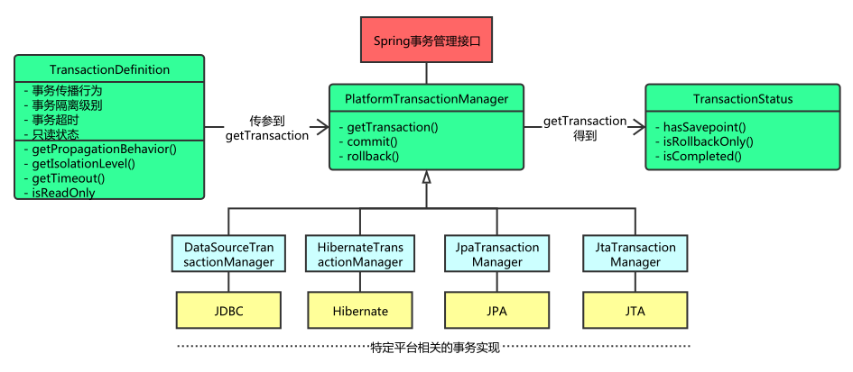

## Spring 事务管理接口
+ **PlatformTransactionManager：** 事务管理器
+ **TransactionDefinition：** 定义事务属性(事务隔离级别、传播行为、超时、只读、回滚规则)
+ **TransactionStatus：** 事务运行状态



## PlatformTransactionManager
Spring 事务管理器的接口是 org.springframework.transaction.PlatformTransactionManager，如上图所示，Spring 并不直接管理事务，通过这个接口，Spring 为各个平台如 JDBC、Hibernate 等都提供了对应的事务管理器，也就是将事务管理的职责委托给 Hibernate 或者 JTA 等持久化机制所提供的相关平台框架的事务来实现。
PlatformTransactionManager 源码：

```java
public interface PlatformTransactionManager {
  	/**
  	 * 根据指定的传播行为，返回当前活动的事务或创建一个新事务
  	 */
    TransactionStatus getTransaction(@Nullable TransactionDefinition var1) throws TransactionException;
		/**
		 * 使用当前事务状态提交
		 */
    void commit(TransactionStatus var1) throws TransactionException;
	  /**
	   * 回滚事务
	   */
    void rollback(TransactionStatus var1) throws TransactionException;
}
```

实现类有：
+ DataSourceTransactionManager：使用 Spring JDBC 或者 mybatis 持久化使用
+ HibernateTransactionManager：使用 Hibernate3.0 持久化使用
+ JpaTransactionManager：使用 Jpa 持久化使用
+ JtaTransactionManager：使用 Jta 管理事务

## TransactionStatus
TransactionStatus 接口描述的是一些处理事务提供简单的控制事务执行和查询事务状态的方法，在回滚或提交的时候需要应用对应的事务状态；

```java
public interface TransactionStatus extends SavepointManager, Flushable {
  	/**
  	 * 是否为新的事务
  	 */
    boolean isNewTransaction();
		/**
  	 * 是否有保存点
  	 */
    boolean hasSavepoint();
		/**
  	 * 设置事务回滚
  	 */
    void setRollbackOnly();
		/**
  	 * 是否支持回滚
  	 */
    boolean isRollbackOnly();

    void flush();
		/**
  	 * 是否完成
  	 */
    boolean isCompleted();
}
```

## TransactionDefinition
事务管理器接口 PlatformTransactionManager 通过 getTransaction(TransactionDefinition definition) 方法来得到一个事务，TransactionDefinition 定义了一些基本的事务属性。
什么是事务属性呢？事务属性可以理解成事务的一些基本配置，描述了事务策略如何应用到方法上，包括：
+ 事务隔离级别
+ 事务传播规则
+ 事务回滚规则
+ 是否只读
+ 事务超时

TransactionDefinition 接口定义如下：

```java
public interface TransactionDefinition {
  	/**
  	 * 事务传播
  	 */
    int PROPAGATION_REQUIRED = 0;
    int PROPAGATION_SUPPORTS = 1;
    int PROPAGATION_MANDATORY = 2;
    int PROPAGATION_REQUIRES_NEW = 3;
    int PROPAGATION_NOT_SUPPORTED = 4;
    int PROPAGATION_NEVER = 5;
    int PROPAGATION_NESTED = 6;
  	/**
  	 * 事务隔离级别
  	 */
    int ISOLATION_DEFAULT = -1;
    int ISOLATION_READ_UNCOMMITTED = 1;
    int ISOLATION_READ_COMMITTED = 2;
    int ISOLATION_REPEATABLE_READ = 4;
    int ISOLATION_SERIALIZABLE = 8;
    /**
     * 事务超时
     */
    int TIMEOUT_DEFAULT = -1;
		// 返回事务的传播行为
    int getPropagationBehavior();
    // 返回事务的隔离级别，事务管理器根据它来控制另外一个事务可以看到本事务内的哪些数据
    int getIsolationLevel();
		// 返回事务必须在多少秒内完成
    int getTimeout();
    // 是否为只读
    boolean isReadOnly();

    @Nullable
    String getName();
}
```

### 事务隔离级别
并发情况下访问数据库可能会存在以下问题：
+ 丢失修改（Lost to modify）: 事务 A 读取一个数据时，事务 B 也访问了该数据，事务 A 中修改了这个数据后，第事务 B 也修改了这个数据。事务 A 内的修改结果就被丢失，因此称为丢失修改。
+ 脏读（Dirty reads）事务 A 读取了事务 B 修改但是还未提交的数据时，后来事务 B 回滚了，事务 A 获取的数据就是"脏数据"。
+ 不可重复读（Nonrepeatable read）：事务 A 多次读取同一数据，在读取间隙，事务 B 修改了该数据，导致事务 A 多次读取到的数据不一致。
+ 幻读（Phantom read）：事务 A 多次读取同一数据，在读取间隙，事务 B 新增了数据，随后的查询中，事务 A 读到的数据对比之前不一致。

TransactionDefinition 接口中定义了五个表示隔离级别的常量：
+ **TransactionDefinition.ISOLATION_DEFAULT**: 使用后端数据库默认的隔离级别，Mysql 默认采用的 REPEATABLE_READ 隔离级别，Oracle 默认采用的 READ_COMMITTED 隔离级别.
+ **TransactionDefinition.ISOLATION_READ_UNCOMMITTED**: 最低的隔离级别，允许读取尚未提交的数据变更，可能会导致脏读、幻读或不可重复读
+ **TransactionDefinition.ISOLATION_READ_COMMITTED**: 允许读取并发事务已经提交的数据，可以阻止脏读，但是幻读、不可重复读仍可能发生
+ **TransactionDefinition.ISOLATION_REPEATABLE_READ**: 对同一字段的多次读取结果都是一致的，除非数据是被本身事务自己所修改，可以阻止脏读和不可重复读，但幻读仍有可能发生
+ **TransactionDefinition.ISOLATION_SERIALIZABLE**: 最高的隔离级别，完全服从 ACID 的隔离级别。所有的事务依次逐个执行，这样事务之间就完全不可能产生干扰，也就是说，该级别可以防止脏读、不可重复读以及幻读。但是这将严重影响程序的性能。通常情况下也不会用到该级别。

### 事务传播行为
事务传播行为解决业务层方法之间互相调用的事务问题；
+ PROPAGATION_REQUIRED：支持当前事务，如果当前没有事务，就新建一个事务。这是最常见的选择。
+ PROPAGATION_SUPPORTS：支持当前事务，如果当前没有事务，就以非事务方式执行
+ PROPAGATION_MANDATORY：支持当前事务，如果当前没有事务，就抛出异常
+ PROPAGATION_REQUIRES_NEW：新建事务，如果当前存在事务，把当前事务挂起
+ PROPAGATION_NOT_SUPPORTED： 以非事务方式执行操作，如果当前存在事务，就把当前事务挂起
+ PROPAGATION_NEVER：以非事务方式执行，如果当前存在事务，则抛出异常
+ PROPAGATION_NESTED：如果当前存在事务，则在嵌套事务内执行。如果当前没有事务，则进行与 PROPAGATION_REQUIRED 类似的操作

举例说明：

```java
ServiceA {
  void methodA() {
    ServiceB.methodB();
  }
}
ServiceB {
  void methodB(){}
}
```

#### PROPAGATION_REQUIRED
假如当前正要执行的事务不在另外一个事务里，那么就起一个新的事务 
比如说，ServiceB.methodB 的事务级别定义为 PROPAGATION_REQUIRED，执行 ServiceA.methodA 的时候有 2 种情况：
1. 如果 ServiceA.methodA 已经起了事务，这时调用 ServiceB.methodB，ServiceB.methodB 看到自己已经运行在 ServiceA.methodA 的事务内部，就不再起新的事务。这时只有外部事务并且他们是共用的，所以这时 ServiceA.methodA 或者 ServiceB.methodB 无论哪个发生异常 methodA 和 methodB 作为一个整体都将一起回滚。
2. 如果 ServiceA.methodA 没有事务，ServiceB.methodB 就会为自己分配一个事务。这样，在 ServiceA.methodA 中是没有事务控制的。只是在 ServiceB.methodB 内的任何地方出现异常，ServiceB.methodB 将会被回滚，不会引起 ServiceA.methodA 的回滚。

#### PROPAGATION_SUPPORTS
如果当前在事务中，即以事务的形式运行，如果当前不再一个事务中，那么就以非事务的形式运行

#### PROPAGATION_MANDATORY
必须在一个事务中运行。也就是说，只能被一个父事务调用。否则，就要抛出异常

#### PROPAGATION_REQUIRES_NEW
启动一个新事务，此事务将被完全 commited 或 rolled back 而不依赖于外部事务，它拥有自己的隔离范围、锁等等。当内部事务开始执行时，外部事务将被挂起，内务事务结束时，外部事务将继续执行。
比如设定 ServiceA.methodA 的事务级别为 PROPAGATION_REQUIRED，ServiceB.methodB 的事务级别为 PROPAGATION_REQUIRES_NEW，那么当执行到 ServiceB.methodB 的时候，ServiceA.methodA 所在的事务就会挂起，ServiceB.methodB 会起一个新的事务，等待 ServiceB.methodB 的事务完成以后，ServiceA.methodA 才继续执行。他与 PROPAGATION_REQUIRED 的事务区别在于事务的回滚程度了。因为 ServiceB.methodB 是新起一个事务，那么就是存在两个不同的事务。
1. 如果 ServiceB.methodB 已经提交，那么 ServiceA.methodA 失败回滚，ServiceB.methodB 是不会回滚的。
2. 如果 ServiceB.methodB 失败回滚，如果他抛出的异常被 ServiceA.methodA 的 try..catch 捕获并处理，ServiceA.methodA 事务仍然可能提交；如果他抛出的异常未被 ServiceA.methodA 捕获处理，ServiceA.methodA 事务将回滚。
使用场景：
不管业务逻辑的 service 是否有异常，Log Service 都应该能够记录成功，所以 Log Service 的传播属性可以配为此属性。

#### PROPAGATION_NOT_SUPPORTED
不支持事务，比如 ServiceA.methodA 的事务级别是 PROPAGATION_REQUIRED，而 ServiceB.methodB 的事务级别是 PROPAGATION_NOT_SUPPORTED，那么当执行到 ServiceB.methodB 时，ServiceA.methodA 的事务挂起，而他以非事务的状态运行完，再继续 ServiceA.methodA 的事务。

#### PROPAGATION_NEVER
不能在事务中运行，假设 ServiceA.methodA 的事务级别是 PROPAGATION_REQUIRED， 而 ServiceB.methodB 的事务级别是 PROPAGATION_NEVER ，那么 ServiceB.methodB 就要抛出异常了

#### PROPAGATION_NESTED
开始一个 "嵌套的" 事务，它是已经存在事务的一个真正的子事务。嵌套事务开始执行时，它将取得一个 savepoint，如果这个嵌套事务失败，我们将回滚到此 savepoint，潜套事务是外部事务的一部分，只有外部事务结束后它才会被提交. 
比如我们设计 ServiceA.methodA 的事务级别为 PROPAGATION_REQUIRED，ServiceB.methodB 的事务级别为 PROPAGATION_NESTED，那么当执行到 ServiceB.methodB 的时候，ServiceA.methodA 所在的事务就会挂起，ServiceB.methodB 会起一个新的子事务并设置 savepoint，等待 ServiceB.methodB 的事务完成以后，ServiceA.methodA 才继续执行。因为 ServiceB.methodB 是外部事务的子事务，那么
1. 如果 ServiceB.methodB 已经提交，那么 ServiceA.methodA 失败回滚，ServiceB.methodB 也将回滚。
2. 如果 ServiceB.methodB 失败回滚，如果他抛出的异常被 ServiceA.methodA 的 try..catch 捕获并处理，ServiceA.methodA 事务仍然可能提交；如果他抛出的异常未被 ServiceA.methodA 捕获处理，ServiceA.methodA 事务将回滚。
理解 Nested 的关键是 savepoint，PROPAGATION_NESTED 与 PROPAGATION_REQUIRES_NEW 的区别是：
PROPAGATION_REQUIRES_NEW 完全是一个新的事务，它与外部事务相互独立，而 PROPAGATION_NESTED 则是外部事务的子事务，如果外部事务 commit，嵌套事务也会被 commit，这个规则同样适用于 roll back. 

在 spring 中使用 PROPAGATION_NESTED 的前提：
1. 我们要设置 transactionManager 的 nestedTransactionAllowed 属性为 true, 注意， 此属性默认为 false!!! 
2. java.sql.Savepoint 必须存在， 即 jdk 版本要 1.4+ 
3. Connection.getMetaData().supportsSavepoints() 必须为 true, 即 jdbc drive 必须支持 JDBC 3.0 

### 事务超时属性
所谓事务超时，就是指一个事务所允许执行的最长时间，如果超过该时间限制但事务还没有完成，则自动回滚事务。在 TransactionDefinition 中以 int 的值来表示超时时间，其单位是秒。

### 事务只读属性
事务的只读属性是指，对事务性资源进行只读操作或者是读写操作。所谓事务性资源就是指那些被事务管理的资源，比如数据源、 JMS 资源，以及自定义的事务性资源等等。如果确定只对事务性资源进行只读操作，那么我们可以将事务标志为只读的，以提高事务处理的性能。在 TransactionDefinition 中以 boolean 类型来表示该事务是否只读。

### 回滚规则
这些规则定义了哪些异常会导致事务回滚而哪些不会。默认情况下，事务只有遇到运行期异常时才会回滚，而在遇到检查型异常时不会回滚。 

