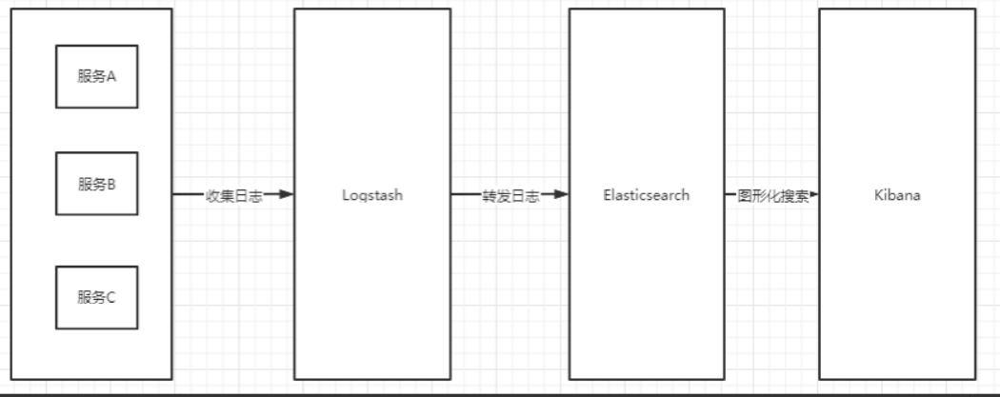
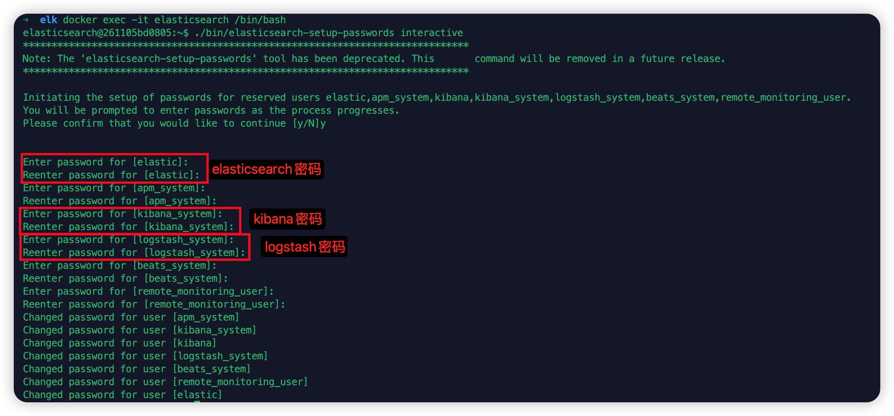
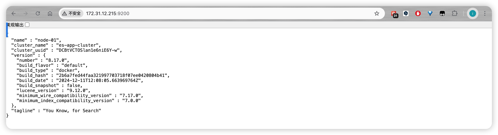

## Docker 构建 ELK
## ELK 架构
+ Elasticsearch 是个开源分布式搜索引擎，提供搜集、分析、存储数据三大功能。
+ Logstash 主要是用来日志的搜集、分析、过滤日志的工具，支持大量的数据获取方式。
+ Kibana 也是一个开源和免费的工具，Kibana 可以为 Logstash 和 ElasticSearch 提供的日志分析友好的 Web 界面，可以帮助汇总、分析和搜索重要数据日志。


### 成员
#### ElasticSearch
定义：Elasticsearch 是一个基于 Lucene 的分布式、RESTful 风格的搜索和数据分析引擎

主要功能：

+ 全文搜索：可以快速地执行全文搜索，返回相关性最高的结
+ 实时索引：支持实时索引数据，意味着数据可以几乎实时地被搜索到
+ 分布式架构：设计为分布式系统，可以水平扩展，处理 PB 级的数据
+ 数据分析：除了搜索，还可以执行复杂的数据分析，如聚合、排序和过滤
+ 使用场景：日志分析、实时监控、搜索引擎、数据仓库等

#### Logstash
定义：Logstash 是一个开源的服务器端数据处理管道，它能够同时从多个来源采集数据，转换数据，然后将数据发送到指定的“stash”（存储库）中

主要功能：

+ 数据采集：能够从各种数据源（如日志文件、系统事件、网络包、社交媒体 feeds 等）中采集数据
+ 数据转换：可以将非结构化的日志数据转换为结构化的 JSON 格式，便于后续处理和分析
+ 数据输出：可以将处理后的数据发送到各种目的地，如 Elasticsearch、数据库、消息队列等
+ 使用场景：日志管理、数据转换、集成各种不同数据源

#### Kibana
定义：Kibana 是一个为 Elasticsearch 设计的开源数据可视化和分析工具

主要功能：

+ 可视化：提供丰富的可视化选项，如柱状图、折线图、饼图、地图等，帮助用户直观地理解数据
+ Dashboard：可以创建和共享交互式的 Dashboard，展示多个可视化结果
+ 探索数据：允许用户通过简单的界面探索 Elasticsearch 中的数据
+ 实时展示：与 Elasticsearch 结合，可以实时展示数据变化
+ 使用场景：与 Elasticsearch 配合使用，进行数据可视化、日志分析、业务监控等

## 前置准备
### 下载镜像

下载 elasticsearch 镜像

```bash
docker pull elasticsearch:8.17.0
```

下载 kibana 镜像

```bash
docker pull kibana:8.17.0
```

下载 logstash 镜像

```bash
docker pull logstash:8.17.0
```

### 创建挂载目录

创建 elasticsearch 挂载目录

```bash
sudo mkdir -p /data/docker/elk/elasticsearch/{config,data,logs,plugins}
```

创建 kibana 挂载目录

```bash
sudo mkdir -p /data/docker/elk/kibana/{config,data,logs}
```

创建 logstash 挂载目录

```bash
sudo mkdir -p /data/docker/elk/logstash/{config,data,pipeline}
```

设置权限将/usr/local/elk 及其所有子目录的权限设置为当前用户的 UID 和 GID

```bash
sudo chown -R $(id -u):$(id -g) /data/docker/elk 
```

设置权限

```bash
sudo chmod -R 777 /data/docker/elk
```


## 安装 ELK

### 准备 docker-compose.yml

```bash
cd /data/docker/elk && vi docker-compose.yml
```

配置如下内容:

```yaml
version: '3'
 
services:
  elasticsearch:
    image: elasticsearch:8.17.0
    container_name: elasticsearch
    environment:
      - cluster.name=es-app-cluster
      - bootstrap.memory_lock=true
      - node.name=es-master
      - discovery.type=single-node
      - xpack.security.enabled=true      
      - xpack.security.http.ssl.enabled=false
      - xpack.security.transport.ssl.enabled=false
      - ingest.geoip.downloader.enabled=false  # 使用正确的配置项
      - ELASTIC_USERNAME=elastic
      - ELASTIC_PASSWORD=elastic
      - "ES_JAVA_OPTS=-Xms512m -Xmx2048m"
    ulimits:
      memlock:
        soft: -1
        hard: -1
    volumes:
      #- /data/docker/elk/elasticsearch/config/elasticsearch.yml:/usr/share/elasticsearch/config/elasticsearch.yml
      #- /data/docker/elk/elasticsearch/data:/usr/share/elasticsearch/data
      #- /data/docker/elk/elasticsearch/logs:/usr/share/elasticsearch/logs
      #- /data/docker/elk/elasticsearch/plugins:/usr/share/elasticsearch/plugins \
      - /etc/localtime:/etc/localtime:ro
    ports:
      - 9200:9200
      - 9300:9300
    networks:
      - elk-network
    restart: always
    privileged: true
 
  kibana:
    image: kibana:8.17.0
    container_name: kibana
    environment:
      - ELASTICSEARCH_HOSTS=http://elasticsearch:9200
      - ELASTICSEARCH_USERNAME=kibana_system
      - ELASTICSEARCH_PASSWORD=elastic
      - XPACK_SECURITY_ENABLED=true
      - SERVER_NAME=kibana
    volumes:
      #- /data/docker/elk/kibana/config/kibana.yml:/usr/share/kibana/config/kibana.yml
      #- /data/docker/elk/kibana/data:/usr/share/kibana/data
      #- /data/docker/elk/kibana/logs:/usr/share/kibana/logs
      - /etc/localtime:/etc/localtime:ro
    ports:
      - 5601:5601
    networks:
      - elk-network
    depends_on:
      - elasticsearch
    restart: always
    privileged: true
    
  logstash:
    image: logstash:8.17.0
    container_name: logstash
    ports:
       - 4560:4560
    privileged: true
    environment:
      - TZ=Asia/Shanghai
    volumes:
      #挂载logstash的配置文件
      #- /data/docker/elk/logstash/config/logstash.yml:/usr/share/logstash/conf/logstash.yml
      #- /data/docker/elk/logstash/config:/usr/share/logstash/conf 
      #- /data/docker/elk/logstash/pipeline:/usr/share/logstash/pipeline
      - /etc/localtime:/etc/localtime:ro
    depends_on:
      - elasticsearch 
    #links:
      #可以用es这个域名访问elasticsearch服务
      # - elasticsearch:es 
    networks:
      - elk-network
    
networks:
  elk-network:
    driver: bridge  
```

### 启动容器

```bash
docker-compose up -d 
```


```bash
docker-compose ps 
```

### 设置密码

```bash
#进入elasticsearch容器
docker exec -it elasticsearch /bin/bash

执行下面的代码
./bin/elasticsearch-setup-passwords interactive
```

密码要求最低 6 个字符，为了方便将所有的用户的密码都设置为`elastic`:



修改密码结束后 exit 退出容器

重启服务

```bash
docker restart elasticsearch
```

### 验证服务

浏览器请求: `http://172.31.12.215:9200`



## 配置 ELK

### 配置 elasticsearch

#### 目录映射

elasticsearch 容器目录复制到宿主机对应目录
```bash
docker cp elasticsearch:/usr/share/elasticsearch/config /data/docker/elk/elasticsearch/
docker cp elasticsearch:/usr/share/elasticsearch/data /data/docker/elk/elasticsearch/
docker cp elasticsearch:/usr/share/elasticsearch/logs /data/docker/elk/elasticsearch/
docker cp /usr/share/elasticsearch/plugins /data/docker/elk/elasticsearch/
```

#### 修改 elasticsearch.yml

```bash
cd /data/docker/elk/elasticsearch/config/ && vi elasticsearch.yml
```

配置如下内容:

```yaml
cluster.name: "es-app-cluster"
# 确保Elasticsearch监听所有接口
network.host: 0.0.0.0
node.name: es-node01
path.data: /usr/share/elasticsearch/data
path.logs: /usr/share/elasticsearch/logs
discovery.type: single-node
xpack.security.enabled: true
bootstrap.memory_lock: true

# 禁用证书检查
xpack.security.http.ssl.enabled: false
xpack.security.transport.ssl.enabled: false

#GeoIP数据库用于将IP地址映射到地理位置信息,关闭它
ingest.geoip.downloader.enabled: false

# 添加这个配置以后在kibana中才会显示联机状态，否则会显示脱机状态
xpack.monitoring.collection.enabled: true

# 修改elasticseach.yml文件，追加
http.cors.enabled: true
http.cors.allow-origin: "*"
```


### 配置 kibana

#### 目录映射

kibana 容器目录复制到宿主机对应目录

```bash
docker cp kibana:/usr/share/kibana/config /data/docker/elk/kibana/
docker cp kibana:/usr/share/kibana/data /data/docker/elk/kibana/
docker cp kibana:/usr/share/kibana/logs /data/docker/elk/kibana/
```

#### 修改 kibana.yml

```bash
cd /data/docker/elk/kibana/config/ && vi kibana.yml
```

配置如下内容:

```yaml
#Kibana 服务监听的网络接口地址
server.host: "0.0.0.0"
#Kibana 服务在接收到关闭信号后等待的时间
server.shutdownTimeout: "10s"
elasticsearch.hosts: [ "http://elasticsearch:9200" ]

#启用或禁用 Kibana 监控界面中对 Elasticsearch 容器的监控
monitoring.ui.container.elasticsearch.enabled: true
#界面汉化
i18n.locale: "zh-CN"
#启用或禁用 Kibana 报告功能的角色管理
xpack.reporting.roles.enabled: false

```


### 配置 logstash

#### 目录映射

#拷贝已启动的容器中的文件到宿主机，用于重启挂载

```bash
docker cp logstash:/usr/share/logstash/config /data/docker/elk/logstash/
docker cp logstash:/usr/share/logstash/data /data/docker/elk/logstash/
docker cp logstash:/usr/share/logstash/pipeline /data/docker/elk/logstash/
```

#### 修改配置文件

##### logstash.yml

```bash
vi /data/docker/elk/logstash/config/logstash.yml
```

配置内容

```yaml
http.host: "0.0.0.0"
# 启用定时重新加载配置
config.reload.automatic: true
# 定时重新加载配置周期
config.reload.interval: 3s

xpack.monitoring.enabled: true
xpack.monitoring.elasticsearch.hosts: [ "http://elasticsearch:9200" ]
xpack.monitoring.elasticsearch.username: "elastic"
xpack.monitoring.elasticsearch.password: "elastic"
```

##### pipelines.yml

```bash
vi /data/docker/elk/logstash/config/pipelines.yml
```

配置内容

```bash
pipeline.id: main
path.config: /usr/share/logstash/pipeline/*.conf
```


##### pipeline.yml

在`/data/docker/elk/logstash/pipeline`目录下创建 test.conf

```bash
input {
  tcp {
    mode => "server"
    host => "0.0.0.0"
    port => 4560
  }
}

output {
  elasticsearch {
    hosts => ["elasticsearch:9200"]
    index => "logstash-%{+YYYY.MM.dd}"
  }
  stdout { codec => rubydebug }
}
```

### 修改 docker-compose.yml

```yaml
version: '3'
 
services:
  elasticsearch:
    image: elasticsearch:8.17.0
    container_name: elasticsearch
    environment:
      - cluster.name=es-app-cluster
      - bootstrap.memory_lock=true
      - node.name=es-master
      - discovery.type=single-node
      - xpack.security.enabled=true      
      - xpack.security.http.ssl.enabled=false
      - xpack.security.transport.ssl.enabled=false
      - ingest.geoip.downloader.enabled=false  # 使用正确的配置项
      - ELASTIC_USERNAME=elastic
      - ELASTIC_PASSWORD=elastic
      - "ES_JAVA_OPTS=-Xms512m -Xmx2048m"
    ulimits:
      memlock:
        soft: -1
        hard: -1
    volumes:
      - /data/docker/elk/elasticsearch/config/elasticsearch.yml:/usr/share/elasticsearch/config/elasticsearch.yml
      - /data/docker/elk/elasticsearch/data:/usr/share/elasticsearch/data
      - /data/docker/elk/elasticsearch/logs:/usr/share/elasticsearch/logs
      - /data/docker/elk/elasticsearch/plugins:/usr/share/elasticsearch/plugins \
      - /etc/localtime:/etc/localtime:ro
    ports:
      - 9200:9200
      - 9300:9300
    networks:
      - elk-network
    restart: always
    privileged: true
 
  kibana:
    image: kibana:8.17.0
    container_name: kibana
    environment:
      - ELASTICSEARCH_HOSTS=http://elasticsearch:9200
      - ELASTICSEARCH_USERNAME=kibana_system
      - ELASTICSEARCH_PASSWORD=elastic
      - XPACK_SECURITY_ENABLED=true
      - SERVER_NAME=kibana
    volumes:
      - /data/docker/elk/kibana/config/kibana.yml:/usr/share/kibana/config/kibana.yml
      - /data/docker/elk/kibana/data:/usr/share/kibana/data
      - /data/docker/elk/kibana/logs:/usr/share/kibana/logs
      - /etc/localtime:/etc/localtime:ro
    ports:
      - 5601:5601
    networks:
      - elk-network
    depends_on:
      - elasticsearch
    restart: always
    privileged: true
    
  logstash:
    image: logstash:8.17.0
    container_name: logstash
    ports:
       - 4560:4560
    privileged: true
    environment:
      - TZ=Asia/Shanghai
    volumes:
      #挂载logstash的配置文件
      - /data/docker/elk/logstash/config/logstash.yml:/usr/share/logstash/conf/logstash.yml
      - /data/docker/elk/logstash/data:/usr/share/logstash/data 
      - /data/docker/elk/logstash/config:/usr/share/logstash/conf 
      - /data/docker/elk/logstash/pipeline:/usr/share/logstash/pipeline
      - /etc/localtime:/etc/localtime:ro
    depends_on:
      - elasticsearch 
    #links:
      #可以用es这个域名访问elasticsearch服务
      # - elasticsearch:es 
    networks:
      - elk-network
    
networks:
  elk-network:
    driver: bridge  
```


### 重新启动服务

```bash
docker-compose down

docker-compose up -d
```


