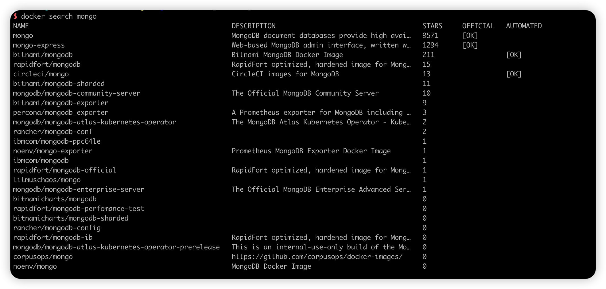

## Docker 构建 MongoDB

## 1.查询 MongoDB 镜像

``````bash
docker search mongo
``````



## 2.拉取镜像

```bash
docker pull mongo
```

## 3.挂载配置目录

将 redis 的配置文件进行挂载，以配置文件方式启动 redis 容器。(挂载：即将宿主的文件和容器内部目录相关联，相互绑定，在宿主机内修改文件的话也随之修改容器内部文件）

- 数据挂载目录

```bash
sudo mkdir -p /data/docker/mongodb/{data,config,logs}
```

```bash
vi /data/docker/mongodb/config/mongod.conf
```
```添加如下内容
# 数据库存储路径
dbpath=/data/docker/mongodb/data
# 日志文件路径
logpath=/data/docker/mongodb/logs/mongod.log
# 监听的端口
port=27017
# 允许所有的 IP 地址连接
bind_ip=0.0.0.0
# 启用日志记录
journal=true
# 是否后台运行
fork=true
# 启用身份验证
#auth=true
```
  
## 4.启动容器

```bash
docker run -itd \
           --name mongodb \
           --restart=always \
           -p 27017:27017 \
           --privileged=true \
           -v /data/docker/mongodb/config/mongod.conf:/etc/mongod.conf \
           -v /data/docker/mongodb/data:/data/db \
           -v /data/docker/mongodb/logs:/var/log/mongodb \
           -e MONGO_INITDB_ROOT_USERNAME=root \
           -e MONGO_INITDB_ROOT_PASSWORD=root_password \
           mongo \
           --auth 
```
### 参数解析

> -d：表示后台启动 mongo；
>
> –-name 给容器命名
>
> -p 27017:27017: 将宿主机 27017 端口与容器内 27017 端口进行映射，冒号之前为物理机端口
>
> -v: 将宿主机目录或文件与容器内目录或文件进行挂载映射，将宿主机的/data/mongodb/data 映射到容器的/data/db 目录，将数据持久化到宿主机，以防止删除容器后，容器内的数据丢失
>
> --auth: 需要密码才能访问容器服务

## 4.创建用户并设置密码

```bash
# root用户进入 MongoDB
docker exec -it mongodb bash

# 连接到 MongoDB
mongosh -u root -p root_password --authenticationDatabase admin
```

## 5. 创建新用户
```bash
use admin
db.createUser({
  user: 'admin',
  pwd: 'admin123456',
  roles: [
    { role: "userAdminAnyDatabase", db: "admin" },
    { role: "readWriteAnyDatabase", db: "admin" },
    { role: "dbAdminAnyDatabase", db: "admin" },
    { role: "clusterAdmin", db: "admin" }
  ]
});
```

## 6. 验证用户创建
一旦容器启动并初始化完成，你可以使用 mongosh 或 mongo 命令验证管理员用户是否已创建
```bash
docker exec -it mongodb mongosh -u admin -p admin123456 --authenticationDatabase admin
```
