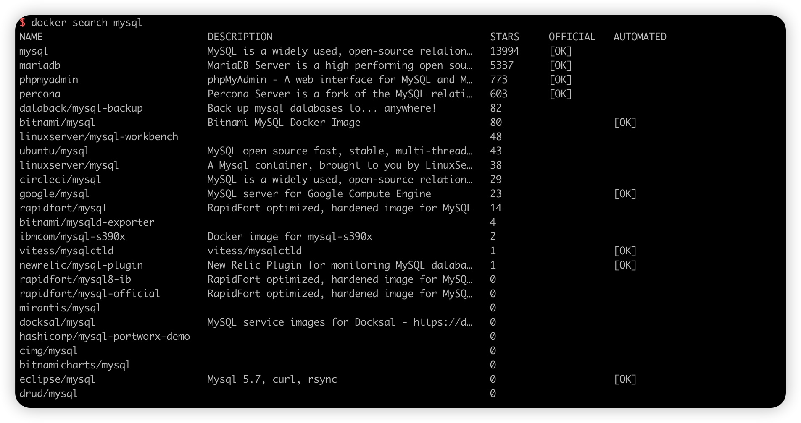

## Docker 构建 MySQL

## 1.查询 mysql 镜像

``````bash
docker search mysql
``````



## 2.拉取镜像

```bash
docker pull mysql
```

## 3.挂载配置文件

将 redis 的配置文件进行挂载，以配置文件方式启动 redis 容器。(挂载：即将宿主的文件和容器内部目录相关联，相互绑定，在宿主机内修改文件的话也随之修改容器内部文件）

- 挂载 mysql 的配置文件 
```bash
sudo mkdir -p /data/docker/mysql/{conf,data,logs}
```
## 3.启动容器

```bash
docker run -d \
           -p 3306:3306 \
           --privileged=true \
           --restart=unless-stopped \
           -v /data/docker/mysql/logs:/var/log/mysql \
           -v /data/docker/mysql/data:/var/lib/mysql \
           -v /data/docker/mysql/conf:/etc/mysql/conf.d \
           -e MYSQL_ROOT_PASSWORD=root1234 \
           --name mysql mysql
```
### 参数解析

> -d：表示后台启动 redis；–name 给容器命名
>
> -p 3306:3306: 将宿主机 3306 端口与容器内 3306 端口进行映射，冒号之前为物理机端口
>
> --privileged=true
>
> --restart=unless-stopped: 容器重启策略
>
> -v /data/docker/mysql/logs:/var/log/mysql: 将日志文件夹挂载到宿主机（宿主机路径:容器路径
>
> -v /data/docker/mysql/data:/var/lib/mysql: 将 mysql 储存文件夹挂载到主机（宿主机路径:容器路径）
>
> -v /data/docker/mysql/conf:/etc/mysql/conf.d 将配置文件夹挂载到主机（宿主机路径:容器路径）
>
> -e MYSQL_ROOT_PASSWORD=root1234: 设置 root 用户密码
>
>  --name mysql: 设置容器名称

## 4.查看运行容器状态

```bash
docker exec -it mysql /bin/bash
mysql -h localhost -u root -p
```
