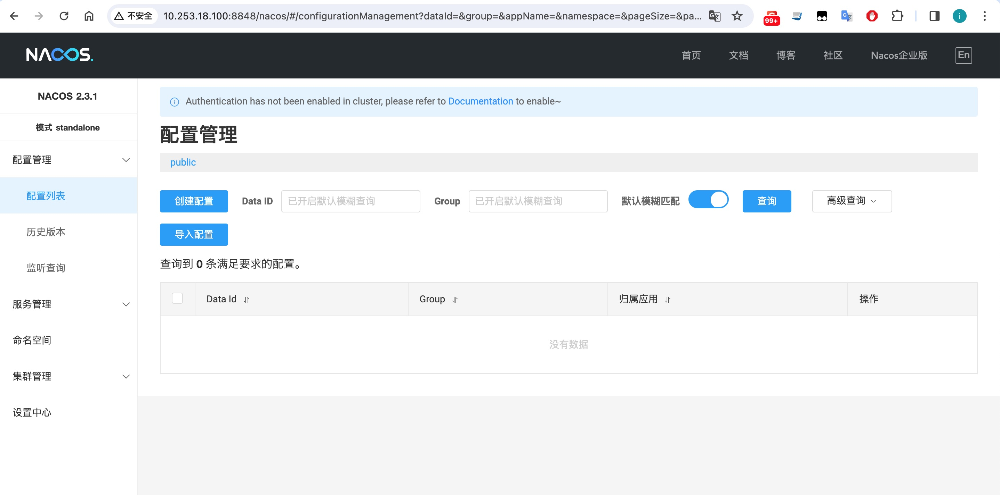

# Docker 构建 Nacos
## 1. 前置准备

## 2.拉取镜像
```bash
## 拉取镜像
docker pull nacos/nacos-server:2.3.1
```

## 3.挂载配置文件

设置 nacos 挂载目录为/data/docker/nacos，并将容器里都 conf 目录、logs 目录、data 目录复制到宿主机/data/docker/nacos 目录里，执行下面都命令，如下：

- 挂载 mysql 的配置文件 
```bash
mkdir -p /data/docker/nacos/{logs,conf,data}

#启动nacos容器
docker run --name nacos -d -p 8848:8848 -e MODE=standalone  nacos/nacos-server:latest

docker cp nacos:/home/nacos/conf /data/docker/nacos
docker cp nacos:/home/nacos/logs /data/docker/nacos
docker cp nacos:/home/nacos/data /data/docker/nacos
```

## 4. mysql 新建并执行 nacos 脚本
mysql 新建 nacos 的数据库，并执行脚本 sql 脚本地址如下：
https://github.com/alibaba/nacos/blob/master/config/src/main/resources/META-INF/nacos-db.sql

## 5.启动容器

停止容器

`docker stop nacos`

彻底删除容器

`docker rm nacos`

```bash
docker run -itd \
           -p 8848:8848 \
           -p 9848:9848 \
           --privileged=true \
           --restart=always \
           -v /data/docker/nacos/conf:/home/nacos/conf \
           -v /data/docker/nacos/logs:/home/nacos/logs \
           -v /data/docker/nacos/:/home/nacos/data \
           -e JVM_XMS=256m \
           -e JVM_XMX=256m \
           -e MODE=standalone \
           -e PREFER_HOST_MODE=hostname \
           -e SPRING_DATASOURCE_PLATFORM=mysql \
           -e MYSQL_SERVICE_HOST=10.253.18.225 \
           -e MYSQL_SERVICE_PORT=3306 \
           -e MYSQL_SERVICE_DB_NAME=nacos_config \
           -e MYSQL_SERVICE_USER=root \
           -e MYSQL_SERVICE_PASSWORD=ytsl@2021 \
           -e MYSQL_SERVICE_DB_PARAM="characterEncoding=utf8&connectTimeout=1000&socketTimeout=3000&autoReconnect=true&useSSL=false&allowPublicKeyRetrieval=true" \
           -e NACOS_AUTH_ENABLE=false \
           -e NACOS_AUTH_TOKEN=SecretKey012345678901234567890123456789012345678901234567890123456789 \
           -e NACOS_AUTH_IDENTITY_KEY=serverIdentity \
           --name nacos nacos/nacos-server:2.3.1
```

唯一需要注意的是：`MYSQL_SERVICE_HOST` 一定要设置为主机的 IP 地址，因为是不同容器（nacos 和 mysql）间的连接，所以一定不能用 localhost


## 4.登陆 nacos

浏览器访问: http://xx.xx.xx.xx:8848


