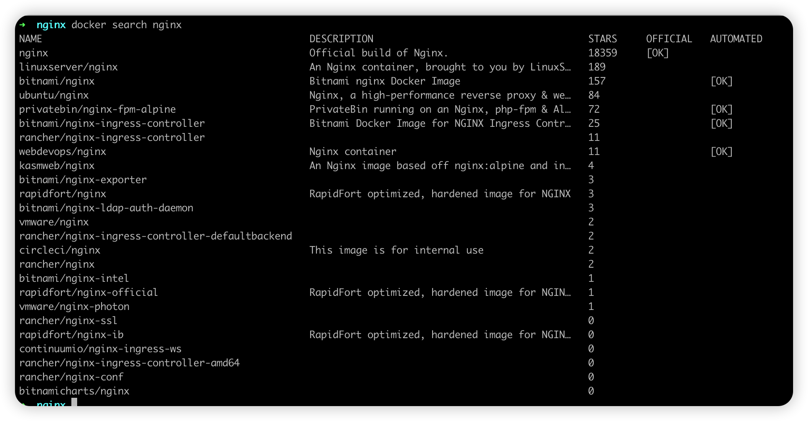

## Docker 构建 Nginx

## 1.查询 Nginx 镜像

``````bash
docker search nginx
``````



## 2.拉取镜像

```bash
docker pull nginx
```

## 3.启动容器

```bash
docker run --name nginx -p 80:80 -d nginx
```

## 4.文件映射

容器中的文件内容是可以被修改的，但是**一旦容器重启，所有写入到容器中的，针对数据文件、配置文件的修改都将丢失**。所以为了保存容器的运行状态，执行结果，我们需要将容器内的一些重要的数据文件、日志文件、配置文件映射到宿主机上。

### 4.1 目录映射

|                    | 容器中路径            | 宿主机中自定义映射路径              |
| :----------------- | :-------------------- |:-------------------------|
| 存储网站网页的目录 | /usr/share/nginx/html | /data/docker/nginx/html  |
| 日志目录           | /etc/nginx/nginx.conf | /data/docker/nginx/conf/ |
| nginx 配置文件目录  | /var/log/nginx        | /data/docker/nginx/logs  |
| 证书存放目录       | /etc/nginx/cert/      | /data/docker/nginx/cert  |
| 子配置项存放处     | /etc/nginx/conf.d     | /data/docker/nginx/      |

### 4.2 将容器中的文件 copy 到宿主机中
将 nginx 配置文件 copy 到宿主机中

```bash
docker cp nginx:/etc/nginx/nginx.conf /data/docker/nginx/conf
docker cp nginx:/etc/nginx/conf.d /data/docker/nginx/
docker cp nginx:/usr/share/nginx/html/ /data/docker/nginx/html/
docker cp nginx:/var/log/nginx/ /data/docker/nginx/logs/
docker cp nginx:/etc/nginx/cert/ /data/docker/nginx/cert/
```

## 5.停止并移除容器

```bash
docker stop nginx
docker rm nginx
```

## 6.启动容器

```bash
docker run -d \
           --name nginx \
           --restart=always \
           -p 80:80 \
           -p 443:443 \
           -v /data/docker/nginx/conf/nginx.conf:/etc/nginx/nginx.conf \
           -v /data/docker/nginx/html/:/usr/share/nginx/html/ \
           -v /data/docker/nginx/logs/:/var/log/nginx/ \
           -v /data/docker/nginx/conf.d/:/etc/nginx/conf.d \
           -v /data/docker/nginx/cert/:/etc/nginx/cert \
           --privileged=true \
           nginx
           
```
