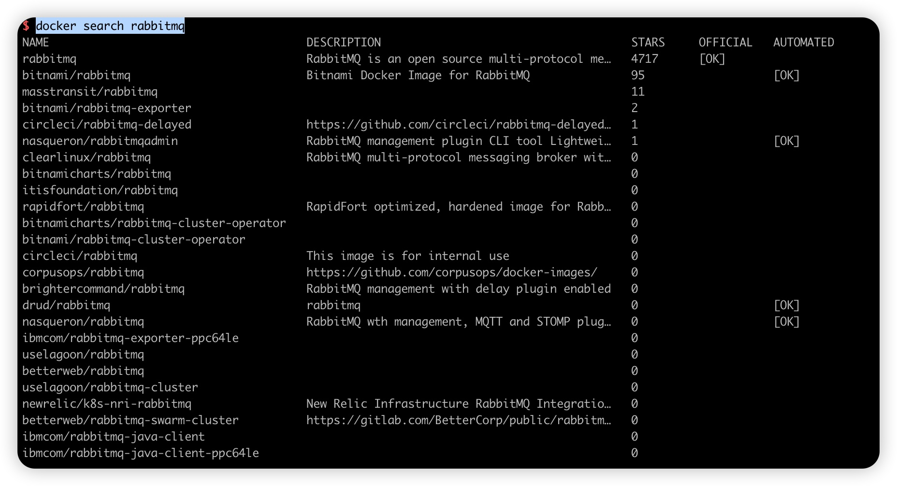
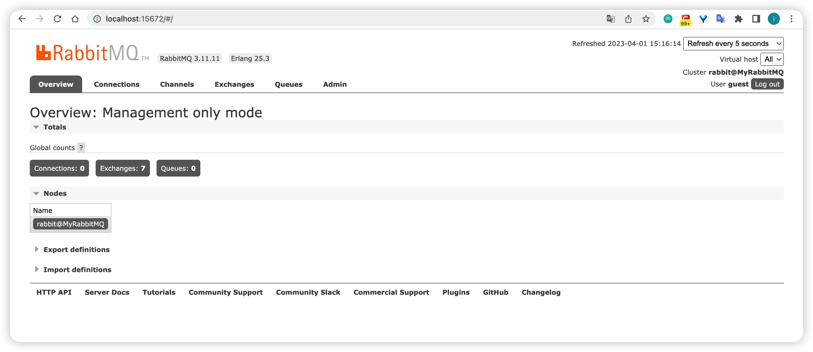

## Docker 构建 RabbitMQ

## 1.查询 RabbitMQ 镜像

``````bash
docker search rabbitmq
``````



## 2.拉取镜像

```bash
docker pull rabbitmq
```

## 3.创建目录授权文件夹
```bash
# 创建目录
mkdir -p /data/docker/rabbitmq/{conf,data,log}
```

```bash
# 授权文件夹
chmod -R 777 /data/docker/rabbitmq
```

## 4.创建并运行 RabbitMQ 容器

```bash
docker run -id --name rabbitmq \
           --restart=always \
           -p 15672:15672 \
           -p 5672:5672 \
           -e RABBITMQ_DEFAULT_VHOST=/ \
           -e RABBITMQ_DEFAULT_USER=admin \
           -e RABBITMQ_DEFAULT_PASS=admin123456 \
           -v /data/docker/rabbitmq/data:/var/lib/rabbitmq \
           -v /data/docker/rabbitmq/conf:/etc/rabbitmq \
           -v /data/docker/rabbitmq/log:/var/log/rabbitmq \
           --hostname MyRabbitMQ \
           rabbitmq:latest
```
### 参数解析

> -id
>
> + i：以交互模式运行容器，通常与 -t 同时使用；
> + d：表示后台启动 rabbitmq；–name 给容器命名
>
> -p：将容器的端口 5672（应用访问端口）和 15672 （控制台 Web 端口号）映射到主机中；
>
> -e：指定环境变量：
>
> - RABBITMQ_DEFAULT_VHOST：默认虚拟机名；
>
> - RABBITMQ_DEFAULT_USER：默认的用户名；
>
> - RABBITMQ_DEFAULT_PASS：默认的用户密码；
>
> --hostname：指定主机名(RabbitMQ 的一个重要注意事项是它根据所谓的 节点名称 存储数据，默认为主机名)
> --name rabbitmq：设置容器名称；
> rabbitmq：容器使用的镜像名称

## 4.启动 rabbit_management

### 方法一

```bash
-- 进入rabbitmq容器
docker exec -it rabbitmq /bin/bash
-- 执行命令
rabbitmq-plugins enable rabbitmq_management
```

### 方法二

```bash
docker exec -it rabbitmq rabbitmq-plugins enable rabbitmq_management
```

## 5.登录控制台
浏览器请求地址 `http://localhost:15672`，输入用户名/密码: guest/guest

