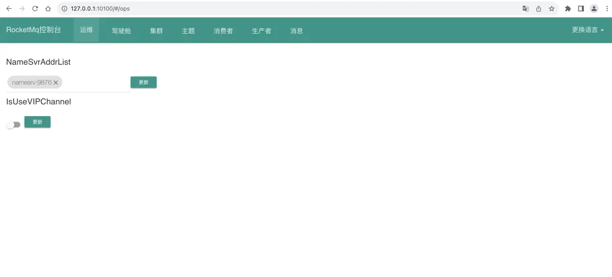

# Docker 构建 RocketMQ
## 1. 前置准备

## 2.拉取镜像
### 2.1 下载 rockermq 镜像
```bash

## 拉取镜像
docker pull apache/rocketmq:5.2.0
```

### 2.2 下载 rockermq-console
```bash
docker pull styletang/rocketmq-console-ng
```

## 3.挂载处理
创建容器挂载文件夹
```bash
mkdir -m 777 -p /data/docker/rocketmq/nameserver/logs
mkdir -m 777 -p /data/docker/rocketmq/nameserver/store
mkdir -m 777 -p /data/docker/rocketmq/broker/logs
mkdir -m 777 -p /data/docker/rocketmq/broker/data
mkdir -m 777 -p /data/docker/rocketmq/broker/store
mkdir -m 777 -p /data/docker/rocketmq/broker/conf
```

## 4. 启动 NameServer
```bash
docker run -d \
           --privileged=true \
           -p 9876:9876 \
           -v /data/docker/rocketmq/nameserver/logs:/home/rocketmq/logs \
           -v /data/docker/rocketmq/nameserver/store:/root/store \
           -e "MAX_HEAP_SIZE=256M" \
           -e "HEAP_NEWSIZE=128M" \
           -e "MAX_POSSIBLE_HEAP=100000000" \
           --name rmqnamesrv \
           apache/rocketmq:5.2.0 sh mqnamesrv
```

## 5. 启动 Broker
### 5.1 创建 broker.conf
```bash
vi /data/docker/rocketmq/broker/conf/broker.conf
```

### 5.2 编辑 broker.conf
```bash
# 集群名称
brokerClusterName=DefaultCluster
# 节点名称
brokerName=broker-a
# broker id节点ID， 0 表示 master, 其他的正整数表示 slave，不能小于0
brokerId=0
# Broker服务地址    String    内部使用填内网ip，如果是需要给外部使用填公网ip
brokerIP1=10.190.209.230
# Broker角色
brokerRole=ASYNC_MASTER
# 刷盘方式
flushDiskType=ASYNC_FLUSH
# 在每天的什么时间删除已经超过文件保留时间的 commit log，默认值04
deleteWhen=04
# 以小时计算的文件保留时间 默认值72小时
fileReservedTime=72
# 是否允许Broker 自动创建Topic，建议线下开启，线上关闭
autoCreateTopicEnable=true
# 是否允许Broker自动创建订阅组，建议线下开启，线上关闭
autoCreateSubscriptionGroup=true
# 磁盘使用达到95%之后,生产者再写入消息会报错 CODE: 14 DESC: service not available now, maybe disk full
diskMaxUsedSpaceRatio=95
```

### 5.3 启动容器
```bash
docker run -itd \
           --name rmqbroker \
           --link rmqnamesrv:namesrv \
           -p 10911:10911 -p 10909:10909 \
           --privileged=true \
           -v /data/docker/rocketmq/broker/logs:/root/logs \
           -v /data/docker/rocketmq/broker/store:/root/store \
           -v /data/docker/rocketmq/broker/conf/broker.conf:/home/rocketmq/broker.conf \
           -e "MAX_POSSIBLE_HEAP=200000000" \
           -e "MAX_HEAP_SIZE=512M" \
           -e "HEAP_NEWSIZE=256M" \
           -e "NAMESRV_ADDR=namesrv:9876" \
           apache/rocketmq:5.2.0 \
           sh mqbroker -c /home/rocketmq/broker.conf
```

## 6.启动 rocketmq-console
```bash
docker run -d \
           --name rmq-console-ng \
           -p 9080:8080 \
           -v /data/rocketmq/data/console/tmp:/tmp \
           -e "JAVA_OPTS=-Drocketmq.namesrv.addr=rmqnamesrv:9876 -Dcom.rocketmq.sendMessageWithVIPChannel=false" \
           - styletang/rocketmq-console-ng
```
## 4.访问 rocketmq
浏览器访问: http://xx.xx.xx.xx:9080


