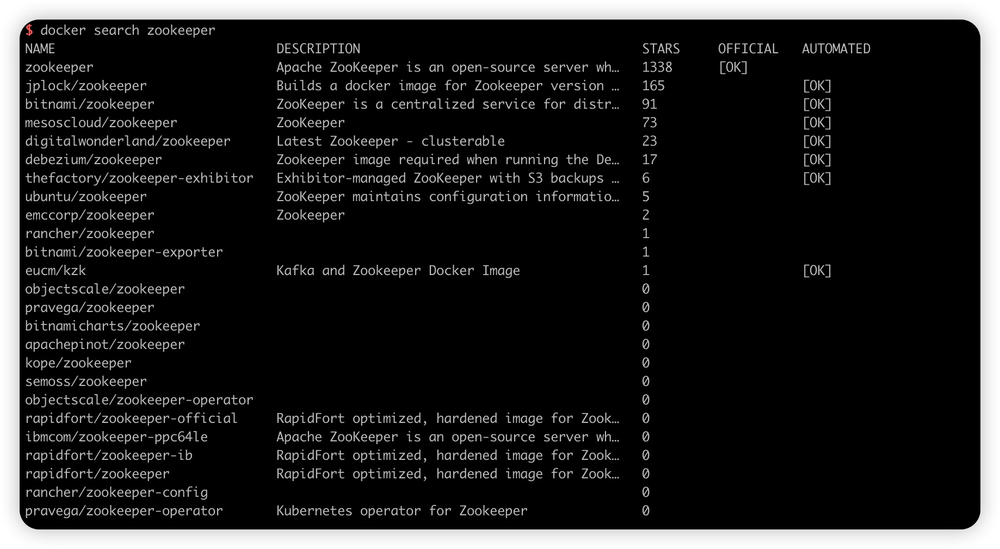
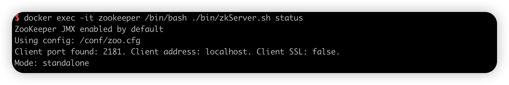

## Docker 构建 ZooKeeper

## 1.查询 ZooKeeper 镜像

``````bash
docker search zookeeper
``````



## 2.拉取镜像

```bash
docker pull zookeeper
```

## 3.挂载配置目录

将 redis 的配置文件进行挂载，以配置文件方式启动 redis 容器。(挂载：即将宿主的文件和容器内部目录相关联，相互绑定，在宿主机内修改文件的话也随之修改容器内部文件）

- 数据挂载目录

```bash
mkdir -p /data/docker/zookeeper/{data,conf,logs}
```

## 4.启动容器

启动 zookeeper 容器

```bash
docker run -d \
           --name zookeeper \
           --privileged=true \
           --restart=always \
           -p 2181:2181 \
           zookeeper
```

复制 zoo.cfg 文件

```bash
docker cp zookeeper:/conf/zoo.cfg /data/docker/zookeeper/conf
```

停止并删除 zookeeper 容器

```bash
docker stop zookeeper && docker rm zookeeper
```

重启容器并挂载目录:

```bash
docker run -d \
           --name zookeeper \
           --privileged=true \
           --restart=always \
           -p 2181:2181 \
           -v /data/docker/zookeeper/data:/data \
           -v /data/docker/zookeeper/conf:/conf \
           -v /data/docker/zookeeper/logs:/datalog \
           zookeeper
```
### 参数解析

> -d：表示后台启动 zookeeper；
>
> –-name 给容器命名
>
> -p 2181:2181: 将宿主机 2181 端口与容器内 2181 端口进行映射，冒号之前为物理机端口
>
> -v 将宿主机目录或文件与容器内目录或文件进行挂载映射；

## 4.验证容器状态

```bash
docker exec -it zookeeper /bin/bash ./bin/zkServer.sh status
```


