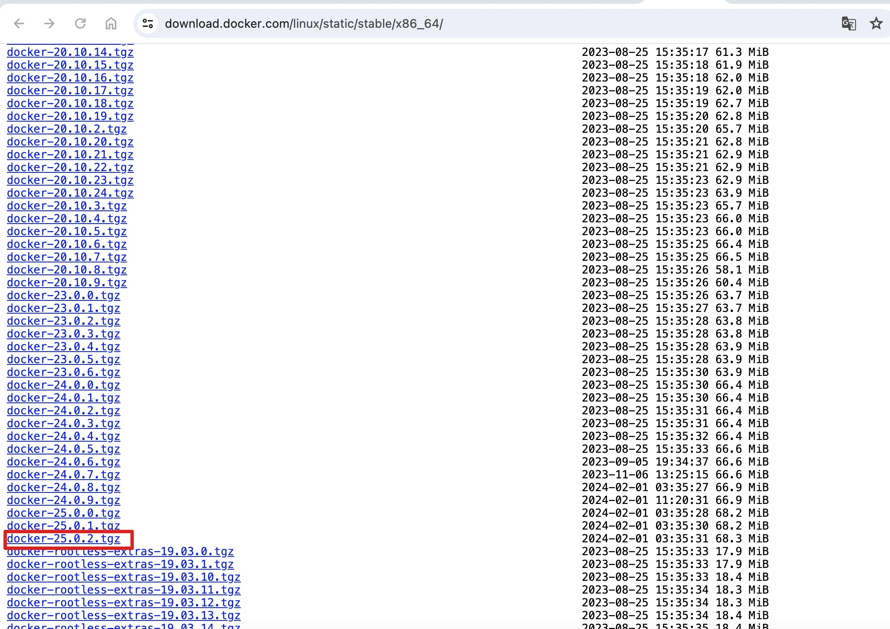

# 安装 Docker

## 1. 背景

## 2. 安装准备

下载 docker 离线安装包，下载地址如下：

[Index of Linux/static/stable/x86_64/](https://download.docker.com/linux/static/stable/x86_64/)

这里我们选择安装最新版本`docker-25.0.2.tgz`。



## 3. 分步安装法

### 3.1 解压缩

```bash
tar -zxvf docker-25.0.2.tgz
```

解压后的文件夹 docker 中文件如下所示：


### 3.2 复制文件

将 docker 中的全部文件，使用下边命令，复制到/usr/bin

```bash
cp ./docker/* /usr/bin
```

### 3.3 创建 docker.service 文件

```bash
vi /etc/systemd/system/docker.service
```

然后将下边内容复制到 docker.service。

```bash
[Unit]
Description=Docker Application Container Engine
Documentation=https://docs.docker.com
After=network-online.target firewalld.service
Wants=network-online.target
[Service]
Type=notify
# the default is not to use systemd for cgroups because the delegate issues still
# exists and systemd currently does not support the cgroup feature set required
# for containers run by Docker
ExecStart=/usr/bin/dockerd
ExecReload=/bin/kill -s HUP $MAINPID
# Having non-zero Limit*s causes performance problems due to accounting overhead
# in the kernel. We recommend using cgroups to do container-local accounting.
LimitNOFILE=infinity
LimitNPROC=infinity
LimitCORE=infinity
# Uncomment TasksMax if your systemd version supports it.
# Only systemd 226 and above support this version.
#TasksMax=infinity
TimeoutStartSec=0
# set delegate yes so that systemd does not reset the cgroups of Docker containers
Delegate=yes
# kill only the Docker process, not all processes in the cgroup
KillMode=process
# restart the Docker process if it exits prematurely
Restart=on-failure
StartLimitBurst=3
StartLimitInterval=60s
[Install]
WantedBy=multi-user.target
```

 编辑好后，ESC 键à:wq 保存并退出 docker.service 文件。

### 3.5 添加可执行权限

```perl
chmod +x /etc/systemd/system/docker.service
```

### 3.6 加载 docker.service

```undefined
systemctl daemon-reload
```

注意，若修改了 docker.service 文件，则要重新加载该文件。

### 3.7 启动 docker

```sql
## 启动docker
systemctl start docker

## 设置开机启动
systemctl enable docker.service
```

### 3.8 查看 docker

```lua
systemctl status docker
```


```undefined
docker -v
```

 

## 4. 一键安装法

如果您觉得上边的步骤繁琐，也可以用下边的办法，一键安装 docker。

#### 4.1 制作 docker.service 文件

在 docker-18.06.3-ce.tgz 同目录下，创建 docker.service，打开编辑文件，文件内容与 3.4 节完全一样，此处不再赘述。

#### 4.2 制作一键安装脚本

```bash
touch install.sh
```

打开编辑 install.sh，将以下内容复制到 install.sh，保存退出。

```bash
#!/bin/sh
echo '解压tar包'
tar -xvf $1
echo '将docker目录下所有文件复制到/usr/bin目录'
cp docker/* /usr/bin
echo '将docker.service 复制到/etc/systemd/system/目录'
cp docker.service /etc/systemd/system/
echo '添加文件可执行权限'
chmod +x /etc/systemd/system/docker.service
echo '重新加载配置文件'
systemctl daemon-reload
echo '启动docker'
systemctl start docker
echo '设置开机自启'
systemctl enable docker.service
echo 'docker安装成功'
docker -v
```

#### 4.3 制作一键卸载脚本

Touch uninstall.sh，将以下内容复制到 uninstall.sh，保存退出。

```bash
#!/bin/sh
echo '停止docker'
systemctl stop docker
echo '删除docker.service'
rm -f /etc/systemd/system/docker.service
echo '删除docker文件'
rm -rf /usr/bin/docker*
echo '重新加载配置文件'
systemctl daemon-reload
echo '卸载成功'
```

#### 4.4 安装 docker

此时 docker-18.06.3-ce.tgz 同目录下，还有上边创建的 docker.service，install.sh，uninstall.sh 这 3 个文件：


分别给 install.sh 和 uninstall.sh 赋予可执行权限。

```perl
chmod +x install.sh
chmod +x uninstall.sh
```

 开始安装

```bash
sh install.sh docker-25.0.2.tgz
```

查看 docker 状态

### 

### 5 总结

一键安装法从实质上来说和分步骤安装方法是一样的，它将分步安装法的步骤，集中写到一个 shell 脚本，其优点是在一台新的机器上安装时，能节约时间，也不容易出错，如果想卸载 docker，一键操作也很方便。

