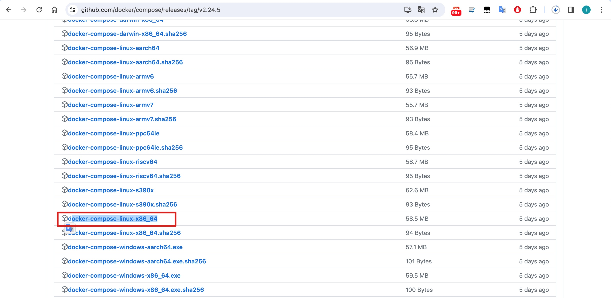
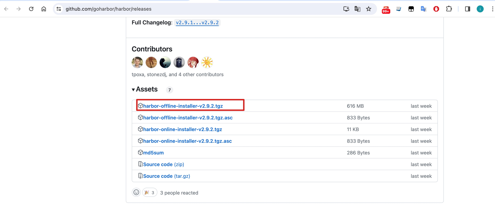
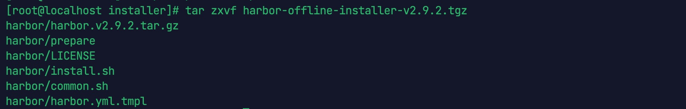
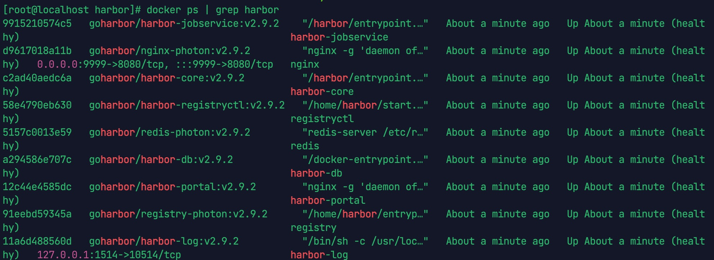
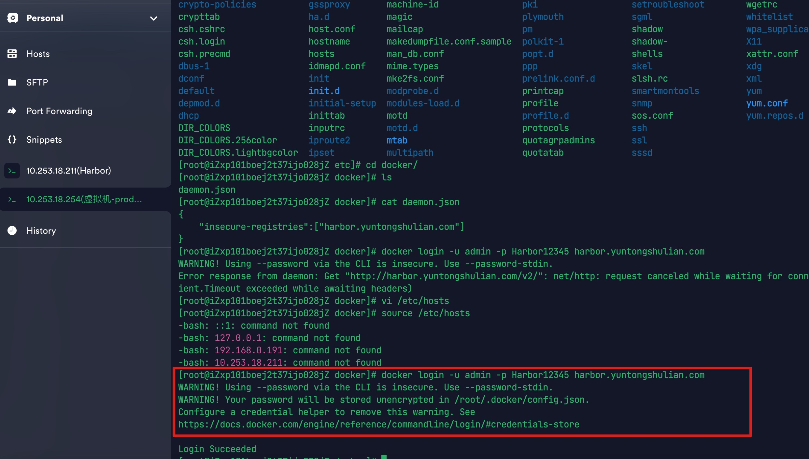
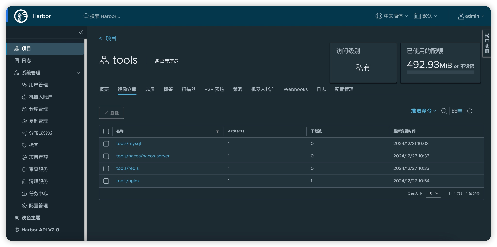

# 安装 Harbor

## 1. Harbor 简介
### 1.1 什么是 Harbor
    Harbor 是 VMware 公司开源的企业级 Docker Registry 项目，其目标是帮助用户迅速搭建一个企业级的 Docker Registry 服务。

    Harbor以 Docker 公司开源的 Registry 为基础，提供了图形管理 UI 、基于角色的访问控制(Role Based AccessControl) 、AD/LDAP 集成、以及审计日志(Auditlogging) 等企业用户需求的功能，同时还原生支持中文。

    Harbor 的每个组件都是以 Docker 容器的形式构建的，使用 docker-compose 来对它进行部署。用于部署 Harbor 的 docker-compose 模板位于 harbor/docker-compose.yml。

### 1.2 Harbor 的特性
   1. 基于角色控制：用户和仓库都是基于项目进行组织的，而用户在项目中可以拥有不同的权限。
   2. 基于镜像的复制策略：镜像可以在多个 Harbor 实例之间进行复制（同步）。
   3. 支持 LDAP/AD：Harbor 可以集成企业内部已有的 AD/LDAP（类似数据库的一张表），用于对已经存在的用户认证和管理。
   4. 镜像删除和垃圾回收：镜像可以被删除，也可以回收镜像占用的空间。
   5. 图形化用户界面：用户可以通过浏览器来浏览，搜索镜像仓库以及对项目进行管理。
   6. 审计管理：所有针对镜像仓库的操作都可以被记录追溯，用于审计管理。
   7. 支持 RESTful API：RESTful API 提供给管理员对于 Harbor 更多的操控, 使得与其它管理软件集成变得更容易。
   8. Harbor 和 docker registry 的关系：Harbor 实质上是对 docker registry 做了封装，扩展了自己的业务模板。

### 1.3 Harbor 的构成
   Harbor 在架构上主要有 Proxy、Registry、Core services、Database（Harbor-db）、Log collector（Harbor-log）、Job services 六个组件。
   1. Proxy: 是一个 nginx 的前端代理，Harbor 的 Registry、UI、Token 服务等组件，都处在 nginx 反向代理后边。 该代理将来自浏览器、docker clients 的请求转发到后端不同的服务上。
   2. Registry: 负责储存 Docker 镜像，并处理 Docker push/pull 命令。由于要对用户进行访问控制，即不同用户对 Docker 镜像 有不同的读写权限，Registry 会指向一个 Token 服务，强制用户的每次 Docker pull/push 请求都要携带一个合法的 Token， Registry 会通过公钥对 Token 进行解密验证。
   3. Core services: Harbor 的核心功能，主要提供以下 3 个服务:
        + UI（harbor-ui）: 提供图形化界面，帮助用户管理 Registry 上的镜像（image）, 并对用户进行授权。 
        + WebHook：为了及时获取 Registry 上 image 状态变化的情况，在 Registry 上配置 Webhook，把状态变化传递给 UI 模块。
        + Token 服务：负责根据用户权限给每个 Docker push/pull 命令签发 Token。Docker 客户端向 Registry 服务发起的请求， 如果不包含 Token，会被重定向到 Token 服务，获得 Token 后再重新向 Registry 进行请求。
   4. Database（harbor-db）：为 core services 提供数据库服务，负责储存用户权限、审计日志、Docker 镜像分组信息等数据。
   5. Job services: 主要用于镜像复制，本地镜像可以被同步到远程 Harbor 实例上。
   6. Log collector（harbor-log）: 负责收集其他组件的日志到一个地方。

Harbor 的每个组件都是以 Docker 容器的形式构建的，因此，使用 Docker Compose 来对它进行部署。

总共分为 7 个容器运行，通过在 docker-compose.yml 所在目录中执行 docker-compose ps 命令来查看， 名称分别为：nginx、harbor-jobservice、harbor-ui、harbor-db、harbor-adminserver、registry、harbor-log。

其中 harbor-adminserver 主要是作为一个后端的配置数据管理，并没有太多的其他功能。harbor-ui 所要操作的所有数据都通过 harbor-adminserver 这样一个数据配置管理中心来完成。


## 2. 安装准备

### 2.1 离线下载 docker-compose

下载 docker-compose 离线安装包，地址如下:

```bash
https://github.com/docker/compose/releases/tag/v2.24.5
```

我们选择安装最新版本`docker-compose-linux-x86_64`:




### 2.2 离线下载 Harbor

下载 harbor 离线安装包，下载地址如下：

```https://github.com/goharbor/harbor/releases```

这里我们选择安装最新版本`harbor-offline-installer-v2.9.2.tgz`。



## 3. 安装 docker-compose

将下载的 docker-compose 上传到服务器，并复制到 `/usr/local/bin/docker-compose`:

```bash
sudo mv docker-compose-linux-x86_64 /usr/local/bin/docker-compose
sudo chmod +x /usr/local/bin/docker-compose
```

查看版本：

```bash
docker-compose -v
```


## 4. 安装 Harbor

### 4.1 上传并解压 Harbor

```bash
tar zxvf harbor-offline-installer-v2.9.2.tgz
```

解压后:



### 4.2 修改 harbor.yml

```bash
cp harbor.yml.tmpl harbor.yml
```

### 4.3 编辑 harbor.yml

```bash
vim harbor.yml
```
1. 修改 hostname: 127.0.0.1
2. 如果不需 https 访问则将 https 部分注释
3. 修改 data_volume: /data/harbor/data

### 4.4 修改 harbor 文件目录权限

```bash
chmod -R 777 harbor
```


### 4.5 执行 harbor 安装程序

```bash
# 先启动docker
systemctl start docker

# 执行安装脚本
sh ./install.sh
```

安装日志:

```txt
[Step 0]: checking if docker is installed ...

Note: docker version: 25.0.2

[Step 1]: checking docker-compose is installed ...

Note: docker-compose version: 2.24.5

[Step 2]: loading Harbor images ...
Loaded image: goharbor/harbor-log:v2.9.2
Loaded image: goharbor/harbor-db:v2.9.2
Loaded image: goharbor/harbor-registryctl:v2.9.2
Loaded image: goharbor/nginx-photon:v2.9.2
Loaded image: goharbor/redis-photon:v2.9.2
Loaded image: goharbor/registry-photon:v2.9.2
Loaded image: goharbor/trivy-adapter-photon:v2.9.2
Loaded image: goharbor/prepare:v2.9.2
Loaded image: goharbor/harbor-portal:v2.9.2
Loaded image: goharbor/harbor-core:v2.9.2
Loaded image: goharbor/harbor-jobservice:v2.9.2
Loaded image: goharbor/harbor-exporter:v2.9.2


[Step 3]: preparing environment ...

[Step 4]: preparing harbor configs ...
prepare base dir is set to /home/installer/harbor
WARNING:root:WARNING: HTTP protocol is insecure. Harbor will deprecate http protocol in the future. Please make sure to upgrade to https
Generated configuration file: /config/portal/nginx.conf
Generated configuration file: /config/log/logrotate.conf
Generated configuration file: /config/log/rsyslog_docker.conf
Generated configuration file: /config/nginx/nginx.conf
Generated configuration file: /config/core/env
Generated configuration file: /config/core/app.conf
Generated configuration file: /config/registry/config.yml
Generated configuration file: /config/registryctl/env
Generated configuration file: /config/registryctl/config.yml
Generated configuration file: /config/db/env
Generated configuration file: /config/jobservice/env
Generated configuration file: /config/jobservice/config.yml
Generated and saved secret to file: /data/secret/keys/secretkey
Successfully called func: create_root_cert
Generated configuration file: /compose_location/docker-compose.yml
Clean up the input dir


Note: stopping existing Harbor instance ...


[Step 5]: starting Harbor ...
[+] Running 9/10
 ⠇ Network harbor_harbor        Created                                                                              1.8s 
 ✔ Container harbor-log         Started                                                                              0.4s 
 ✔ Container harbor-db          Started                                                                              1.0s 
 ✔ Container registry           Started                                                                              1.1s 
 ✔ Container redis              Started                                                                              0.9s 
 ✔ Container harbor-portal      Started                                                                              0.9s 
 ✔ Container registryctl        Started                                                                              1.1s 
 ✔ Container harbor-core        Started                                                                              1.2s 
 ✔ Container nginx              Started                                                                              1.7s 
 ✔ Container harbor-jobservice  Started                                                                              1.7s
 ✔ ----Harbor has been installed and started successfully.----
```

至此 Harbor 安装完成。


### 4.6 检查 harbor 是否可用

```bash
docker ps | grep harbor
```




### 4.1 登陆 harbor

```bash
#访问
http://127.0.0.1:8443
```

登陆，用户名为: admin , 管理密码需要在 harbor.yml 中查找, 默认密码为: Harbor12345




~~~~### 4.9 设置 Harbor 开机自动启动

1. 编辑服务文件：
使用以下命令创建并编辑 systemd 服务文件:
```bash
sudo vim /etc/systemd/system/harbor.service
```

2. 写入以下内容:
```bash
[Unit]
Description=Harbor Docker Compose Service
After=network.target docker.service
Requires=docker.service

[Service]
WorkingDirectory=/root/harbor
ExecStart=/usr/local/bin/docker-compose -f /opt/harbor/docker-compose.yml up -d
ExecStop=/usr/local/bin/docker-compose -f /opt/harbor/docker-compose.yml down
Restart=always
User=root
Group=root

[Install]
WantedBy=multi-user.target
```

WorkingDirectory: 指定 Harbor 的目录。

ExecStart: 启动 Docker Compose 的命令，确保路径 /usr/local/bin/docker-compose 是正确的。你可以通过 which docker-compose 来确认。

ExecStop: 停止 Docker Compose 的命令。

User 和 Group: 运行 Docker Compose 的用户和组。如果你希望以非 root 用户身份运行，可以替换为对应的用户和组。

3. 重新加载 systemd 配置
```bash
sudo systemctl daemon-reload
```
4. 启用并启动服务
使服务在系统启动时自动启动:
```bash
sudo systemctl enable harbor.service
```
启动服务并检查状态:
```bash
sudo systemctl start harbor.service
sudo systemctl status harbor.service
```
5. 验证服务状态
查看服务日志以确保 Harbor 正常启动：
```bash
sudo journalctl -u harbor.service
```
通过这些步骤，可以将 Harbor 配置为一个 systemd 服务，使其在系统启动时自动运行。
~~~~

## 5. Harbor 整合 Docker

### 5.1 配置 harbor

在另一台机器上配置

```bash
## 编辑
vi /etc/docker/daemon.json

## 如果没有文件则依次执行
mkdir -p /etc/docker
touch daemon.json
vi daemon.json
```

添加内容:

```json
{
  "insecure-registries":["127.0.0.1:8443"]
}
```

### 5.2 登陆 Harbor

```bash
docker login -u admin -p Harbor12345 127.0.0.1:8443
```

### 5.2 推送镜像

```bash
#1.登陆Harbor
docker login -u admin -p Harbor12345 127.0.0.1:8443

#WARNING! Using --password via the CLI is insecure. Use --password-stdin.
#Login Succeeded

#2.将镜像打上标签
docker tag redis:latest 127.0.0.1:8443/library/redis:latest
 
#3.推送镜像
docker push 127.0.0.1:8443/library/redis:latest
```

推送成功:


