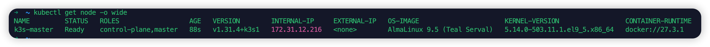
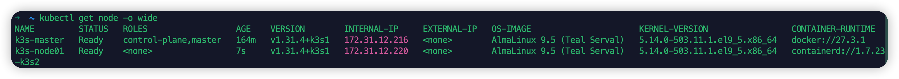
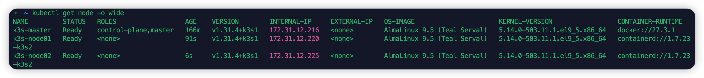

# 安装 K3s


## 1.集群规划

### 1.1 机器环境

| 服务器 ip    | 主机名       | 配置 |
| ----------- | ---------- | ---- |
| 192.168.0.115 | k3s-master |      |
| 192.168.0.120 | k3s-node01 |      |
| 192.168.0.125 | K3s-node02 |      |

## 2. 前置准备 (所有节点)

### 2.1 禁用 selinux

在 K8s 集群的所有节点都执行:

```bash
# 将 SELinux 设置为 permissive 模式（相当于将其禁用）
## 临时
setenforce 0

## 永久关闭
sed -i 's/^SELINUX=enforcing$/SELINUX=disabled/' /etc/selinux/config
```

### 2.2 禁用防火墙

在 K8s 集群的所有节点都执行:

```bash
systemctl stop firewalld
systemctl disable firewalld
```


### 2.3 设置 hosts

在 K8s 集群的所有节点都执行:

```bash
cat >> /etc/hosts << EOF
192.168.0.115 k3s-master
192.168.0.120 k3s-node01
192.168.0.125 k3s-node02
EOF
```


### 2.4 设置主机名

登陆到 K3s 集群 Master 节点`192.168.0.115`上，执行以下命令

```bash
hostnamectl set-hostname k3s-master
```


登陆到 K3s 集群 Node 节点`192.168.0.120`上，执行以下命令

```bash
hostnamectl set-hostname k3s-node01
```


登陆到 K3s 集群 Master 节点`192.168.0.125`上，执行以下命令

```bash
hostnamectl set-hostname k3s-node02
```


### 2.5 设置时间同步

```bash
yum install -y ntpdate

ntpdate  time1.aliyun.com
```


## 3. K3s 安装

K3s 集群中有 2 类节点: Server 节点和 Agent 节点;


### 3.1 k3s Server 节点安装

K3s 提供了一个安装脚本，可以方便地将其作为服务安装在基于 systemd 或 openrc 的系统上。该脚本可在 [https://get.k3s.io](https://get.k3s.io/) 获得。要使用这种方法安装 K3s，只需运行：

```bash
curl -sfL https://get.k3s.io | sh -
```


**国内可以使用以下方法加速安装：**

在 `192.168.0.115` 机器上执行以下脚本:

```bash
curl -sfL \
     https://rancher-mirror.rancher.cn/k3s/k3s-install.sh | \
     INSTALL_K3S_MIRROR=cn sh -s - \
     --system-default-registry "registry.cn-hangzhou.aliyuncs.com" \
     --write-kubeconfig ~/.kube/config \
     --write-kubeconfig-mode 666 \
     --disable traefik
```


运行此安装后：

- K3s 服务将被配置为在节点重启后或进程崩溃或被杀死时自动重启。
- 将安装其他实用程序，包括 `kubectl`、`crictl`、`ctr`、`k3s-killall.sh` 和 `k3s-uninstall.sh`。
- [kubeconfig](https://kubernetes.io/docs/concepts/configuration/organize-cluster-access-kubeconfig/) 文件将写入到 `/etc/rancher/k3s/k3s.yaml`，由 K3s 安装的 kubectl 将自动使用该文件。


**单节点 Server 安装即是一个功能齐全的 Kubernetes 集群**，它包括了托管工作负载 pod 所需的所有数据存储、control plane、kubelet 和容器运行时组件。除非你希望向集群添加容量或冗余，否则没有必要添加额外的 Server 或 Agent 节点。

安装之后在 Server 节点上执行 `kubectl get node -o wide`




### 4.2 K3s Agent 节点安装

要安装其他 Agent 节点并将它们添加到集群，请使用 `K3S_URL` 和 `K3S_TOKEN` 环境变量运行安装脚本。以下示例演示了如何添加 Agent 节点：

```bash
curl -sfL https://get.k3s.io | K3S_URL=https://myserver:6443 K3S_TOKEN=mynodetoken sh -
```


**中国用户，可以使用以下方法加速安装：**

```text
curl -sfL https://rancher-mirror.rancher.cn/k3s/k3s-install.sh | INSTALL_K3S_MIRROR=cn K3S_URL=https://myserver:6443 K3S_TOKEN=mynodetoken sh -
```


**`K3S_URL` 参数会导致安装程序将 K3s 配置为 Agent 而不是 Server，K3s Agent 将注册到在 URL 上监听的 K3s Server；**

**`K3S_TOKEN` 使用的值存储在 Server 节点上的 `/var/lib/rancher/k3s/server/node-token` 中；**


替换安装脚本中的 K3S_URL: https://192.168.0.115:6443

从 `192.168.0.115` 机器上获取 K3S_TOKEN 的值:


#### 4.2.1 K3s Agent 节点 1 安装

在 `192.168.0.120` 机器上执行以下脚本:

```bash
curl -sfL https://rancher-mirror.rancher.cn/k3s/k3s-install.sh | INSTALL_K3S_MIRROR=cn K3S_URL=https://192.168.0.115:6443 K3S_TOKEN=K10eb7d903c4a9fc0abaf9f61856f54b50a9a5c3a9680d8ed8b6c26bdce83c1dff4::server:2025f3e45d5e705909bca242471ce6cf sh -
```

安装之后在 Server 节点上执行 `kubectl get node -o wide`:




#### 4.2.2 K3s Agent 节点 2 安装

在 `192.168.0.125` 机器上执行以下脚本:

```bash
curl -sfL https://rancher-mirror.rancher.cn/k3s/k3s-install.sh | INSTALL_K3S_MIRROR=cn K3S_URL=https://192.168.0.115:6443 K3S_TOKEN=K10eb7d903c4a9fc0abaf9f61856f54b50a9a5c3a9680d8ed8b6c26bdce83c1dff4::server:2025f3e45d5e705909bca242471ce6cf sh -
```

安装之后在 Server 节点上执行 `kubectl get node -o wide`:




```bash
# 要从 agent 节点卸载 K3s，请运行：
/usr/local/bin/k3s-agent-uninstall.sh
```

## 3. K3s 其他
### 3.1 停止 K3s
要停止所有 K3s 容器并重置容器状态，你可以使用 k3s-killall.sh 脚本。

killall 脚本能清理容器、K3s 目录和网络组件，同时还能删除 iptables 链以及所有相关规则，但集群数据不会被删除。
要停止 K3s 请在 Server 节点中运行 killall 脚本:

```bash
/usr/local/bin/k3s-killall.sh
```

### 3.1 K3s Server 卸载
```bash
# 要从 server 节点卸载 K3s，请运行：
/usr/local/bin/k3s-uninstall.sh
```


### 3.2 K3s Agent 卸载
```bash
# 要从 agent 节点卸载 K3s，请运行：
/usr/local/bin/k3s-agent-uninstall.sh
```


