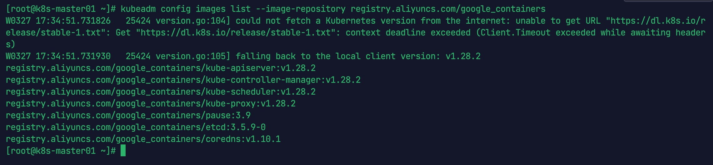
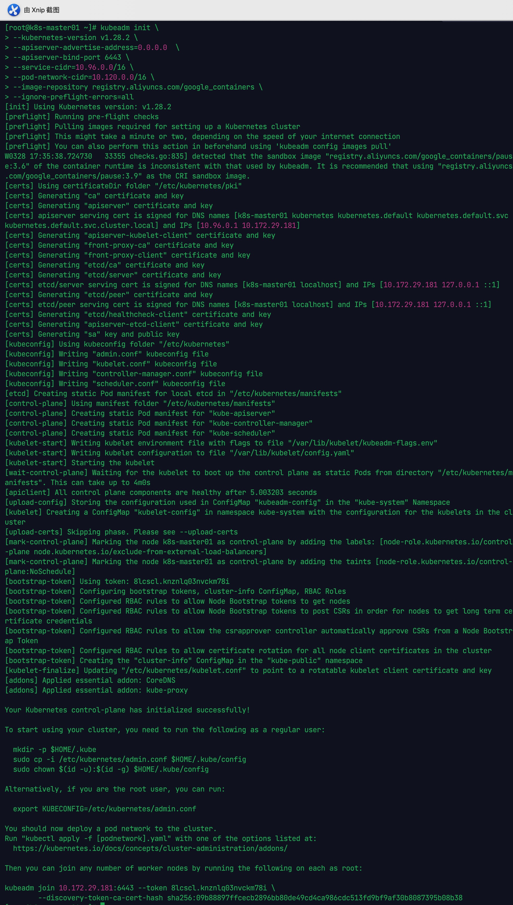
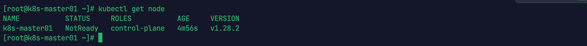
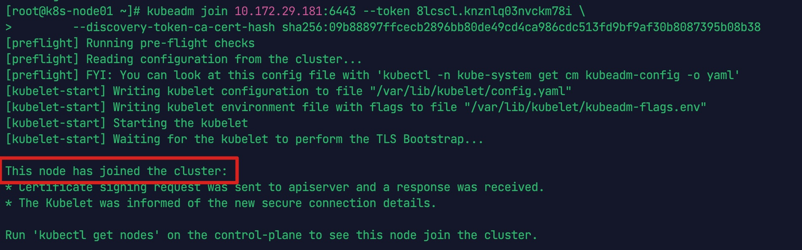
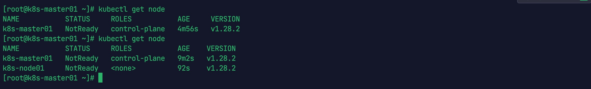

# 安装 K8s

记录使用 CentOS7.9 进行 k8s-1.28 版本部署，运行时环境使用 containerd，网络插件使用 calic，集群搭建完成后。搭建 NFS 共享存储环境，测试运行 pod 并挂载使用持久卷。

## 1.集群规划

### 1.1 机器环境

| 服务器 ip    | 主机名       | 配置 |
| ----------- | ------------ | ---- |
| 192.168.0.100 | k8s-master01 |      |
| 192.168.0.101 | k8s-node01   |      |
| 192.168.0.102 | K8s-node02   |      |

### 1.2 软件环境

| 名称       | 版本   |      |
| ---------- | ------ | ---- |
| CentOS     | 7.6    |      |
| Kubernetes | 1.28.2 |      |
| Containerd | 1.6.28 |      |

## 2. 前置准备 (所有节点)

### 2.1 禁用 selinux

在 K8s 集群的所有节点都执行:

```bash
# 将 SELinux 设置为 permissive 模式（相当于将其禁用）
## 临时
setenforce 0

## 永久关闭
sed -i 's/^SELINUX=enforcing$/SELINUX=disabled/' /etc/selinux/config
```

### 2.2 禁用 swap

在 K8s 集群的所有节点都执行:

```bash
# 关闭swap分区 
## 临时
swapoff -a

## 永久
sed -i 's/.*swap.*/#&/' /etc/fstab
```

### 2.3 禁用防火墙

在 K8s 集群的所有节点都执行:

```bash
systemctl stop firewalld
systemctl disable firewalld
```

### 2.4 升级操作系统内核(非必需)

在 K8s 集群的所有节点都执行:

```bash
yum -y update kernel*
```

### 2.5 设置 nameserver

在 K8s 集群的所有节点都执行:

```bash
vi /etc/resolv.conf

## 添加以下内容
nameserver 144.144.144.144
nameserver 8.8.8.8
```

### 2.6 设置 hosts

在 K8s 集群的所有节点都执行:

```bash
cat >> /etc/hosts << EOF
192.168.0.100 k8s-master01
192.168.0.101 k8s-node01
192.168.0.102 k8s-node02
EOF
```

### 2.7 设置主机名

登陆到 K8s 集群 Master 节点`192.168.0.100`上，执行以下命令

```bash
hostnamectl set-hostname k8s-master01
```

登陆到 K8s 集群 Node 节点`192.168.0.101`上，执行以下命令

```bash
hostnamectl set-hostname k8s-node01
```

登陆到 K8s 集群 Master 节点`192.168.0.102`上，执行以下命令

```bash
hostnamectl set-hostname k8s-node02
```


### 2.8 设置时间同步

```bash
yum install -y ntpdate

ntpdate  time1.aliyun.com
```


### 2.9 内核参数调整

**以下命令在每台服务器上执行**

```bash
cat <<EOF | sudo tee /etc/modules-load.d/kubernetes.conf
overlay
br_netfilter
EOF
```


```bash
sudo modprobe overlay
sudo modprobe br_netfilter
```


设置所需的 sysctl 参数，参数在重新启动后保持不变

```bash
cat <<EOF | sudo tee /etc/sysctl.d/kubernetes.conf
net.bridge.bridge-nf-call-iptables  = 1
net.bridge.bridge-nf-call-ip6tables = 1
net.ipv4.ip_forward                 = 1
EOF
```


应用 sysctl 参数而不重新启动

```bash
sudo sysctl --system
```


通过运行以下指令确认 br_netfilter 和 overlay 模块被加载

```bash
lsmod | grep br_netfilter
lsmod | grep overlay
```


通过运行以下指令确认 net.bridge.bridge-nf-call-iptables、net.bridge.bridge-nf-call-ip6tables 和 net.ipv4.ip_forward 系统变量在你的 sysctl 配置中被设置为 1

```bash
sysctl net.bridge.bridge-nf-call-iptables net.bridge.bridge-nf-call-ip6tables net.ipv4.ip_forward
```


```bash
## 使刚才修改的内核参数生效
sysctl -p /etc/sysctl.d/Kubernetes.conf
```


### 2.10 集群免密登陆

```bash
# 生成密钥
ssh-keygen -t ecdsa -f /root/.ssh/id_rsa -N ''
# 复制密钥到所有服务器
ssh-copy-id 192.168.0.100
ssh-copy-id 192.168.0.101
ssh-copy-id 192.168.0.102
```


### 2.11 配置 ipvs 功能

在 kubernetes 中 Service 有两种代理模型，一种是基于 iptables 的，一种是基于 ipvs，两者对比 ipvs 的性能要高，如果想要使用 ipvs 模型，需要手动载入 ipvs 模块

```bash
yum -y install ipset ipvsadm
cat > /etc/sysconfig/modules/ipvs.modules << EOF
modprobe -- ip_vs
modprobe -- ip_vs_rr
modprobe -- ip_vs_wrr
modprobe -- ip_vs_sh
modprobe -- nf_conntrack_ipv4  
EOF

chmod +x /etc/sysconfig/modules/ipvs.modules # 执行脚本
/etc/sysconfig/modules/ipvs.modules

# 验证ipvs模块
lsmod | grep -e ip_vs -e nf_conntrack_ipv4
```


## 3. 安装容器运行时 (所有节点)

从 k8s 1.24 版本开始，负责 kubelet 与 docker 直接握手的 docker-shim 已经不再支持，转而强制使用容器运行时 Container Runtime 作为 kubelet 和容器的桥梁。

目前容器运行时有两种选择，一种是与 docker 有强关联的 cri-dockerd，一种是 Containerd，本安装手册选用 Containerd，在前面安装了对应的 containerd.io 包。

为了让 Containerd 能够在后面与 kubelet 成功协同，这里需要做几点优化：

（1）Containerd 安装完成后，其自带的配置文件/etc/containerd/config.toml 中的内容，需要用打印出的 containerd 默认配置替换。

（2）Containerd 的 Cgroup 设为 systemd，以和 k8s 默认的 Cgroup 保持一致。

（3）pause 镜像路径改为国内源 registry.aliyuncs.com/google_containers/pause:3.9。

### 3.1 containerd

#### 3.1.1 安装 containerd

```bash
yum install -y yum-utils
yum-config-manager --add-repo https://download.docker.com/linux/centos/docker-ce.repo
yum -y install containerd.io
```

#### 3.1.2 生成 config.toml 配置

```bash
containerd config default > /etc/containerd/config.toml
```

#### 3.1.3 配置 systemd cgroup

```bash
sed -i 's/SystemdCgroup = false/SystemdCgroup = true/g' /etc/containerd/config.toml

## 修改结果
[plugins."io.containerd.grpc.v1.cri".containerd.runtimes.runc]
  ...
  [plugins."io.containerd.grpc.v1.cri".containerd.runtimes.runc.options]
    SystemdCgroup = true

```

将 sandbox_image 下载地址改为阿里云地址

```bash
sed -i 's|registry.k8s.io|registry.aliyuncs.com/google_containers|g' /etc/containerd/config.toml

## 修改结果
[plugins."io.containerd.grpc.v1.cri"]
    ...
    sandbox_image = "registry.aliyuncs.com/google_containers/pause:3.9"
```

#### 3.1.4 启动 containerd 并设置开机自启动

```bash
systemctl restart containerd && systemctl enable containerd
```

#### 3.1.5 配置客户端工具

crictl 是遵循 CRI 接口规范的一个命令行工具，随 containerd.io 一起安装，常用它来检查和管理 kubelet 节点上的容器运行时和镜像。

crictl 下载镜像时使用的默认端点（endpoint）是/var/run/dockershim.sock，这个已经在 k8s v1.24 起被废弃，需要我们手工指定为新的端点 containerd.sock。

重新指定的工作需要通过配置/etc/crictl.yaml 来完成。

```bash
cat > /etc/crictl.yaml <<EOF
runtime-endpoint: unix:///run/containerd/containerd.sock
image-endpoint: unix:///run/containerd/containerd.sock
timeout: 10
debug: false
EOF
```

或者

```bash
# 配置crictl工具运行时接口地址(runtime-endpoint)
crictl config --set runtime-endpoint=unix:///run/containerd/containerd.sock
crictl config --set image-endpoint=unix:///run/containerd/containerd.sock
crictl ps
```


## 4. K8s 服务安装

### 4.1 k8s 配置阿里云 yum 源 (所有节点)

```bash
cat <<EOF > /etc/yum.repos.d/kubernetes.repo
[kubernetes]
name = Kubernetes
baseurl = https://mirrors.aliyun.com/kubernetes/yum/repos/kubernetes-el7-x86_64
enabled = 1
gpgcheck = 0
repo_gpgcheck = 0
gpgkey = https://mirrors.aliyun.com/kubernetes/yum/doc/yum-key.gpg https://mirrors.aliyun.com/kubernetes/yum/doc/rpm-package-key.gpg
EOF


yum makecache
```

### 4.2 kubeadm&kubelet&kubectl (所有节点)

- kubeadm：用来初始化集群的指令。
- kubelet：在集群中的每个节点上用来启动 Pod 和容器等。
- kubectl：用来与集群通信的命令行工具。

kubeadm 不能帮你安装或者管理 kubelet 或 kubectl， 所以你需要确保它们与通过 kubeadm 安装的控制平面的版本相匹配。 如果不这样做，则存在发生版本偏差的风险，可能会导致一些预料之外的错误和问题。 然而，控制平面与 kubelet 之间可以存在一个次要版本的偏差，但 kubelet 的版本不可以超过 API 服务器的版本。 例如，1.7.0 版本的 kubelet 可以完全兼容 1.8.0 版本的 API 服务器，反之则不可以。

这些说明适用于 Kubernetes 1.28，阿里的 yum 源，kubelet 版本只更新到 1.28.0 版本，所以下面命令需要加上版本号

#### 4.2.1 安装 k8s 组件

```bash
yum install -y kubelet-1.28.2 kubeadm-1.28.2 kubectl-1.28.2 --disableexcludes=kubernetes
```

```bash
## 设置kubelet开机启动
systemctl start kubelet && systemctl enable --now kubelet

## 此处还无法启动kubelet服务，在kubeadm init xx 过程中会自动启动kubelet
systemctl status kubelet
```


### 4.3 使用 kubeadm 创建集群

#### 4.3.1 准备容器镜像 (所有节点)

以下命令在每个节点上执行

```bash
kubeadm config images list --image-repository registry.aliyuncs.com/google_containers
```



使用国内镜像进行替换下载，在此 pause 使用 3.9 会导致集群无法初始化，还需要下载 pause:3.6

方法一

```bash
kubeadm config images pull \
--image-repository registry.aliyuncs.com/google_containers
```

方法二

```bash
##下载镜像
docker pull registry.aliyuncs.com/google_containers/kube-apiserver:v1.28.8
docker pull registry.aliyuncs.com/google_containers/kube-controller-manager:v1.28.8
docker pull registry.aliyuncs.com/google_containers/kube-scheduler:v1.28.8
docker pull registry.aliyuncs.com/google_containers/kube-proxy:v1.28.8
docker pull registry.aliyuncs.com/google_containers/pause:3.6
docker pull registry.aliyuncs.com/google_containers/pause:3.9
docker pull registry.aliyuncs.com/google_containers/etcd:3.5.9-0
docker pull registry.aliyuncs.com/google_containers/coredns:v1.10.1


## 将镜像标记为官方镜像版本
docker tag registry.aliyuncs.com/google_containers/kube-apiserver:v1.28.8 registry.k8s.io/kube-apiserver:v1.28.8
docker tag registry.aliyuncs.com/google_containers/kube-controller-manager:v1.28.8 registry.k8s.io/kube-controller-manager:v1.28.8
docker tag registry.aliyuncs.com/google_containers/kube-scheduler:v1.28.8 registry.k8s.io/kube-scheduler:v1.28.8
docker tag registry.aliyuncs.com/google_containers/kube-proxy:v1.28.8 registry.k8s.io/kube-proxy:v1.28.8
docker tag registry.aliyuncs.com/google_containers/pause:3.9 registry.k8s.io/pause:3.9
docker tag registry.aliyuncs.com/google_containers/pause:3.6 registry.k8s.io/pause:3.6
docker tag registry.aliyuncs.com/google_containers/etcd:3.5.9-0 registry.k8s.io/etcd:3.5.9-0
docker tag registry.aliyuncs.com/google_containers/coredns:v1.10.1 registry.k8s.io/coredns/coredns:v1.10.1

## 删除旧的tag(可暂时保留)
docker rmi registry.aliyuncs.com/google_containers/kube-apiserver:v1.28.8
docker rmi registry.aliyuncs.com/google_containers/kube-controller-manager:v1.28.8
docker rmi registry.aliyuncs.com/google_containers/kube-scheduler:v1.28.8
docker rmi registry.aliyuncs.com/google_containers/kube-proxy:v1.28.8
docker rmi registry.aliyuncs.com/google_containers/pause:3.6
docker rmi registry.aliyuncs.com/google_containers/pause:3.9
docker rmi registry.aliyuncs.com/google_containers/etcd:3.5.9-0
docker rmi registry.aliyuncs.com/google_containers/coredns:v1.10.1
```


#### 4.3.2 初始化控制节点 (k8s-master01)

自定义镜像初始化 Master 节点

```bash
kubeadm init \
--kubernetes-version v1.28.2 \
--apiserver-advertise-address=0.0.0.0  \
--apiserver-bind-port 6443 \
--service-cidr=10.96.0.0/16 \
--pod-network-cidr=10.120.0.0/16 \
--image-repository registry.aliyuncs.com/google_containers \
--ignore-preflight-errors=all
```


|参数名称|参数含义|默认值|
| ------------- | ------------ | ---- |
|apiserver-advertise-address|	API 服务器所公布的其正在监听的 IP 地址。	如果未设置，则使用默认网络接口|
|apiserver-bind-port 6443|	API 服务器绑定的端口。	6443|
|control-plane-endpoint|	为控制平面指定一个稳定的 IP 地址或 DNS 名称。	|
|service-cidr|	为服务的虚拟 IP 地址另外指定 IP 地址段。	“10.96.0.0/12”|
|service-dns-domain|	为服务另外指定域名	“cluster.local”|
|pod-network-cidr|	指明 Pod 网络可以使用的 IP 地址段。如果设置了这个参数，控制平面将会为每一个节点自动分配 CIDR。	|
|image-repository|	选择用于拉取控制平面镜像的容器仓库。	“registry.k8s.io”|




得到以下内容,表示安装成功

```bash
Your Kubernetes control-plane has initialized successfully!

To start using your cluster, you need to run the following as a regular user:

  mkdir -p $HOME/.kube
  sudo cp -i /etc/kubernetes/admin.conf $HOME/.kube/config
  sudo chown $(id -u):$(id -g) $HOME/.kube/config

Alternatively, if you are the root user, you can run:

  export KUBECONFIG=/etc/kubernetes/admin.conf

You should now deploy a pod network to the cluster.
Run "kubectl apply -f [podnetwork].yaml" with one of the options listed at:
  https://kubernetes.io/docs/concepts/cluster-administration/addons/

Then you can join any number of worker nodes by running the following on each as root:

kubeadm join 10.172.29.181:6443 --token 8lcscl.knznlq03nvckm78i \
        --discovery-token-ca-cert-hash sha256:09b88897ffcecb2896bb80de49cd4ca986cdc513fd9bf9af30b8087395b08b38  
```


#### 4.3.3 环境变量配置 (k8s-master01)

```bash
# 设置环境变量，官网建议root用户使用
export KUBECONFIG=/etc/kubernetes/admin.conf
cat <<EOF | tee -a ~/.bash_profile
export KUBECONFIG=/etc/kubernetes/admin.conf
EOF
source  ~/.bash_profile

# 复制控制配置，便于后继使用kubectl
mkdir -p $HOME/.kube
sudo cp -i /etc/kubernetes/admin.conf $HOME/.kube/config
sudo chown $(id -u):$(id -g) $HOME/.kube/config

```

现在可以看到 master 节点了

```bash
kubectl get node
```




#### 4.3.4 向集群中加入工作节点(k8s-node01,k8s-node02)

控制节点初始化时输出以下命令，用于添加管理节点与工作节点

```bash
You should now deploy a pod network to the cluster.
Run "kubectl apply -f [podnetwork].yaml" with one of the options listed at:
  https://kubernetes.io/docs/concepts/cluster-administration/addons/

Then you can join any number of worker nodes by running the following on each as root:

kubeadm join 10.172.29.181:6443 --token 8lcscl.knznlq03nvckm78i \
        --discovery-token-ca-cert-hash sha256:09b88897ffcecb2896bb80de49cd4ca986cdc513fd9bf9af30b8087395b08b38  
```


登陆子节点 `192.168.0.101`和`192.168.0.102`,执行以下命令:

由于使用了 cri-dockerd，需要指定 cri-socket 参数用于加入集群工作节点

```bash
kubeadm join 10.172.29.181:6443 --token 8lcscl.knznlq03nvckm78i \
        --discovery-token-ca-cert-hash sha256:09b88897ffcecb2896bb80de49cd4ca986cdc513fd9bf9af30b8087395b08b38 
```




子节点加入集群成功，登陆到 Master 节点机器 `192.168.0.100`，执行以下命令:

```bash
kubectl get node
```




### 4.4 配置 K8s 网络

K8s 集群必须部署一个基于 Pod 网络插件的 容器网络接口 (CNI)，以便 Pod 可以相互通信。 在安装网络之前，集群 DNS (CoreDNS) 将不会启动。

注意 Pod 网络不得与任何主机网络重叠： 如果有重叠，你很可能会遇到问题。 （如果你发现网络插件的首选 Pod 网络与某些主机网络之间存在冲突， 则应考虑使用一个合适的 CIDR 块来代替， 然后在执行 kubeadm init 时使用 --pod-network-cidr 参数并在你的网络插件的 YAML 中替换它）。
常见的网络插件有 flannel，Calico，Canal，Weave，本次使用 Calico 组件进行网络配置

#### 4.4.1 集群节点状态

```bash
[root@Kubernetes-master01 ~]# kubectl get pods -n kube-system
NAME                                   READY   STATUS              RESTARTS   AGE
coredns-66f779496c-46r4p               0/1     Pending             0          11m
coredns-66f779496c-kjz67               0/1     Pending             0          11m
etcd-Kubernetes-master01                      1/1     Running             1          11m
kube-apiserver-Kubernetes-master01            1/1     Running             1          11m
kube-controller-manager-Kubernetes-master01   1/1     Running             13         11m
kube-proxy-87g75                       0/1     ContainerCreating   0          4m10s
kube-proxy-flpz9                       1/1     Running             0          11m
kube-scheduler-Kubernetes-master01            1/1     Running             13         11m

[root@Kubernetes-master01 ~]# kubectl get nodes
NAME           STATUS     ROLES           AGE     VERSION
Kubernetes-master01   NotReady   control-plane   11m     v1.28.2
Kubernetes-node01     NotReady   <none>          4m19s   v1.28.2
```

可以看到**master 和 node 都显示 NotReady**。这是因为 k8s 没有配置网络的原因。下面开始配置 calico 网络


#### 4.4.2 安装 calico 网络插件 (k8s-master01)

```bash
# 下载配置文件
wget https://github.com/projectcalico/calico/blob/master/manifests/calico.yaml

## 安装calico
kubectl apply -f  calico.yaml
```

等待一会，再次查看 node，发现现在 node 状态已经变为了 Ready

```bash
[root@k8s-master01]# kubectl get pod -n kube-system
NAME                                       READY   STATUS              RESTARTS   AGE
calico-kube-controllers-57758d645c-kjl5x   0/1     ContainerCreating   0          86s
calico-node-8t2x2                          1/1     Running             0          86s
calico-node-dst6w                          1/1     Running             0          86s
calico-node-dzppx                          1/1     Running             0          86s
coredns-66f779496c-658b8                   1/1     Running             0          6m14s
coredns-66f779496c-k59qm                   1/1     Running             0          6m14s
etcd-k8s-master01                          1/1     Running             12         6m27s
kube-apiserver-k8s-master01                1/1     Running             12         6m27s
kube-controller-manager-k8s-master01       1/1     Running             24         6m28s
kube-proxy-4p8ss                           1/1     Running             0          6m14s
kube-proxy-k77hf                           1/1     Running             0          3m22s
kube-proxy-xh5vk                           1/1     Running             0          116s
kube-scheduler-k8s-master01                1/1     Running             24         6m29s

[root@k8s-master01]# kubectl get nodes
NAME           STATUS   ROLES           AGE     VERSION
k8s-master01   Ready    control-plane   6m35s   v1.28.2
k8s-node01     Ready    <none>          3m27s   v1.28.2
k8s-node02     Ready    <none>          2m1s    v1.28.2
```

