# K3s 管理工具 Kuboard

## 1.目标

1.安装并使用 kuboard 管理集群:

   之前我们已经安装部署了 K3s 集群 [参照 [安装 K3s](docs/Infrastructure/容器编排/K3s/安装K3s/安装K3s.md)] ，现在我们目标是通过 Kuboard 管理该集群;

2.从 harbor 下载镜像并运行

   需要从我们自建的 Harbor 镜像仓库下载镜像并通过 Kuboard 部署到 K3s 集群上;


## 2. 安装 Kuboard

```bash
## 下载docker镜像
docker pull eipwork/kuboard:v3

## 运行容器
docker run -d \
  --restart=unless-stopped \
  --name=kuboard \
  -p 30080:80/tcp \
  -p 10081:10081/tcp \
  -e KUBOARD_ENDPOINT="https://192.168.0.110:6443" \
  -e KUBOARD_AGENT_SERVER_TCP_PORT="10081" \
  -v /root/kuboard-data:/data/docker/kuboard/data \
  eipwork/kuboard:v3
```


**KUBOARD_ENDPOINT 需要对应 K3s 服务端地址**

## 3. Kuboard 使用教程

### 3.1 登陆

浏览器访问 `http://192.168.0.110:30080`，用户名: admin，密码: Kuboard123

主页面:

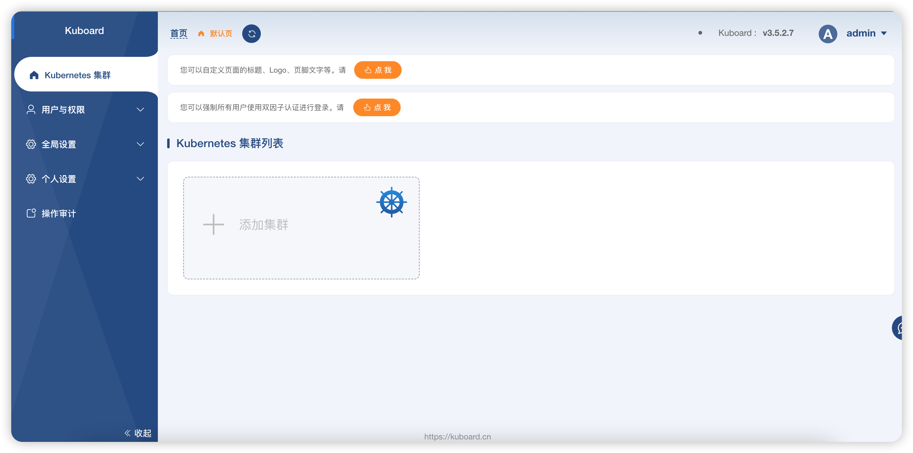

### 3.2 创建集群

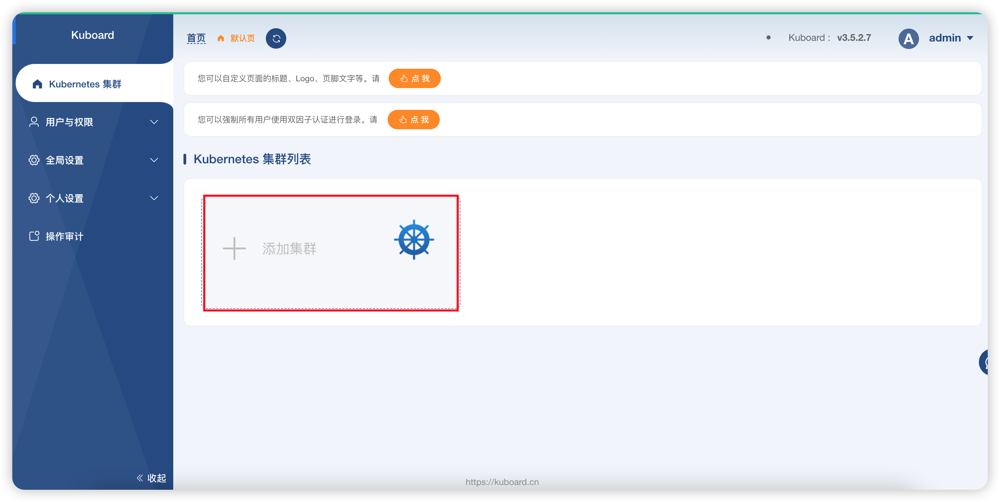

选择 KubeConfig 方式

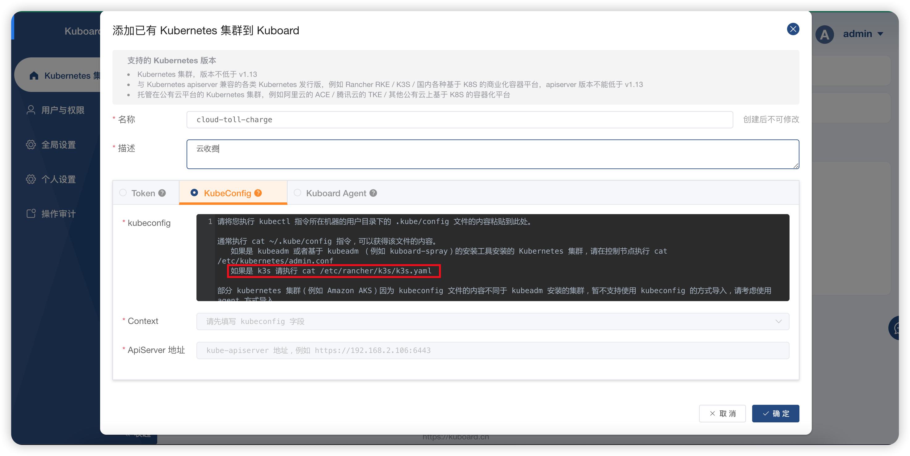

按照提示登录到 `k3s-master` 上执行 `cat /etc/rancher/k3s/k3s.yaml`

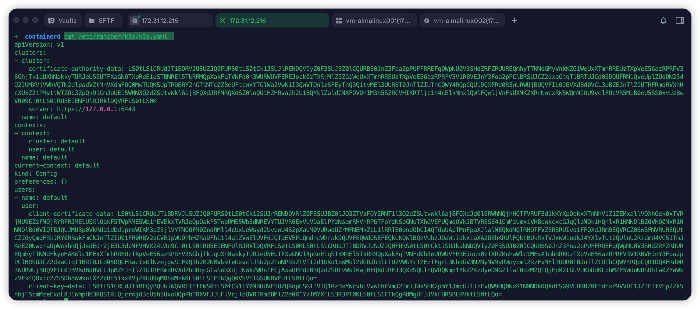

复制并粘贴 `/etc/rancher/k3s/k3s.yaml`内容

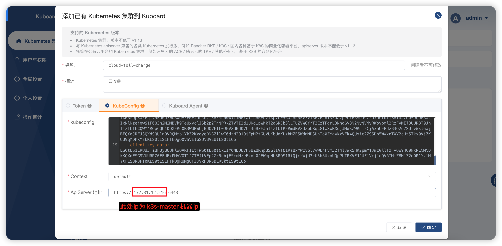

集群创建成功

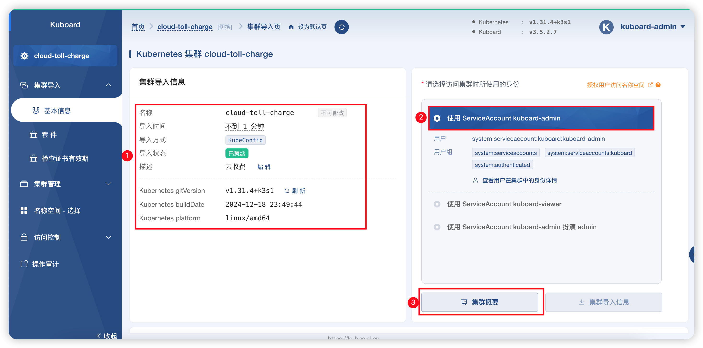

### 3.3 查看集群信息

点击创建的集群，点击 `集群概要`, 查看集群概要信息，可以看到 k3s-master, k3s-node01, k3s-node02 3 个节点都已经被管理:

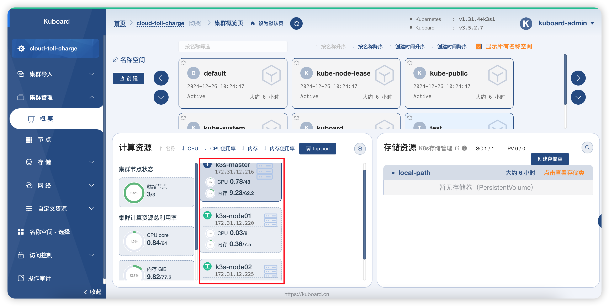

## 4. 通过 Kuboard 部署应用

### 4.1 创建命名空间

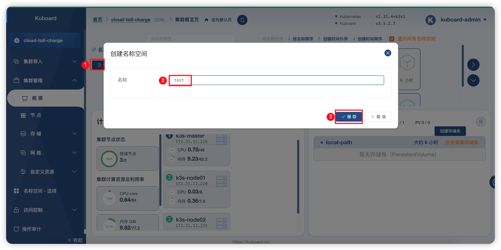

创建成功

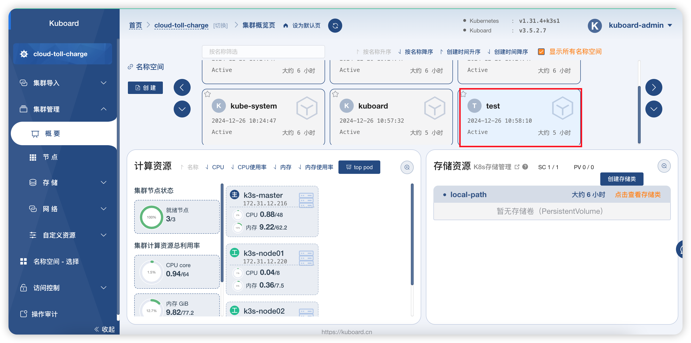

点击 test 进入命名空间，依次点击常用操作—创建工作负载。如下图依次填写工作负载名称、副本数、然后点部署

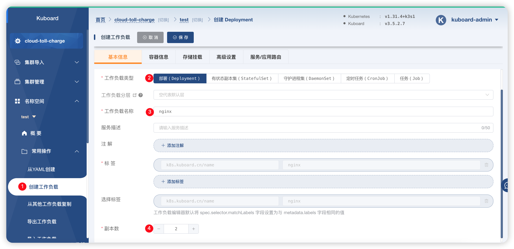

### 4.2 配置容器信息

#### 4.2.1 配置 Harbor 支持 https 访问

请参照  [Harbor 安全访问](docs/Infrastructure/环境/Harbor镜像仓库/Harbor安全访问/Harbor安全访问.md)

#### 4.2.1 containerd 接入 harbor 仓库

K3s 使用  containerd 容器运行时，可以配置 Containerd 连接到私有镜像仓库，并使用它们在节点上拉取私有镜像。

启动时，K3s 会检查`/etc/rancher/k3s/`中是否存在`registries.yaml`文件，并指示 containerd 使用文件中定义的镜像仓库。如果你想使用一个私有的镜像仓库，那么你需要在每个使用镜像仓库的节点上以 root 身份创建这个文件。

请注意，server 节点默认是可以调度的。如果你没有在 server 节点上设置污点，那么将在它们上运行工作负载，请确保在每个 server 节点上创建`registries.yaml`文件。

Containerd 中的配置可以用于通过 TLS 连接到私有镜像仓库，也可以与启用验证的镜像仓库连接

##### 4.2.1.1 停止 K3s 服务

需要停止 K3s 的 Server 及 Agent 节点服务

登陆到 `k3s-master` 节点`192.168.0.110`上，执行以下命令

```bash
systemctl stop k3s
```

登陆到 `k3s-node01` 节点`172.31.12.220`上，执行以下命令

```bash
systemctl stop k3s-agent
```

登陆到 `k3s-node02` 节点`172.31.12.2205 上，执行以下命令

```bash
systemctl stop k3s-agent
```

##### 4.2.1.2 配置 k3s-master

```bash
vi /etc/rancher/k3s/registries.yaml
```

写入内容为:

```yaml
mirrors:
  docker.io:
    endpoint:
      - "https://harbor.repo:8443"
configs:
  "harbor.repo:8443":
    auth:
      username: admin
      password: Harbor12345
    tls:
      ca_file: /data/harbor/ssl/ca.crt
      cert_file: /data/harbor/ssl/harbor.repo.crt
      key_file: /data/harbor/ssl/harbor.repo.key
```

重启 K3s 服务使配置生效:

```bash
systemctl restart k3s
```

查看生效配置:
```bash
cat /var/lib/rancher/k3s/agent/etc/containerd/config.toml
```

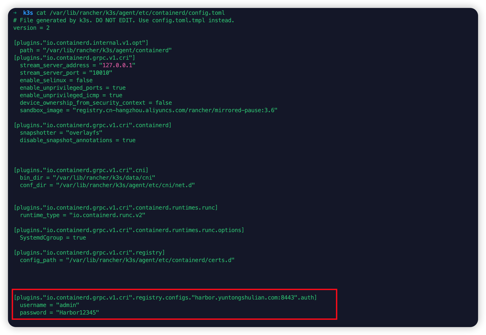

##### 4.2.1.3 配置 k3s-node01

在 k3s-node01 上创建证书目录

```bash
mkdir /data/harbor/ssl
```


 将证书文件从 k3s-master 复制到 k3s-node01:

```bash
cd /data/harbor/ssl

scp ca.crt harbor.repo.{crt,key} root@172.31.12.220:/data/harbor/ssl/
```


在 k3s-node01 上创建 `/etc/rancher/k3s/` 目录

```bash
mkdir /etc/rancher/k3s/
```


将 `/etc/rancher/k3s/registries.yaml` 从 k3s-master 复制到 k3s-node01:

```bash
scp /etc/rancher/k3s/registries.yaml root@172.31.12.220:/etc/rancher/k3s/
```


在 k3s-node01 上重启 k3s-agent：

```bash
systemctl start k3s-agent
```

查看生效配置:
```bash
cat /var/lib/rancher/k3s/agent/etc/containerd/config.toml
```

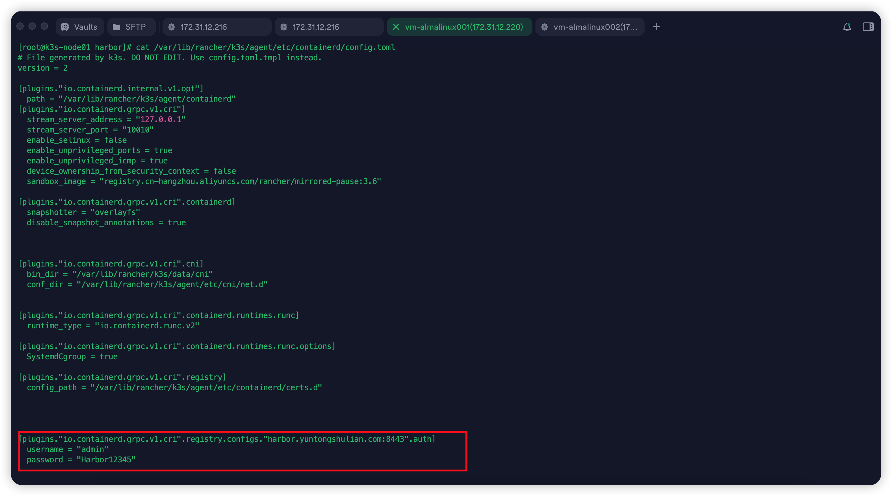

##### 4.2.1.4 配置 k3s-node02

在 k3s-node02 上创建证书目录

```bash
mkdir /data/harbor/ssl
```


 将证书文件从 k3s-master 复制到 k3s-node02:

```bash
cd /data/harbor/ssl

scp ca.crt harbor.repo.{crt,key} root@172.31.12.225:/data/harbor/ssl/
```


在 k3s-node02 上创建 `/etc/rancher/k3s/` 目录

```bash
mkdir /etc/rancher/k3s/
```


将 `/etc/rancher/k3s/registries.yaml` 从 k3s-master 复制到 k3s-node02:

```bash
scp /etc/rancher/k3s/registries.yaml root@172.31.12.225:/etc/rancher/k3s/
```


在 k3s-node02 上重启 k3s-agent：

```bash
systemctl start k3s-agent
```

查看生效配置:
```bash
cat /var/lib/rancher/k3s/agent/etc/containerd/config.toml
```
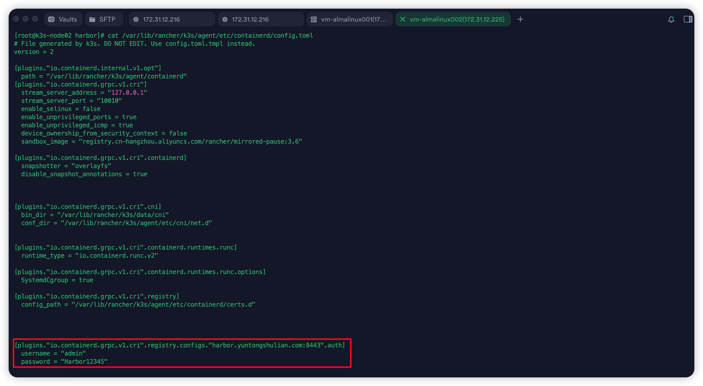

### 4.3 添加容器信息

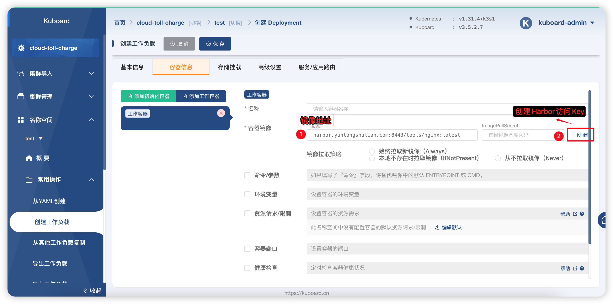

创建 Harbor 访问密钥

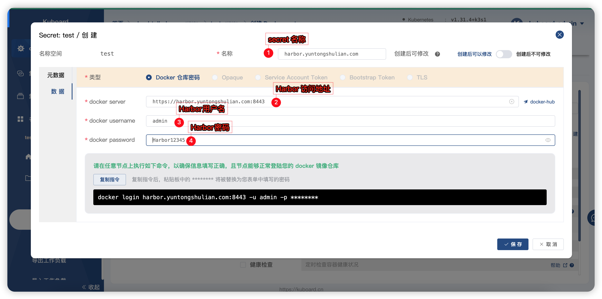

选择 Harbor 访问密钥

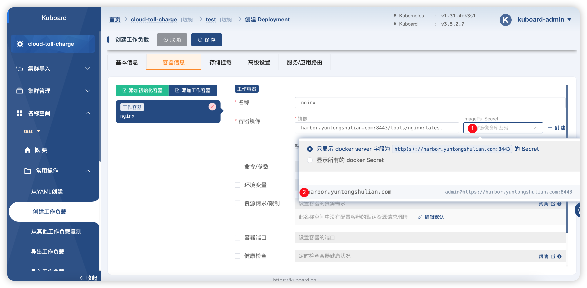

### 4.4 添加端口映射

在`服务/应用路由`中选择`服务`，并添加`端口`，服务类型选择为`NodePort`，配置端口映射:

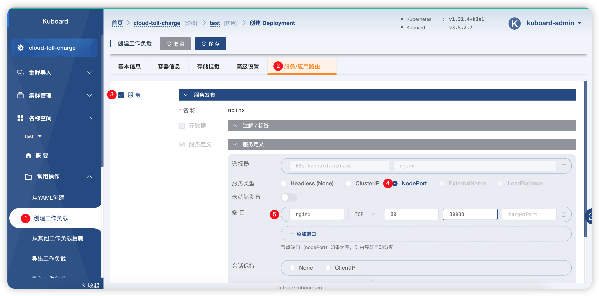

保存 > 应用

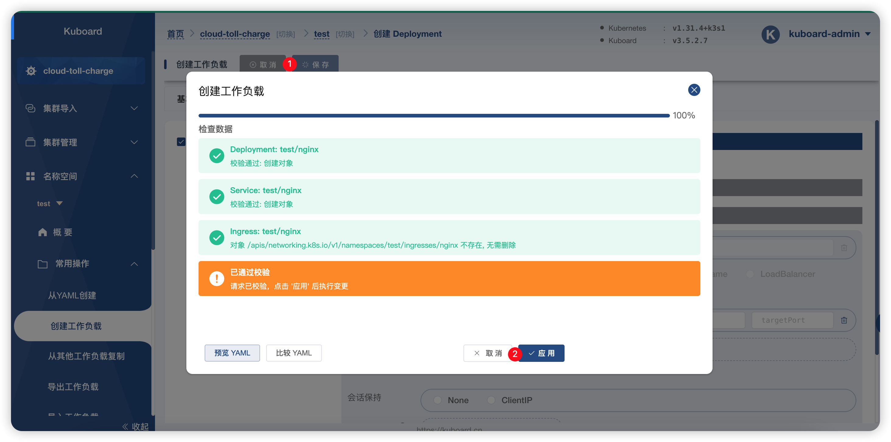

### 4.5 创建工作负载成功

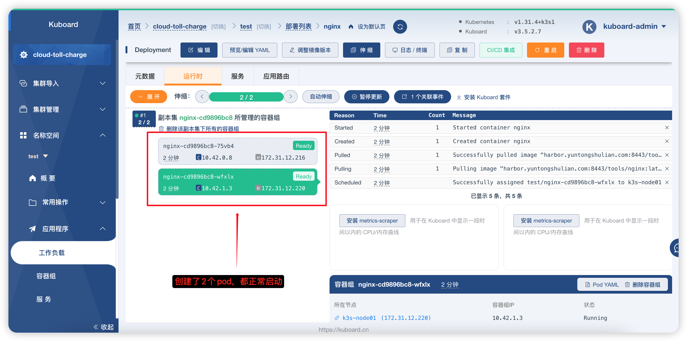

### 4.6 验证

k3s-master:

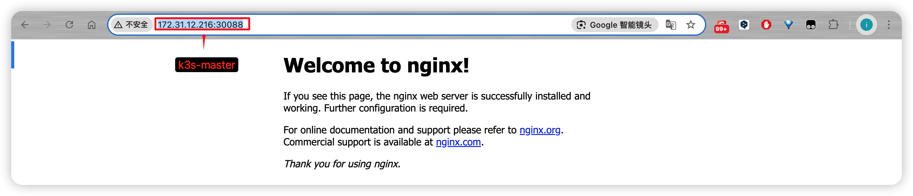

#### 5.4 添加容器挂载
为容器添加存储
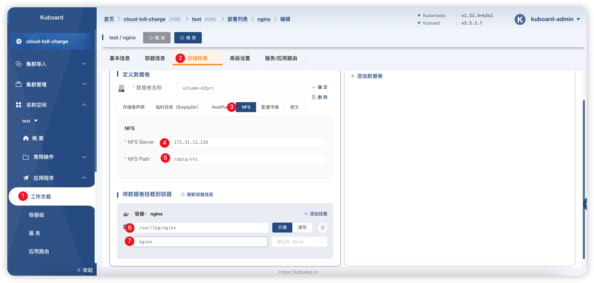

验证:
k3s-master:
```bash
➜  nfs ll /data/nfs/nginx           
total 4.0K
-rw-r--r-- 1 root root    0 12月 27 13:28 access.log
-rw-r--r-- 1 root root 3.2K 12月 27 13:28 error.log
```

k3s-node01:
```bash
[root@k3s-node01 data]# ll /data/nfs/nginx/
total 4
-rw-r--r-- 1 root root    0 Dec 27 13:28 access.log
-rw-r--r-- 1 root root 3176 Dec 27 13:28 error.log
```

k3s-node02:
```bash
[root@k3s-node02 data]# ll /data/nfs/nginx/
total 4
-rw-r--r-- 1 root root    0 Dec 27 13:28 access.log
-rw-r--r-- 1 root root 3176 Dec 27 13:28 error.log
```

