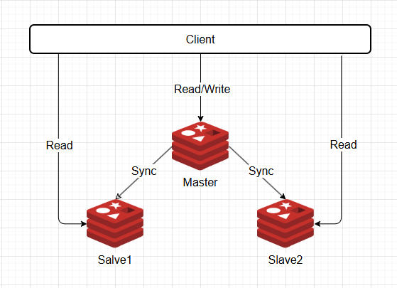
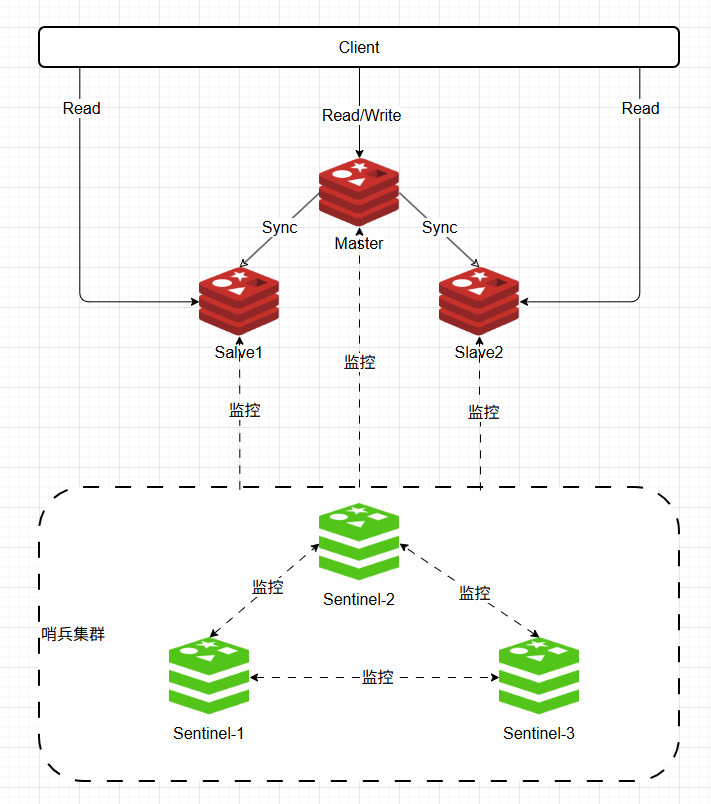
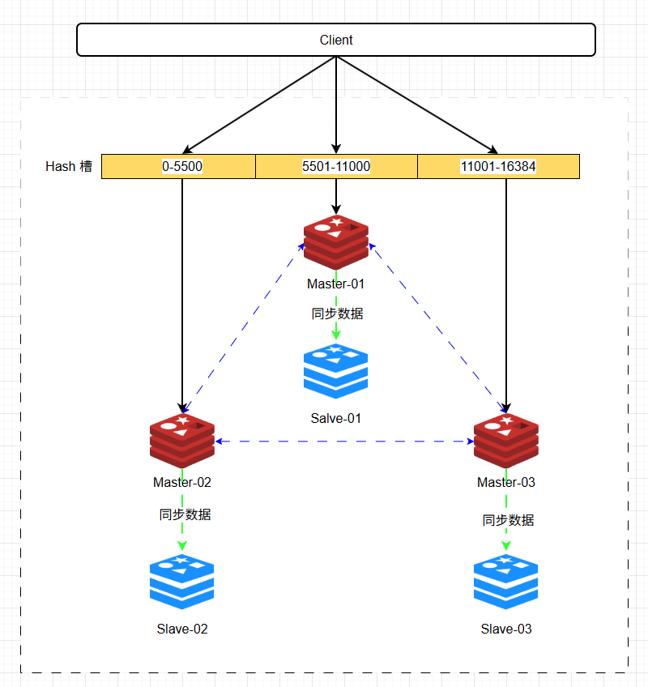

## 1. 简介
对于 Redis 来说，单一实例的工作模式通常无法保证 Redis 的可用性和拓展性，Redis 提供了高可用三种分布式方案：

- 主从模式
- 哨兵模式
- 集群模式

## 2. 主从模式

Redis 的主从模式是一种**数据备份**和**读写分离**的模式。在这种模式下，有一个主节点（Master）和一个或多个从节点（Slave）。所有的写操作都在主节点上进行，而读操作可以在主节点和从节点上进行。从节点会复制主节点的数据，实现数据的备份。

### 2.1 概述

- 这种模式是 Redis 高可用架构的基础机制。
- 它允许一个 Redis 服务器（主节点）将其数据**异步**复制到一个或多个 Redis 服务器（从节点）。
- 数据流向是**单向**的：从主节点复制到从节点。

### 2.2 核心原理

- 连接建立
  - 从节点启动后，通过 `replicaof <master-ip> <master-port>` 命令或配置文件连接主节点。
  - 从节点向主节点发送 `SYNC` 或 `PSYNC` 命令（Redis 2.8+）请求同步数据。
- 全量同步**(SYNC / Full Resynchronization)**
  - **首次连接**或**主从节点复制积压缓冲区不足时**触发。
  - 主节点执行 `BGSAVE`（后台保存）生成一个 RDB 快照文件。
  - 生成完成后将 RDB 文件传输给从节点。
  - 从节点清空自身旧数据，加载接收到的 RDB 文件。
  - 主节点在生成和传输 RDB 期间的新写命令，会记录在“复制缓冲区”中。
  - 从节点加载完 RDB 后，主节点再将缓冲区内的命令发送给从节点执行，使两者最终保持一致。
- 增量同步 (PSYNC / Partial Resynchronization)
  - Redis 2.8+ 引入，提升效率，**降低网络中断后恢复复制的成本**。
  - 主节点会在内存中维护一个固定大小的**复制积压缓冲区 (Replication Backlog Buffer)**。
  - 从节点断开重连后，向主节点报告自己已复制的偏移量。
  - 如果偏移量之后的数据仍然在积压缓冲区中，主节点只需将从节点缺失的那部分增量命令发送过去。
  - 否则，降级为全量同步。
- **持续复制**： 完成初始化同步（全量或增量）后，主节点接收到的每条写命令都会异步发送给所有连接的从节点执行。

### 2.3 应用场景

- **读写分离**：主节点处理写操作（和部分读操作），多个从节点分担读操作负载。适用读多写少的场景。
- **数据热备份**：从节点是主节点数据的实时副本，提供**数据冗余**，在主节点故障时，从节点是数据的恢复来源（需要手动干预）。
- **灾难恢复**：可在异地部署从节点，在主数据中心故障时，作为灾备恢复点。
- **离线数据分析/报表**：可以在不影响主节点性能的情况下，在从节点上运行慢查询或数据统计操作。

## 3. 哨兵模式 (Sentinel)

Redis 的哨兵模式是在主从模式的基础上，增加了故障转移的功能。

哨兵模式下，除了主节点和从节点，还有一个或多个哨兵节点（Sentinel）。哨兵节点的主要任务是监控主节点和从节点的运行状态，并在主节点发生故障时，自动将从节点提升为主节点。

### 3.1 概述

- Sentinel 是 Redis **官方提供的原生高可用性 (HA) 解决方案**。
- **不直接处理读写请求**，而是作为一个**分布式监控和管理系统**运行。
- 核心任务是**监控**主节点和从节点的健康状态，并在主节点发生故障时，自动执行**故障转移**。
- 由多个哨兵节点（Sentinel）共同组成集群，避免单点故障

### 3.2 核心原理

- 监控

  - 每个哨兵节点通过发送 `PING` 命令监控所有主节点、从节点和其他哨兵节点的状态。
  - 通过配置发现主节点下的所有从节点。

- 通知

  - 哨兵发现某个节点不可达（`PING` 超时且达到一定阈值）时，可以在需要时发送通知（告警）。

- 自动故障转移 (Failover)

  当一个哨兵判定主节点客观下线 ( Objectively Down ODOWN ) 时（需要获得多数哨兵的同意），它将发起故障转移流程：

  1. **选举领导者哨兵**： 多个哨兵通过 Raft 选举算法选出一个领导者来协调故障转移。

  2. **选择新主节点**： 领导者哨兵根据规则（优先级、复制偏移量、Run ID 等）从存活的从节点中选出一个晋升为新主节点。

  3. **提升新主**： 向被选中的从节点发送 `REPLICAOF NO ONE` 命令，使其成为新的主节点。
  4. **切换从属关系**： 向其他所有从节点发送 `REPLICAOF <new-master-ip> <new-master-port>` 命令，让它们复制新的主节点。
  5. **更新配置**： 通知并更新客户端或其他需要使用 Redis 的应用配置信息（指向新的主节点）。

- 配置中心

  - 哨兵充当了客户端发现 Redis 服务当前状态的权威来源。客户端连接到哨兵集群获取当前主节点的地址。
  - 哨兵本身提供主节点地址信息，客户端连接到它询问谁是主节点。

### 3.3 应用场景

- **自动主节点故障恢复**： 当主节点发生硬件故障、进程崩溃、网络隔离等导致不可用时，无需人工干预，自动完成从节点晋升和新主从关系建立。
- **高可用集群**： 提供近似零宕机的服务能力（故障转移时存在少量瞬断）。适用于需要持续可用性的线上服务。
- **服务发现**： 客户端库（如 Java Jedis/Sentinel 客户端）可以通过询问哨兵集群来动态获取最新的主节点地址。
- **集群状态监控**： 通过哨兵 API 或工具可以方便地监控主从节点的在线状态和配置信息。

## 4. 集群模式

哨兵模式解决了主从复制不能自动故障转移，达不到高可用的问题，但还是存在难以在线扩容，Redis 容量受限于单机配置的问题。

Redis 的集群模式实现了 Redis 的分布式存储，它允许多个 Redis 节点（服务器）协同工作，提供更高的性能和可用性(即每台节点存储不同的内容，来解决在线扩容的问题)。在这种模式下，数据被分片存储在多个节点上，每个节点负责一部分数据的读写。

在集群模式下，Redis 使用一种叫做**哈希槽**的技术来实现数据的分片。整个哈希空间被分成**16384**个哈希槽，每个节点负责一部分哈希槽。当一个键需要被存储时，Redis 会根据键的值计算出一个哈希值，然后根据哈希值决定将这个键存储在哪个节点上。这样，读写请求就可以在多个节点上并行处理，提高了系统的性能。

### 4.1 概述

- 集群模式是 Redis 原生提供的分布式数据库解决方案。
- 核心目标是**水平扩展**，通过**分片 (Sharding)** 机制将数据自动分散存储在**多个节点**上，解决**单机内存容量、网络带宽、计算能力的瓶颈**。
- **结合了主从复制（每个分片内部）和高可用（类似哨兵的自动故障转移）**。
- **无中心节点**，数据被划分为 16384 个**哈希槽 (Hash Slot)**，由集群中的所有主节点共同分担存储。

### 4.2 核心原理

- 数据分片 (Sharding)

  - 集群的所有键会被映射到固定的 16384 个槽中 (`CRC16(key) mod 16384`)。
  - 集群上线前，管理员需将槽位分配给各主节点（可以手动指定或自动平衡）。
  - 集群会自动跟踪槽位的分布情况。

- 节点结构

  - 集群由多个 Redis 节点组成，每个节点要么是主节点，要么是从节点。

  - 主节点：

    - 负责存储和管理分配给它的槽位中的数据。
  - 处理客户端对这些槽位中数据的读写请求。
    - 参与集群状态决策（如故障检测、选举）。

  - 从节点：

    - 异步复制其主节点的数据，提供数据副本。
    - 在主节点故障时，有可能被选为新的主节点（参与主节点选举）。
    - 可以处理读请求分担负载。
  
- 请求路由 (Gossip Protocol & Smart Client)

  - MOVED / ASK 重定向：

    - 客户端直接连接集群中的任意节点。
- 如果请求的键所在的槽不由该节点处理，节点会返回一个 `MOVED <slot> <node-ip>:<node-port>` 错误，告诉客户端正确的节点地址。
    - 在集群迁移槽位时，请求的键可能已经迁移走但节点还不知道最新位置（或正在迁移中），会返回 `ASK` 错误进行重定向。

  - **Smart Client**： 成熟的 Redis Cluster 客户端库会缓存槽位与节点的映射关系，并根据 `MOVED/ASK` 响应动态更新缓存，减少重定向次数。

- 集群总线 (Cluster Bus)：

  - 节点间通过专用的二进制协议（TCP 端口通常是节点端口号+10000）进行通信（通过 Gossip 协议）。
  - 用于故障检测、节点间状态信息传播（`PING/PONG`）、配置更新通知（如槽位迁移完成、新主节点生效）等。
  
- 故障检测与转移 (基于 Gossip)：

  - 节点定期（秒级）与其他节点交换`PING/PONG`消息。

  - 如果一个节点在一定时间内未被其他节点响应，它会被该节点标记为**疑似下线 (PFAIL)**。

  - 当集群中多数主节点都将某个主节点 X 标记为 PFAIL 时，X 被标记为**客观下线 (FAIL)**。

  - 触发选举： X 的从节点检测到其主节点 FAIL，会尝试发起选举成为新主节点：

    1. **资格检查**： 从节点距离上次与主节点通信不能太久。
    2. **延迟选举**： 稍作等待（`RAND` 范围内的延迟），让主节点下线信息更充分传播。
    3. **选举请求**： 向所有其他主节点广播 `FAILOVER_AUTH_REQUEST` 消息请求投票。
    4. **投票授权**： 收到请求的主节点给第一个请求投票（每个纪元只投一票）。
    5. **成为主节点**： 获得**超过半数主节点**投票的从节点，执行 `REPLICAOF NO ONE` 成为新主。
    6. **接管槽位**： 新主节点接管其旧主节点负责的所有槽位。
    7. **广播更新**： 通知整个集群配置已变更。
    
  - 集群完整性保障：
  
    - 只有当集群中超过半数的槽位（严格说是主节点）可用时，集群才继续可用（接受写请求）。
  - 否则，集群将进入 `FAIL` 状态，拒绝写操作。

### 4.3 日常应用场景

- **海量数据存储**： 当数据集大小远超单台服务器内存容量（几十上百 GB 甚至 TB 级），需要分布式存储。
- **超高并发访问**： 当单机 Redis 实例的处理能力（每秒 OPS 或网络带宽）成为瓶颈时，多个主节点可以分摊读写压力。
- **业务隔离**： 可以将不同业务的数据分散在不同的主节点上（通过配置键前缀等方式），实现某种程度的逻辑隔离。
- **追求原生分布式与高可用结合**： 需要同时满足数据量大、高并发和高可用的严苛场景，并且希望使用官方原生方案。
- **规避代理层**： 相比于使用 Twemproxy/Codis 等代理分片方案，Redis Cluster 消除了代理层可能带来的瓶颈和复杂性

## 5. 对比总结

|       特性       |           主从复制           |          哨兵模式(Sentinel)          |                 Cluster                  |
| :--------------: | :--------------------------: | :----------------------------------: | :--------------------------------------: |
|   **核心目的**   | 数据冗余、读写分离、数据备份 |     主节点故障时 **自动高可用**      |       水平扩展 (**分片**) + 高可用       |
|   **数据分布**   |      单主或多主（独立）      |       单主（可能多级链式复制）       |     **多主** (数据分片到多个主节点)      |
|    **扩展性**    | 仅能水平扩展读（添加从节点） |   同样只能水平扩展读（添加从节点）   |    **能水平扩展读写和存储**(添加节点)    |
|   **高可用性**   |   无自动故障转移（需手动）   |   **提供自动故障转移 (Failover)**    |           **内建自动故障转移**           |
|    **复杂性**    |            最简单            |                较简单                |    **最复杂** (分片、路由、集群管理)     |
|    **客户端**    |     简单，直接连主从节点     | 需要支持 Sentinel 的客户端获取主节点 |  需要支持 Cluster 协议的 **智能客户端**  |
|    **数据量**    |        受限于单机内存        |            受限于单机内存            |    可水平扩展（理论上可突破单机限制）    |
| **网络分区处理** |              弱              |      弱（多数哨兵存活即可决策）      | 相对强（需多数主节点存活才能提供写服务） |
|   **典型场景**   | 数据备份、读写分离、小型应用 | 高可用性要求高、但数据量/写并发适中  |   **大数据量、高并发、高可用三者兼备**   |
|     **限制**     | 主节点单点故障（无自动转移） |     写性能和存储容量无法水平扩展     | 部分多键操作限制（需在同分片）、迁移阻塞 |

**选择指南**：

1. **仅需读写分离或数据备份**： **主从复制**（最轻量级）。
2. **需要高可用但数据量/写压力不大**： **主从复制 + 哨兵模式**。
3. **数据量巨大（超过单机内存）或写并发极高、且要求高可用**： **Redis Cluster**。
4. **想使用主从复制但需要手动干预故障转移（简单维护）**： 单独使用**主从复制**。