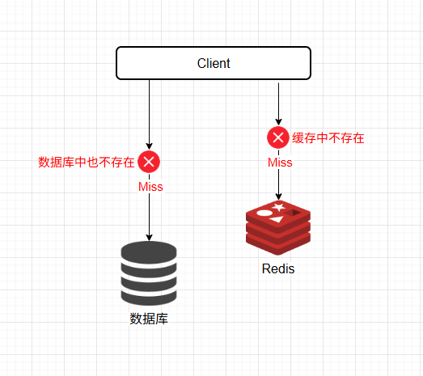
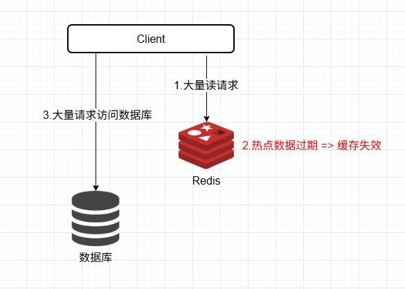
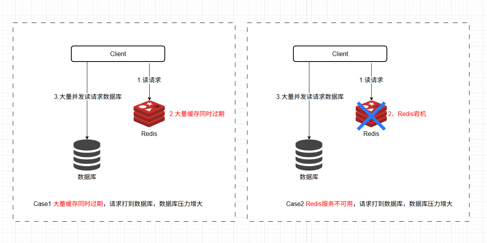

## 1. 缓存穿透
### 1.1 定义

缓存穿透是指**恶意用户或程序请求查询的数据在缓存和数据库中都不存在**，导致每次请求都会直接打到数据库，绕过缓存。由于缓存没有存储该请求的结果，所有这类请求都会绕过缓存，直接访问数据库，从而导致数据库承受巨大的压力。



### 1.2 产生原因

- **恶意攻击**：有意构造大量不存在的数据请求，如查询不存在的用户 ID 或商品 ID，缓存中没有这些数据，因此直接请求数据库。
- **查询不存在的键**：一些业务逻辑上无法避免查询不存在的数据，例如用户查询某些过时或错误的请求参数，数据库中也没有相应的记录。

### 1.3 危害

- **数据库性能下降**：由于查询的数据既不在缓存中，也不在数据库中，因此每次请求都会直接打到数据库，造成数据库压力增大，甚至引发性能瓶颈。

### 1.4 解决方案
#### 1.4.1 缓存空值(主要)
当数据库中查不到数据的时候，就缓存一个空对象，然后给这个空对象的缓存设置一个过期时间，这样下次再查询该数据的时候，就可以直接从缓存中拿到，从而达到了减小数据库压力的目的。

缺点：

1. 需要缓存层提供更多的内存空间来缓存这些空对象，当这种空对象很多的时候，就会浪费更多的内存；
2. 会导致缓存层和存储层的数据不一致，即使在缓存空对象时给它设置了一个很短的过期时间，那也会导致这一段时间内的数据不一致问题

#### 1.4.2 布隆过滤器(主要)

布隆过滤器是一种基于哈希算法的数据结构，用于快速判断一个元素是否存在于一个集合中。在请求到达缓存之前，先通过布隆过滤器判断该请求是否合法。如果布隆过滤器判断该请求不存在，则直接返回，避免查询数据库。这样可以有效拦截掉绝大多数不存在的请求，防止这些请求绕过缓存直接打到数据库。

优点是内存占用较少，适合处理大规模数据，Redis 缓存中也不会存储多余的键。但是实现相对复杂，并且存在一定的误判率，但可以通过调整布隆过滤器的参数来降低误判率。

#### 1.4.3 增强数据的合法性校验(主要)
在查询请求进入系统前，进行严格的参数校验和过滤，避免不合法的请求进入系统。例如用户 ID 或商品 ID 是否符合格式要求，避免恶意构造的非法请求直接打到数据库。

4、使用分布式锁
在缓存穿透的场景下，当多个请求同时发现缓存中没有数据时，可以使用分布式锁（如 Redis 的 SETNX 命令）来确保只有一个请求去数据库查询数据并更新缓存，其他请求等待锁释放后直接从缓存获取数据。

5、限流和熔断
对于高频请求，可以采用限流策略，限制单位时间内对某个接口的访问次数。当请求量超过阈值时，直接返回错误或排队等待。此外，还可以结合熔断机制，在缓存穿透导致数据库压力过大时，暂时停止对数据库的访问。

6、设置热点数据永不过期
对于一些热点数据（如热门商品信息），可以设置其缓存永不过期，或者通过后台线程定期更新缓存。这样可以避免因缓存过期而导致的缓存穿透问题。

7、二级缓存
也可以采用缓存雪崩中的二级缓存解决办法，A1 为原始缓存，A2 为拷贝缓存，A1 失效后可以访问 A2，A1 缓存失效的时间可以设置短期，A2 缓存可以设置为长期。其中 A2 可以是热点缓存，将 A1 中的热点缓存记录并放入 A2，应对突发情况。

不同的解决方案适用于不同的场景，可以根据实际需求选择合适的方法。例如，对于小规模应用，缓存空对象或增强数据校验可能足够；而对于大规模高并发系统，布隆过滤器或分布式锁可能是更好的选择。

## 2. 缓存击穿

### 2.1 定义

缓存击穿是指**缓存中存储的某个热点数据在某一时刻失效**，大量并发请求同时去访问这个热点数据，持续的高并发就穿破缓存，直接请求数据库。

> 缓存击穿和缓存雪崩的区别在于缓存击穿是针对某一个 Key 缓存而盲，缓存雪崩则是针对很多 Key。



### 2.2 产生原因

- **热点缓存失效**：缓存击穿是指缓存中的某个热点数据（通常是访问量非常高的数据）在某个时间点过期，此时若有大量并发请求访问这个数据，就会直接请求到数据库，导致数据库压力骤增。

### 2.3 危害

- **数据库压力过大**：由于热点数据失效，导致瞬间的大量请求直接打到数据库，增加数据库的压力，可能会引发数据库连接耗尽、响应变慢等问题，严重时可能导致数据库宕机。

### 2.4 解决方案

#### 2.4.1 设置热点数据过期时间

热点 key 设置极长 TTL 或定期主动刷新，防止失效。

#### 2.4.2 互斥锁（Mutex）机制

- 为了解决在缓存失效瞬间，大量请求同时访问数据库的问题，可以通过加锁机制，保证同一时刻只有一个线程能访问数据库。其他线程需要等待该线程将新数据写入缓存后，再读取缓存。

```java
String value = redisTemplate.opsForValue().get(key);
if (value == null) {
    // 获取分布式锁
    if (redisTemplate.opsForValue().setIfAbsent(lockKey, "lock", 10, TimeUnit.SECONDS)) {
        try {
            // Double-check
            value = redisTemplate.opsForValue().get(key);
            if (value == null) {
                // 查询数据库
                value = database.get(key);
                // 将结果写入缓存
                redisTemplate.opsForValue().set(key, value, ttl, TimeUnit.SECONDS);
            }
        } finally {
            // 释放锁
            redisTemplate.delete(lockKey);
        }
    } else {
        // 等待锁释放后，再从缓存中读取数据
        Thread.sleep(100); // 自行调整等待时间
        value = redisTemplate.opsForValue().get(key);
    }
}
```

#### 2.4.3 逻辑过期

逻辑过期是指在缓存中存储数据时，将数据和过期时间一起存储。当查询缓存时，先检查数据是否过期，如果未过期，直接返回数据，如果已过期，启动独立线程去更新缓存，同时返回旧数据。这样做的优点在于即使缓存已过期，也可以先返回旧数据。

```java
@Data
public class RedisData {
    private LocalDateTime expireTime;
    private Object data;
}

// 查询缓存
String json = stringRedisTemplate.opsForValue().get(key);
if (StrUtil.isNotBlank(json)) {
    RedisData redisData = JSONUtil.toBean(json, RedisData.class);
    if (redisData.getExpireTime().isAfter(LocalDateTime.now())) {
        return redisData.getData();
    } else {
        // 启动独立线程更新缓存
        CACHE_REBUILD_EXECUTOR.submit(() -> {
            try {
                Object newData = queryDatabase(key);
                setCacheWithLogicalExpire(key, newData, expireTime);
            } catch (Exception e) {
                throw new RuntimeException(e);
            }
        });
        return redisData.getData(); // 返回旧数据
    }
}
```

#### 2.4.4 预防性缓存更新

在热点数据即将过期时，提前异步刷新缓存。通过检测热点数据的访问频率，当即将过期时触发自动更新操作，避免过期瞬间的击穿问题。

#### 2.4.5 本地缓存和 Redis 缓存（二级缓存）
采用多级缓存架构，在本地缓存中存储热点数据，先查询本地缓存，如果本地缓存失效，则查询 Redis 缓存。

```java
// 查询本地缓存
Object data = localCache.get(key);
if (data == null) {
    // 查询Redis缓存
    String json = stringRedisTemplate.opsForValue().get(key);
    if (StrUtil.isNotBlank(json)) {
        data = JSONUtil.toBean(json, type);
        localCache.put(key, data); // 更新本地缓存
    }
}
return data;
```

> 互斥锁适用于缓存失效时需要保护数据库的场景。
> 逻辑过期适用于需要快速返回数据且对数据实时性要求不高的场景。
> 热点数据永不过期适用于热点数据频繁访问的场景。
> 布隆过滤器适用于数据量大且需要快速判断 Key 是否存在的场景。
> 多级缓存适用于需要进一步减轻数据库压力的场景。

## 3. 缓存雪崩

### 3.1 定义

缓存雪崩是指**在某一时刻，大量缓存同时失效**，导致大量请求直接打到数据库层，造成数据库压力骤增，甚至可能导致数据库崩溃、系统不可用的情况。



### 3.2 产生原因

- **缓存集中失效**：通常情况下，缓存的失效时间（TTL）是设置好的，但如果大量缓存键设定了相同或接近的过期时间点，那么在这些缓存集中失效时，会造成大量的请求无法从缓存中读取数据，只能直接访问数据库。
- **缓存服务器宕机**：如果 Redis 服务器集群出现宕机或故障，那么所有缓存数据会瞬间不可用，大量请求直接涌向数据库。

### 3.3 危害

- **数据库压力激增**：大量并发请求瞬间打到数据库，可能造成数据库连接数耗尽、性能下降，甚至宕机。
- **服务不可用**：由于数据库无法及时响应请求，系统整体响应速度变慢或完全失去响应，导致服务不可用。

### 3.4 解决方案

#### 3.4.1 缓存预热(主要)
在系统上线前，提前将热点数据加载到缓存中，避免大量请求同时触发缓存未命中的情况。

#### 3.4.2 缓存过期时间分散化(主要)
可以为不同的缓存键设置不同的失效时间（TTL），使得缓存的过期时间均匀分布，避免大量缓存同时失效。例如，在设定 TTL 时，加上一个随机值，避免缓存键在同一时间失效。

#### 3.4.3 降级限流

对于出现缓存雪崩后的补救措施可以使用服务降级和请求限流等机制进行补救。服务降级的最终目的就是保证核心服务可用，即使是有损的。服务降级应当提前确定好哪些服务是可降级的，不同情况下不同的服务的优先级也不同。

在缓存雪崩时，可以采取拒接服务、延迟服务、限流（限制访问流量）、出现异常降级处理等策略，减缓数据库的压力。如在缓存失效时，直接返回默认值或缓存过期的旧数据，避免数据库短时间内处理大量请求。

#### 3.4.4 多级缓存

采用多级缓存架构，在本地缓存中存储热点数据，先查询本地缓存，如果本地缓存失效，则查询 Redis 缓存。

```java
// 查询本地缓存
Object data = localCache.get(key);
if (data == null) {
    // 查询Redis缓存
    String json = stringRedisTemplate.opsForValue().get(key);
    if (StrUtil.isNotBlank(json)) {
        data = JSONUtil.toBean(json, type);
        localCache.put(key, data); // 更新本地缓存
    }
}
return data;
```

#### 3.4.5 加锁控制对某个缓存的读线程数量
在缓存失效后，通过加锁或者队列的方式，来控制读数据库和写缓存的线程数量，例如对于某个 Key ，只允许一个线程查询数据和写缓存，其他线程等待。

#### 3.4.6 Redis 高可用

部署 Redis 主从集群，使用 Redis 的哨兵模式（Sentinel）或者 Redis Cluster 来实现高可用，避免缓存服务器单点故障
