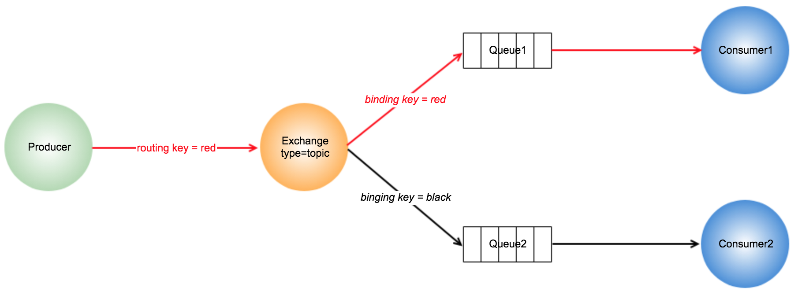
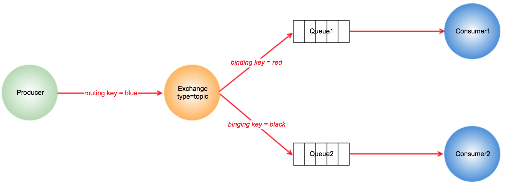
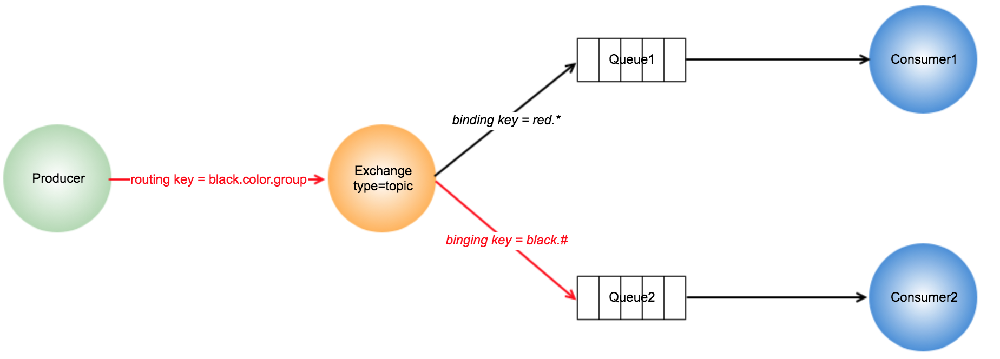

RabbitMQ 是一个由 erlang 开发的 AMQP（Advanced Message Queue ）的开源实现

## 什么是 AMQP
AMQP（高级消息队列协议）是一个网络协议。支持符合要求的客户端应用（application）和消息中间件代理（messaging middleware broker）之间进行通信。
消息代理（message brokers）从发布者（publishers）亦称生产者（producers）那儿接收消息，并根据既定的路由规则把接收到的消息发送给处理消息的消费者（consumers）。
由于 AMQP 是一个网络协议，所以这个过程中的发布者，消费者，消息代理 可以存在于不同的设备上。

## AMQP 原理

AMQP 工作过程如下图：消息（message）被发布者（publisher）发送给交换机（exchange），然后交换机将收到的消息根据路由规则分发给绑定的队列（queue）。最后 AMQP 代理会将消息投递给订阅了此队列的消费者，或者消费者按照需求自行获取。

发布者（publisher）发布消息时可以给消息指定各种消息属性（message meta-data）。有些属性有可能会被消息代理（brokers）使用，然而其他的属性则是完全不透明的，它们只能被接收消息的应用所使用。

从安全角度考虑，网络是不可靠的，接收消息的应用也有可能在处理消息的时候失败。基于此原因，AMQP 模块包含了一个消息确认（message acknowledgements）的概念：当一个消息从队列中投递给消费者后，消费者会通知消息代理（broker），这个可以是自动的也可以由处理消息的应用的开发者执行。当“消息确认”被启用的时候，消息代理不会完全将消息从队列中删除，直到它收到来自消费者的确认回执（acknowledgement）。

在某些情况下，例如当一个消息无法被成功路由时，消息或许会被返回给发布者并被丢弃。或者，如果消息代理执行了延期操作，消息会被放入一个所谓的死信队列中。此时，消息发布者可以选择某些参数来处理这些特殊情况。

队列，交换机和绑定统称为 AMQP 实体（AMQP entities）。

## AMQP 组件及概念
### Broker 
接收和分发消息的应用，RabbitMQ Server 就是 Message Broker。

### Virtual host 
出于多租户和安全因素设计的，把 AMQP 的基本组件划分到一个虚拟的分组中，类似于网络中的 namespace 概念。当多个不同的用户使用同一个 RabbitMQ server 提供的服务时，可以划分出多个 vhost，每个用户在自己的 vhost 创建 exchange／queue 等。

### Connection
publisher／consumer 和 broker 之间的 TCP 长连接。断开连接的操作只会在 client 端进行，Broker 不会断开连接，除非出现网络故障或 broker 服务出现问题。

AMQP 是一个使用 TCP 提供可靠投递的应用层协议，AMQP 使用认证机制并且提供 TLS（SSL）保护，当一个应用不再需要连接到 AMQP 代理的时候，需要优雅的释放掉 AMQP 连接，而不是直接将 TCP 连接关闭

### Channel 
如果每一次访问 RabbitMQ 都建立一个 Connection，在消息量大的时候建立 TCP Connection 的开销将是巨大的，效率也较低。Channel 是在 connection 内部建立的逻辑连接，Channel 作为轻量级的 Connection 极大减少了操作系统建立 TCP connection 的开销。如果应用程序支持多线程，通常每个 thread 创建单独的 channel 进行通讯，并且这些通道不能被线程/进程共享。一个特定 Channel 上的通讯与其他 Channel 上的通讯是完全隔离的，因此每个 AMQP 方法都需要携带一个通道号，这样客户端就可以指定此方法是为哪个通道准备的。

### Exchange 
交换机(Exchange)是用来发送消息的 AMQP 实体。交换机拿到一个消息之后将它路由给一个或零个队列。使用哪种路由算法是由交换机类型和 binding key 所决定的。:

#### Routing key
生产者在将消息发送给 Exchange 的时候，一般会指定一个 routing key，来指定这个消息的路由规则，而这个 routing key 需要与 Exchange Type 及 binding key 联合使用才能最终生效。

在设置了 Exchange Type 与 binding key 的情况下，生产者就可以在发送消息给 Exchange 时，通过指定 routing key 来决定消息流向哪里。

RabbitMQ 为 routing key 设定的长度限制为 255 bytes。

#### Route Type
常用的 Exchange Type 有 fanout、direct、topic、headers;

##### Direct exchange（直连交换机）
直连型交换机（direct exchange）是根据消息携带的路由键（routing key）将消息投递给对应队列的，直连交换机用来处理消息的单播路由。下边介绍它是如何工作的：
- 将一个队列绑定到某个交换机上，同时赋予该绑定一个路由键（binding key）
- 当一个携带着 routing key 为`key`的消息被发送给直连交换机时，交换机会把它路由给 binding key 为`key`的队列。

直连交换机经常用来循环分发任务给多个工作者（workers）。当这样做的时候，消息的负载均衡是发生在消费者（consumer）之间的，而不是队列（queue）之间。

direct 交换机图例：

##### Fanout exchange（扇型交换机）
扇型交换机（funout exchange）将消息路由给绑定到它身上的所有队列，忽略 routing key 是否和 binding key 匹配。如果 N 个队列绑定到某个扇型交换机上，当有消息发送给此扇型交换机时，交换机会将消息的拷贝分别发送给这所有的 N 个队列。扇型用来交换机处理消息的广播路由（broadcast routing）。

fanout 交换机图例：

##### Topic exchange（主题交换机）
主题交换机（topic exchanges）通过对消息的 routing key 和队列到交换机的绑定模式之间的匹配，将消息路由给一个或多个队列。主题交换机经常用来实现各种分发/订阅模式及其变种。主题交换机通常用来实现消息的多播路由（multicast routing）。当一个问题涉及到那些想要有针对性的选择需要接收消息的 多消费者/多应用（multiple consumers/applications） 的时候，主题交换机都可以被列入考虑范围。

主题交换机模式下 binding key 配置支持 2 种格式：
- `*`代表任意的一个词，如 key.*能够匹配到 key.one、key.two、key.three…….
- `#`代表任意多个词，如 key.#，他能够匹配到，key.group.one 、key.group.two、key.color、key.color.name.red

topic 型交换机图例：

##### Headers exchange（头交换机）
headers 类型的 Exchange 不依赖于 routing key 与 binding key 的匹配规则来路由消息，而是根据发送的消息内容中的 headers 属性进行匹配。

在绑定 Queue 与 Exchange 时指定一组键值对；当消息发送到 Exchange 时，RabbitMQ 会取到该消息的 headers（也是一个键值对的形式），对比其中的键值对是否完全匹配 Queue 与 Exchange 绑定时指定的键值对；如果完全匹配则消息会路由到该 Queue，否则不会路由到该 Queue。

头交换机可以视为直连交换机的另一种表现形式。头交换机能够像直连交换机一样工作，不同之处在于头交换机的路由规则是建立在头属性值之上，而不是路由键。路由键必须是一个字符串，而头属性值则没有这个约束，它们甚至可以是整数或者哈希值（字典）等。

#### Exchange 其他属性
除交换机类型外，在声明交换机时还可以附带许多其他的属性，其中最重要的几个分别是：
- Name
- Durability （消息代理重启后，交换机是否还存在）
- Auto-delete （当所有与之绑定的消息队列都完成了对此交换机的使用后，删掉它）
- Arguments（依赖代理本身）

### Queue 
消息存储在 Queue 里等待 consumer 取走。一个 message 可以被同时拷贝到多个 queue 中。
Queue 在声明（declare）后才能被使用。如果一个队列尚不存在，声明一个队列会创建它。如果声明的队列已经存在，并且属性完全相同，那么此次声明不会对原有队列产生任何影响。如果声明中的属性与已存在队列的属性有差异，那么一个错误代码为 406 的通道级异常就会被抛出。

#### Queue 关键属性
- Name
队列的名字可以由应用（application）来取，也可以让消息代理（broker）直接生成一个。队列的名字可以是最多 255 字节的一个 utf-8 字符串。若希望 AMQP 消息代理生成队列名，需要给队列的 name 参数赋值一个空字符串：在同一个通道（channel）的后续的方法（method）中，我们可以使用空字符串来表示之前生成的队列名称。之所以之后的方法可以获取正确的队列名是因为通道可以默默地记住消息代理最后一次生成的队列名称。
以"amq."开始的队列名称被预留做消息代理内部使用。如果试图在队列声明时打破这一规则的话，一个通道级的 403 (ACCESS_REFUSED)错误会被抛出。
- Durable（消息代理重启后，队列依旧存在）
- Exclusive（只被一个连接（connection）使用，而且当连接关闭后队列即被删除）
- Auto-delete（当最后一个消费者退订后即被删除）
- Arguments（一些消息代理用他来完成类似与 TTL 的某些额外功能）

### Binding 
Binding 是交换机（exchange）将消息（message）路由给队列（queue）所需遵循的规则，binding 中可以包含 routing key。Binding 信息被保存到 exchange 中的查询表中，用于 message 的分发依据。

#### Binding key
在绑定（Binding）Exchange 与 Queue 的同时，一般会指定一个 binding key；消费者将消息发送给 Exchange 时，一般会指定一个 routing key；当 binding key 与 routing key 相匹配时，消息将会被路由到对应的 Queue 中。
在绑定多个 Queue 到同一个 Exchange 的时候，这些 Binding 允许使用相同的 binding key。
binding key 并不是在所有情况下都生效，它依赖于 Exchange Type，比如 fanout 类型的 Exchange 就会无视 binding key，而是将消息路由到所有绑定到该 Exchange 的 Queue。

###Message(消息)：
生产者传递给消费者的信息，由有效载荷(payload)和标签(label)组成，其中有效载荷即传输的数据

#### 消息属性和有效载荷（消息主体）
AMQP 模型中的消息（Message）对象是带有属性（Attributes）的。例如：
- Content type（内容类型）
- Content encoding（内容编码）
- Routing key（路由键）
- Delivery mode (persistent or not) 投递模式（持久化 或 非持久化）
- Message priority（消息优先权）
- Message publishing timestamp（消息发布的时间戳）
- Expiration period（消息有效期）
- Publisher application id（发布应用的 ID）

有些属性是被 AMQP 代理所使用的，但是大多数是开放给接收它们的应用解释器用的。有些属性是可选的也被称作消息头（headers）。他们跟 HTTP 协议的 X-Headers 很相似。消息属性需要在消息被发布的时候定义。

AMQP 的消息除属性外，也含有一个有效载荷 - Payload（消息实际携带的数据），它被 AMQP 代理当作不透明的字节数组来对待。消息代理不会检查或者修改有效载荷。消息可以只包含属性而不携带有效载荷。它通常会使用类似 JSON 这种序列化的格式数据，为了节省，协议缓冲器和 MessagePack 将结构化数据序列化，以便以消息的有效载荷的形式发布。AMQP 及其同行者们通常使用"content-type" 和 "content-encoding" 这两个字段来与消息沟通进行有效载荷的辨识工作，但这仅仅是基于约定而已。

### Producer(生产者)
创建消息，发布到代理服务器(Message Broker)

### Consumer(消费者)
连接代理服务器，并订阅到队列上，代理服务器将发送消息给一个订阅/监听的消费者，消费者只能接收消息的有效载荷(payload)部分。

### Prefetch count
如果有多个消费者同时订阅同一个 Queue 中的消息，Queue 中的消息会被平摊给多个消费者。如果每个消息的处理时间不同，就有可能会导致某些消费者一直在忙，而另外一些消费者很快就处理完手头工作并一直空闲的情况。我们可以通过设置 prefetchCount 来限制 Queue 每次发送给每个消费者的消息数，比如我们设置 prefetchCount=1，则 Queue 每次给每个消费者发送一条消息；消费者处理完这条消息后 Queue 会再给该消费者发送一条消息。

### 持久化
#### Queue 持久化
持久化队列（Durable queues）会被存储在磁盘上，当消息代理（broker）重启的时候，它依旧存在。没有被持久化的队列称作暂存队列（Transient queues）。

持久化的队列并不会使得路由到它的消息也具有持久性。倘若消息代理挂掉了，重新启动，那么在重启的过程中持久化队列会被重新声明，无论怎样，只有经过持久化的消息才能被重新恢复。

#### Exchange 持久化
Exchange 可以有两个状态：持久（durable）、暂存（transient），持久化的交换机会在消息代理（broker）重启后依旧存在，而暂存的交换机则不会（它们需要在代理再次上线后重新被声明）

#### Message 持久化
Message 能够以持久化的方式发布，AMQP 代理会将此消息存储在磁盘上。如果服务器重启，系统会确认收到的持久化消息未丢失。简单地将消息发送给一个持久化的交换机或者路由给一个持久化的队列，并不会使得此消息具有持久化性质：它完全取决与消息本身的持久模式（persistence mode）。将消息以持久化方式发布时，会对性能造成一定的影响（就像数据库操作一样，健壮性的存在必定造成一些性能牺牲）

### 消息确认
消费者应用（Consumer applications）用来接受和处理消息的应用 - 在处理消息的时候偶尔会失败或者有时会直接崩溃掉。而且网络原因也有可能引起各种问题。这就给我们出了个难题，AMQP 代理在什么时候删除消息才是正确的？有 2 种方式：
##### 自动确认模式（automatic acknowledgement model）
当消息代理（broker）将消息发送给应用后立即删除。（使用 AMQP 方法：basic.deliver 或 basic.get-ok）

##### 显式确认模式（explicit acknowledgement model）
待应用（application）发送一个确认回执（acknowledgement）后再删除消息。（使用 AMQP 方法：basic.ack）

在实际应用中，可能会发生消费者收到 Queue 中的消息，但没有处理完成就宕机（或出现其他意外）的情况，这种情况下就可能会导致消息丢失。为了避免这种情况发生，我们可以要求消费者在消费完消息后发送一个回执给 RabbitMQ，RabbitMQ 收到消息回执（Message acknowledgment）后才将该消息从 Queue 中移除；如果 RabbitMQ 没有收到回执并检测到消费者的 RabbitMQ 连接断开，则 RabbitMQ 会将该消息发送给其他消费者（如果存在多个消费者）进行处理。这里不存在 timeout 概念，一个消费者处理消息时间再长也不会导致该消息被发送给其他消费者，除非它的 RabbitMQ 连接断开。……
这里会产生另外一个问题，如果在处理完业务逻辑后，忘记发送回执给 RabbitMQ，这将会导致严重的 bug——Queue 中堆积的消息会越来越多；消费者重启后会重复消费这些消息并重复执行业务逻辑…

### 拒绝消息
当一个消费者接收到某条消息后，处理过程有可能成功，有可能失败。应用可以向消息代理表明，本条消息由于“拒绝消息（Rejecting Messages）”的原因处理失败了（或者未能在此时完成）。当拒绝某条消息时，应用可以告诉消息代理如何处理这条消息——销毁它或者重新放入队列。当此队列只有一个消费者时，请确认不要由于拒绝消息并且选择了重新放入队列的行为而引起消息在同一个消费者身上无限循环的情况发生。

### 预取消息
在多个消费者共享一个队列的案例中，明确指定在收到下一个确认回执前每个消费者一次可以接受多少条消息是非常有用的。这可以在试图批量发布消息的时候起到简单的负载均衡和提高消息吞吐量的作用。注意，RabbitMQ 只支持通道级的预取计数，而不是连接级的或者基于大小的预取。