# React Native 跨端开发环境
React Native 可以基于目前大热的开源 JavaScript 库 React.js 来开发 iOS 和 Android 原生 App。

## 1 安装依赖
### 1.1 Node
访问 [NodeJS 官方网站](https://nodejs.org/zh-cn) `https://nodejs.org/zh-cn` 下载 Node，安装并设置环境变量;

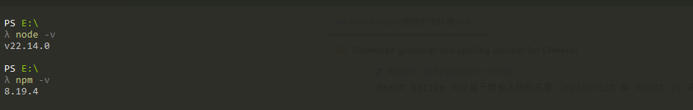

**注意 Node 的版本应大于等于 18，安装完 Node 后建议设置 npm 镜像（淘宝源）以加速后面的过程（或使用科学上网工具）。**

**注意：强烈建议始终选择 Node 当前的 LTS （长期维护）版本，一般是偶数版本，不要选择偏实验性质的奇数版本。**

**注意：不要使用 cnpm！cnpm 安装的模块路径比较奇怪，packager 不能正常识别！**
```bash
# 使用nrm工具切换淘宝源
npx nrm use taobao

# 如果之后需要切换回官方源可使用
npx nrm use npm
```

### 1.2 Yarn
Yarn 是 Facebook 提供的替代 npm 的工具，可以加速 node 模块的下载。**Yarn 是非必选项，你也可以使用 npm**，由于安装 Node 之后已经默认安装了 npm, 所以 Yarn 是否安装取决于个人习惯即可。

```bash
npm install -g yarn
```

安装完 yarn 之后就可以用 yarn 代替 npm 了，例如用 yarn 代替 npm install 命令，用 yarn add 某第三方库名代替 npm install 某第三方库名。

### 1.3 JDK
React Native 的 JDK 版本要求取决于其版本和 Android 构建工具的兼容性。以下是不同 React Native 版本对 JDK 的要求和配置建议：

1. React Native 0.71 及以上版本（推荐最新版本） JDK 要求 17
   
   从 React Native 0.71 开始，官方推荐使用 JDK 17，因为 Android Gradle Plugin (AGP) 8.0+ 和 Android Studio Giraffe (2023.3.1+) 默认依赖 JDK 17。
   这是 Google 对 Android 开发工具的官方要求升级。

2. React Native 0.68 ~ 0.70 版本 JDK 要求 11

   这些版本通常兼容 JDK 11，因为 Android Gradle Plugin (AGP) 7.0+ 需要 JDK 11。 如果使用 JDK 8 可能会遇到构建错误（如 Unsupported class file major version）。

3. React Native 0.67 及以下版本 JDK 要求 8
   旧版本 React Native 可能依赖 JDK 8，但官方已不再维护这些版本，建议升级到最新 React Native 和 JDK。

React Native 低于 0.73 版本的 React Native 需要 JDK 11 版本，而低于 0.67 的需要 JDK 8 版本。

本次使用 React Native 最新版本 `0.78`, 需要安装 JDK17 版本。
请访问 [OpenJDK 官方网站](https://jdk.java.net/archive/) `https://jdk.java.net/archive/` 按照系统下载安装 OpenJDK 17 版本，并配置好环境变量。

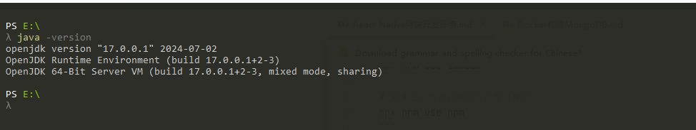

## 2 Android 开发环境
### 2.1 安装 Android Studio
首先访问 [Addroid Studio 官网](https://developer.android.google.cn/studio?hl=zh-cn) `https://developer.android.google.cn/studio?hl=zh-cn` 下载和安装 Android Studio，本次安装版本为 `2024.3.1.14`，安装过程一路默认即可。

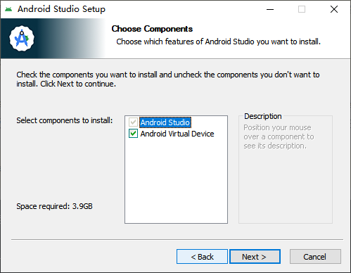

### 2.2 安装 Android SDK
Android Studio 默认会安装最新版本的 Android SDK。当前 React Native(0.78) 官方推荐使用的是 Android 15 (VanillaIceCream)版本的 SDK（注意 SDK 版本不等于对用户系统版本的要求，React Native 目前最低要求的 Android 版本请访问 `https://github.com/facebook/react-native?tab=readme-ov-file#-requirements` 查看）。

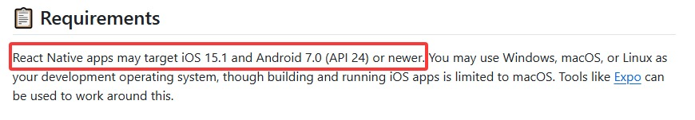

你可以在 Android Studio 的 SDK Manager 中选择安装各版本的 SDK。

如果设备上未安装过 Android SDK， 那么 Android Studio 首次启动会下载 Android SDK、 Android 官方模拟器等数据，按照如下补助设置即可。

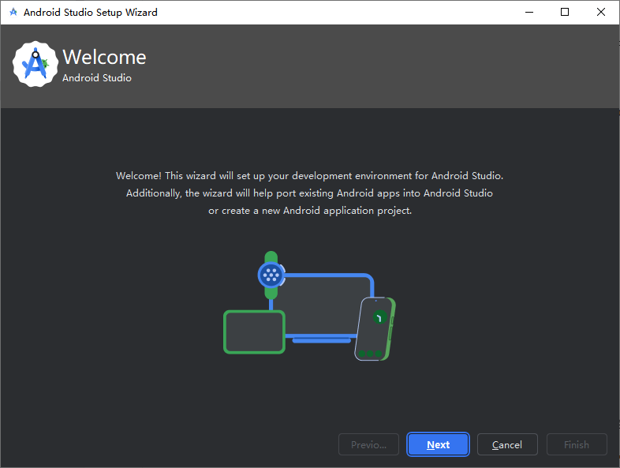

有 2 种安装模式 `Standard` 和 `Custom`, 此处选择 `Standard` 模式：

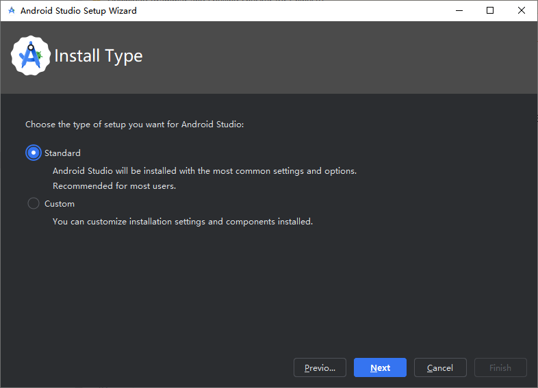

`Standard` 模式会安装的内容:

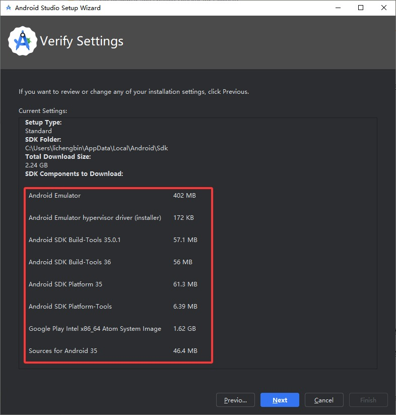

选择 `Accept`, 继续:


等待安装完成即可，此处耗时可能很久，需要耐心等待:

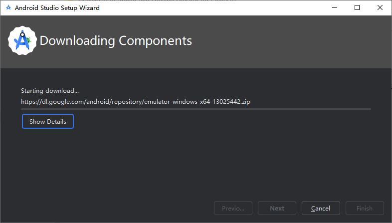

执行完这些步骤之后，相关的文件安装目录如下:
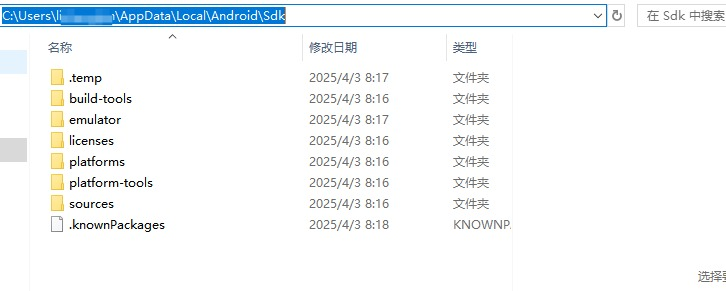

当然安装过后也可以在 SDK Manager 中重新安装其他版本的 SDK，在 Android Studio 中可通过 `File > Settings > Languages & Frameworks > Android SDK` 菜单路径访问到 SDK Manager:
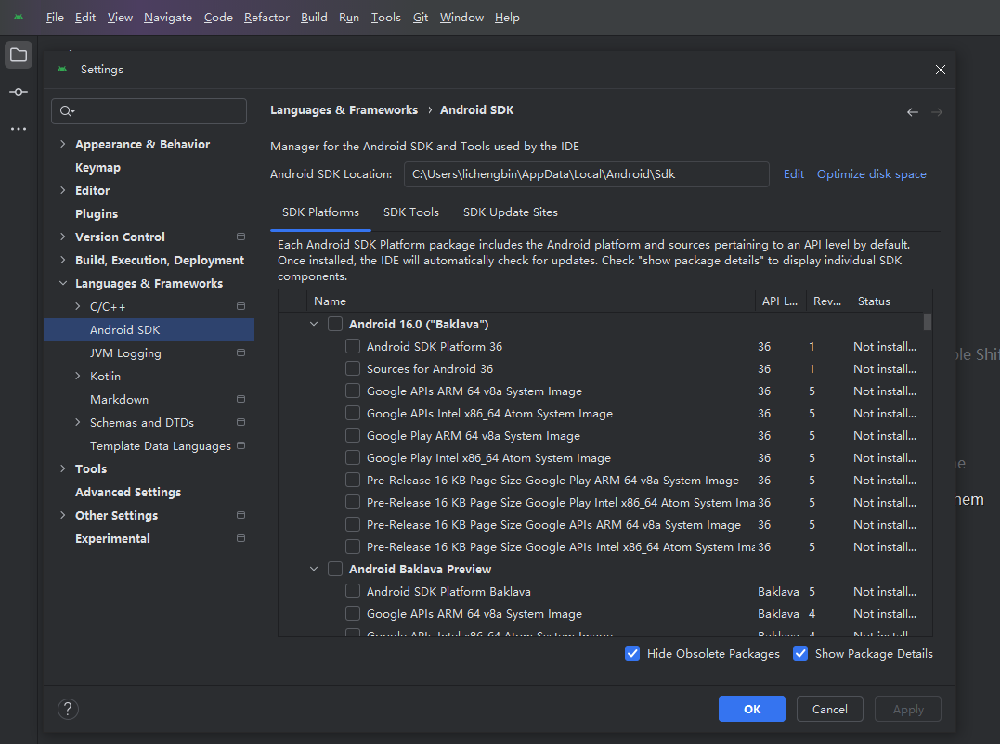

也可以通过如下路径访问到:
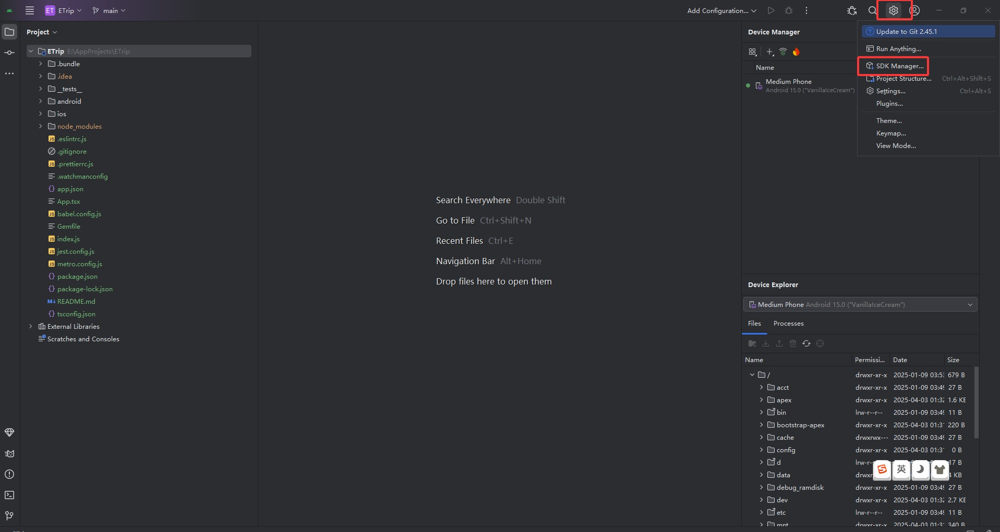


在 SDK Manager 中选择"SDK Platforms"选项卡，然后在右下角勾选"Show Package Details"。展开 Android 15 (VanillaIceCream)选项，确保勾选了下面这些组件（如果你看不到这个界面，则需要使用稳定的代理软件）：

Android SDK Platform 35

Google Play Intel x86 Atom_64 System Image（官方模拟器镜像文件，使用非官方模拟器不需要安装此组件）

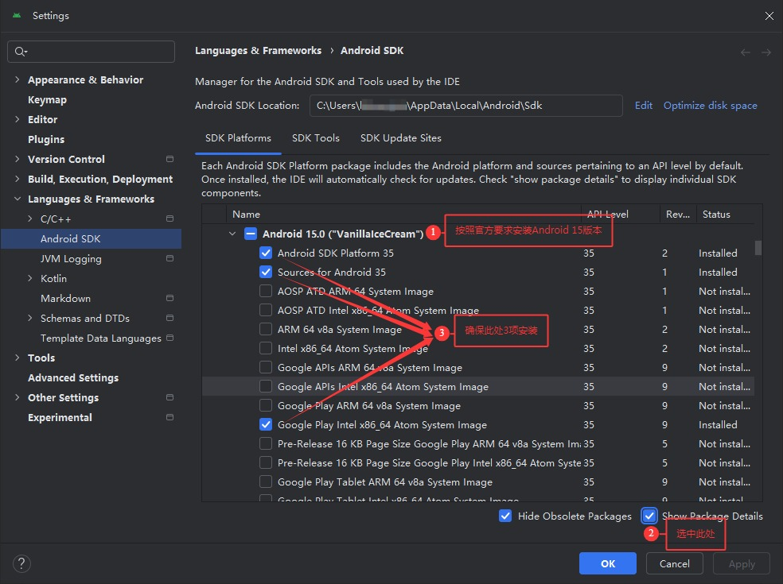

然后点击"SDK Tools"选项卡检查配置：

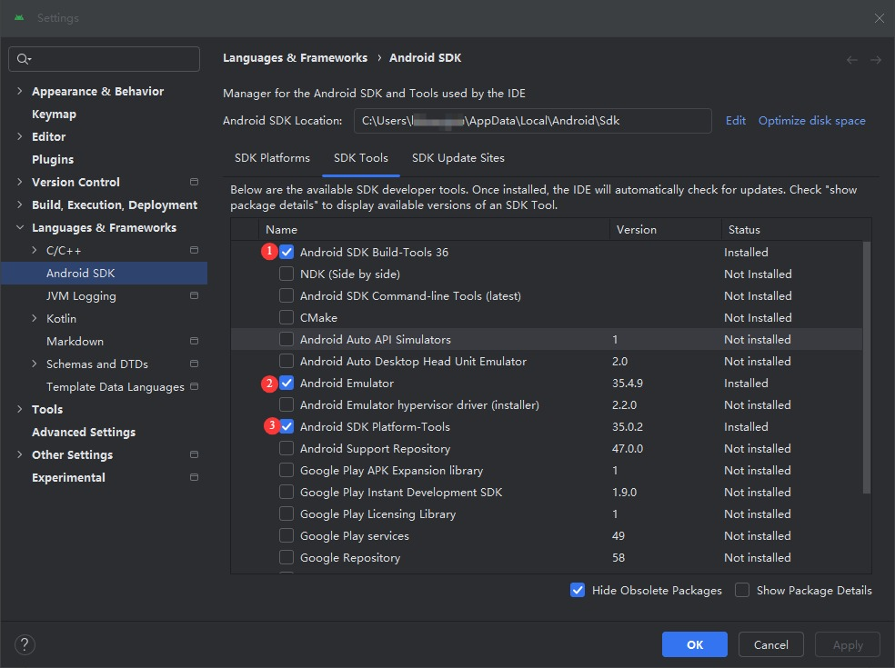

同样勾中右下角的"Show Package Details"。展开"Android SDK Build-Tools"选项，确保选中了 React Native 所必须的 35.0.0 版本。你可以同时安装多个其他版本。

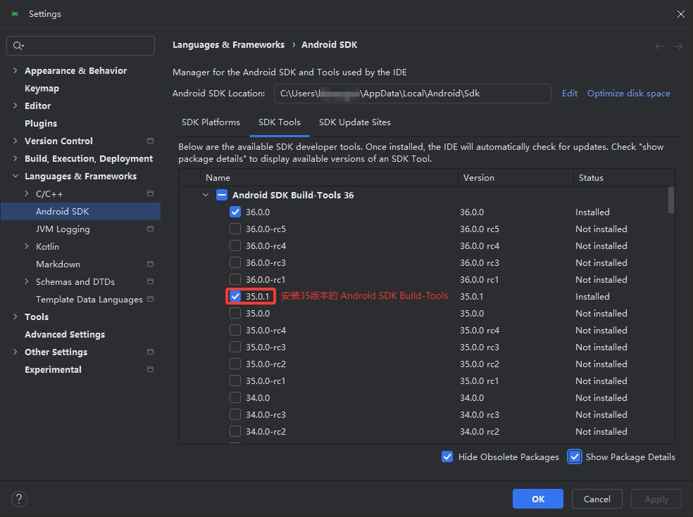

最后点击"Apply"来下载和安装这些组件。

如果选择框是灰的，你也可以先跳过，稍后再来安装这些组件。

### 2.3 配置 ANDROID_HOME 环境变量
React Native 需要通过环境变量来了解你的 Android SDK 装在什么路径，从而正常进行编译。

打开控制面板 -> 系统和安全 -> 系统 -> 高级系统设置 -> 高级 -> 环境变量 -> 新建，创建一个名为 ANDROID_HOME 的环境变量（系统或用户变量均可），指向你的 Android SDK 所在的目录（具体的路径可能和下图不一致，请自行确认）：

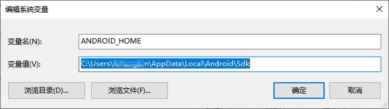

SDK 默认是安装在下面的目录：
```bash
C:\Users\{你的用户名}\AppData\Local\Android\Sdk
```

你可以在 Android Studio 的"Preferences"菜单中查看 SDK 的真实路径，具体是 Appearance & Behavior → System Settings → Android SDK。
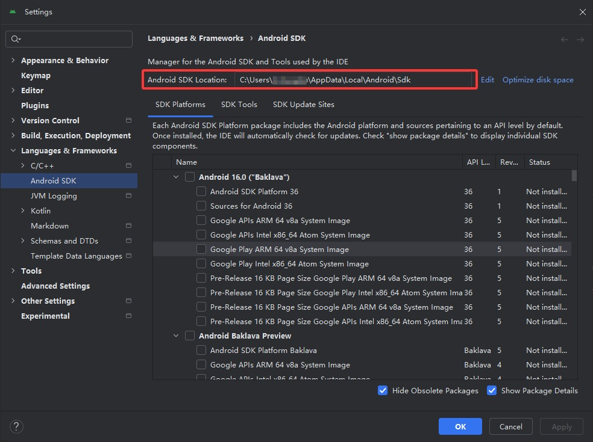

你需要关闭现有的命令符提示窗口然后重新打开，这样新的环境变量才能生效。

### 2.4 把工具目录添加到环境变量 Path
打开控制面板 -> 系统和安全 -> 系统 -> 高级系统设置 -> 高级 -> 环境变量，选中 Path 变量，然后点击编辑。点击新建然后把以下工具目录路径添加进去：platform-tools

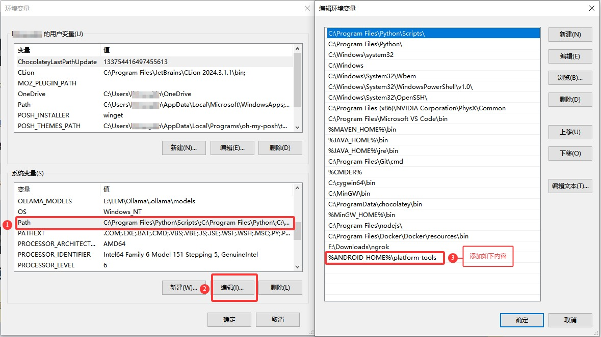


## 3 创建新项目
如果你之前全局安装过旧的 react-native-cli 命令行工具，请使用 `npm uninstall -g react-native-cli` 卸载掉它以避免一些冲突：

```bash
npm uninstall -g react-native-cli @react-native-community/cli
```

使用 React Native 内建的命令行工具来创建一个名为"ETrip"的新项目。这个命令行工具不需要安装，可以直接用 node 自带的 npx 命令来使用：

**注意事项一：请不要在目录、文件名中使用中文、空格等特殊符号。请不要单独使用常见的关键字作为项目名（如 class, native, new, package 等等）。请不要使用与核心模块同名的项目名（如 react, react-native 等）。**

**注意事项二：请不要在某些权限敏感的目录例如 System32 目录中 init 项目！会有各种权限限制导致不能运行！**

**注意事项三：请不要使用一些移植的终端环境，例如 git bash 或 mingw 等等，这些在 windows 下可能导致找不到环境变量。请使用系统自带的命令行（CMD 或 powershell）运行。**

```bash
npx @react-native-community/cli init ETrip
```

**[可选参数]** 指定项目版本
你可以使用 --version 参数（注意是两个杠）创建指定 React Native 版本的项目。注意版本号必须精确到两个小数点。

```bash
npx @react-native-community/cli init ETrip --version X.XX.X
```

**[可选参数]** 指定项目模板
还可以使用--template 来使用一些社区提供的模板。
```bash
npx @react-native-community/cli init ETrip --template xx
```

## 4 准备 Android 设备
你需要准备一台 Android 设备来运行 React Native Android 应用。这里所指的设备既可以是真机，也可以是模拟器。Android 官方提供了名为 Android Virtual Device（简称 AVD）的模拟器。此外还有很多第三方提供的模拟器如 Genymotion、BlueStack 等。一般来说官方模拟器免费、功能完整，但性能较差。第三方模拟器性能较好，但可能需要付费，或带有广告。

### 4.1 使用 Android 真机
你也可以使用 Android 真机来代替模拟器进行开发，只需用 usb 数据线连接到电脑，然后遵照[在设备上运行](https://reactnative.cn/docs/running-on-device)`https://reactnative.cn/docs/running-on-device`这篇文档的说明操作即可。

### 4.2 使用 Android 模拟器
在 Android Studio 中通过 `Device Manager` 来管理可用的虚拟设备，入口如下：

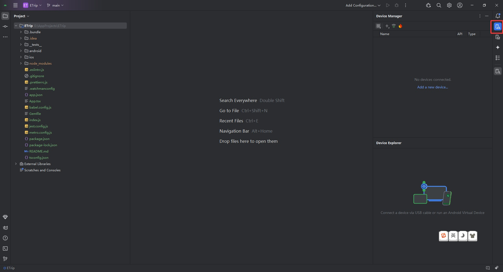

创建一个虚拟设备，点击"Create Virtual Device..."，然后选择所需的设备类型并点击"Next"，然后选择 Tiramisu API Level 33 image.

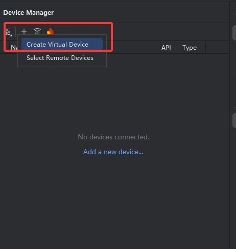

选择创建 Phone 类型模拟器:

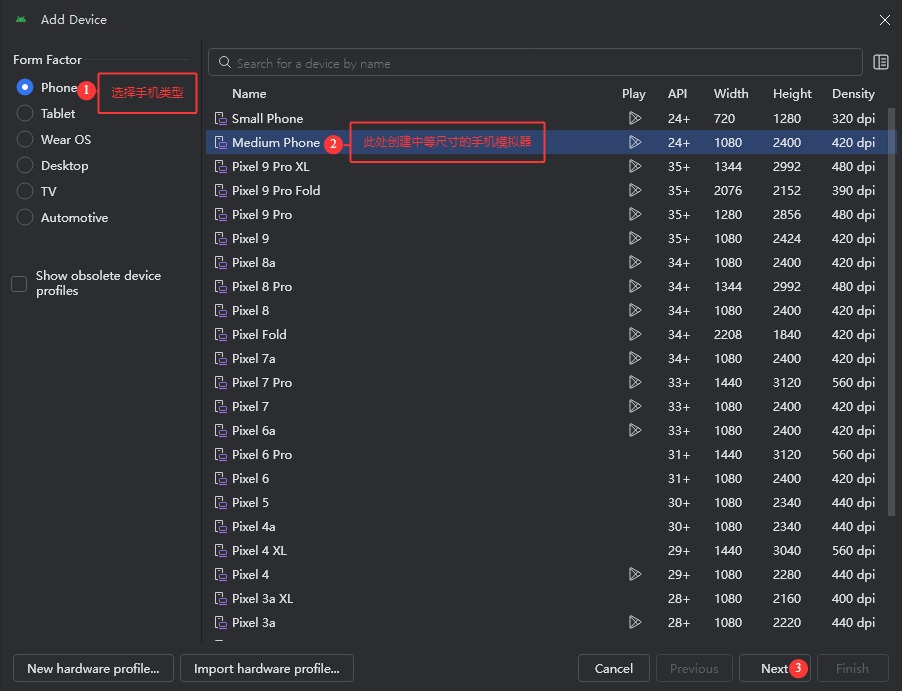

指定 Android 版本:

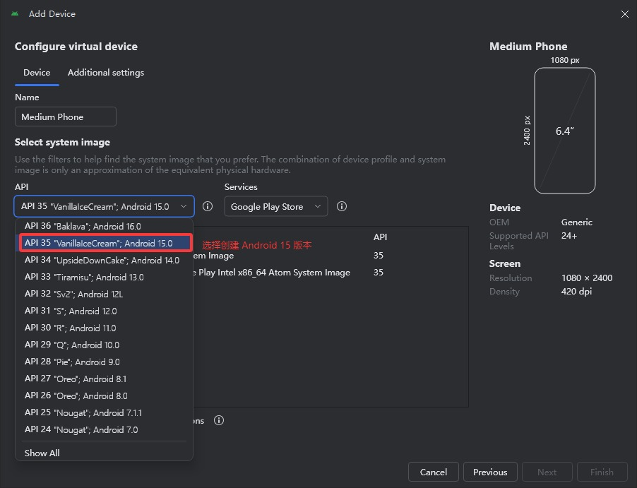

下载系统镜像:
+ Google Play Intel x86 Atom_64 System Image 前边配置 Android SDK 时已经下载，此处无需下载
+ Pre-Release 16KB Page Size Google Play Intel x86 Atom_64 System Image 未下载过，点击下载控件

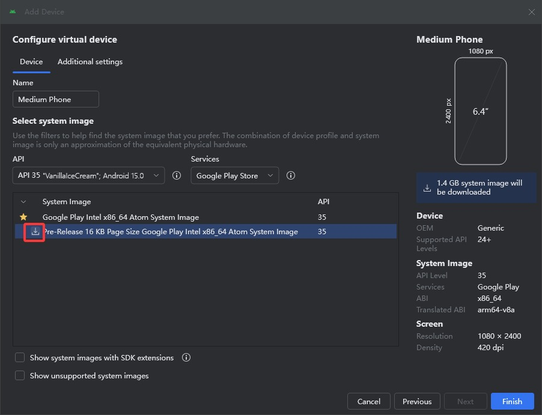

下载中慢慢等待:

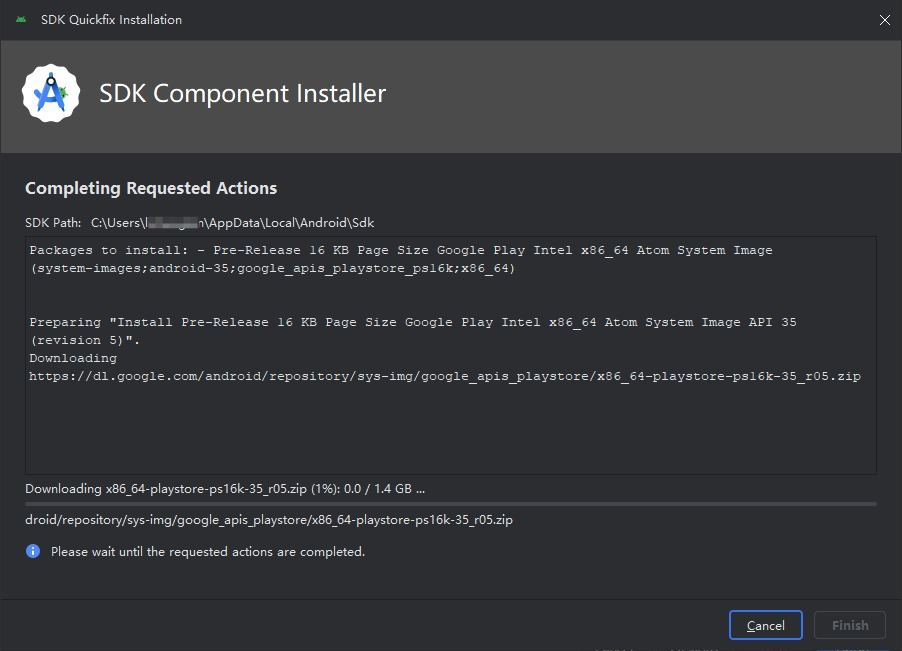

创建完成长这样:

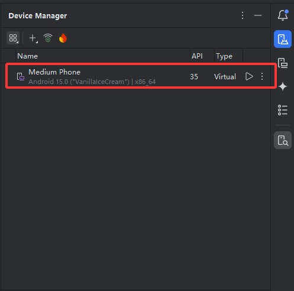

译注：请不要轻易点击 Android Studio 中可能弹出的建议更新项目中某依赖项的建议，否则可能导致无法运行。

## 5 编译并运行 React Native 应用
确保你先运行了模拟器或者连接了真机，然后在你的项目目录中运行 `yarn android` 或者 `yarn react-native run-android`：

```bash
cd ETrip
yarn android
# 或者
yarn react-native run-android
```

此命令会对项目的原生部分进行编译，同时在另外一个命令行中启动 Metro 服务对 js 代码进行实时打包处理（类似 webpack）。Metro 服务也可以使用 yarn start 命令单独启动。

如果配置没有问题，你应该可以看到应用自动安装到设备上并开始运行。注意第一次运行时需要下载大量编译依赖，耗时可能数十分钟。此过程严重依赖稳定的代理软件，否则将频繁遭遇链接超时和断开，导致无法运行。

**注意** `npx react-native run-android` 只是运行应用的方式之一。你也可以在 Android Studio 中直接运行应用。

执行 `yarn android` 以启动 Android 应用开发流程，具体会完成以下事情：
1. 编译和构建 Android 应用
   + 构建原生代码：如果项目依赖原生模块（如通过 react-native link 链接的库），会编译 C++/Java/Kotlin 代码。
   + 生成 APK/AAB：生成 Android 应用包（debug 模式默认生成未签名的 APK 文件）。

2. 安装到设备/模拟器
   + 自动检测设备：如果连接了 Android 设备或启动了模拟器，会将 APK 安装到设备。
   + 覆盖旧版本：若设备上已有同包名的应用，会直接覆盖安装。

3. 启动 Metro Bundler 服务
   + 启动本地服务：启动 Metro（React Native 的 JavaScript 打包工具），默认运行在 `http://localhost:8081`。
   + 实时打包 JS 代码：将 JavaScript 代码和资源打包成 index.android.bundle，支持热重载（Hot Reload）和实时刷新。

4. 启动应用
   + 自动打开应用：安装完成后，设备/模拟器上会自动启动应用。
   + 加载 JS Bundle：应用运行时会从 Metro 服务拉取最新的 JavaScript 代码，实现动态更新（无需重新安装 APK）。

5. 日志输出
   + 终端显示日志：在终端中会输出构建日志、安装状态和可能的错误信息（如设备未连接、依赖缺失等）。
   + React Native 日志：应用运行时的 console.log 或错误信息会显示在终端。

执行过程:

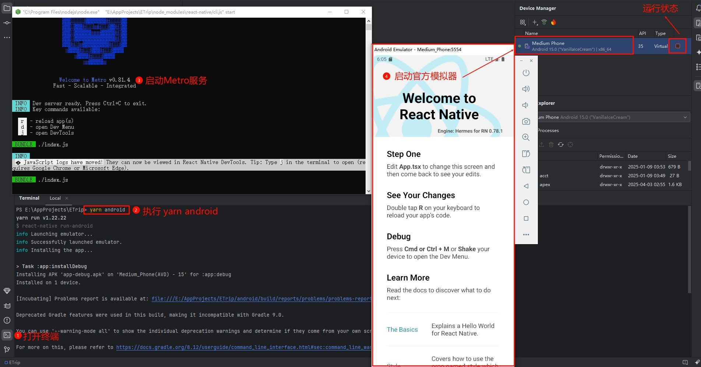

终端输出：
```bash
$ react-native run-android
info A dev server is already running for this project on port 8081.
info Installing the app...

> Task :app:buildCMakeDebug[arm64-v8a]
C/C++: Hard link from 'C:\Users\lichengbin\.gradle\caches\8.12\transforms\52a52e4c4792af3ca58b2df5dfea7545\transformed\react-android-0.78.1-debug\prefab\modules\reactnative\libs\android.arm64-v8a\libreactnative.so' to 'E:\AppProjects\ETrip\android\app\build\intermediates\cxx\Debug\k571s242\obj\arm64-v8a\libreactnative.so' failed. Doing a slower copy instead.
C/C++: Hard link from 'C:\Users\lichengbin\.gradle\caches\8.12\transforms\52a52e4c4792af3ca58b2df5dfea7545\transformed\react-android-0.78.1-debug\prefab\modules\reactnative\libs\android.arm64-v8a\libreactnative.so' to 'E:\AppProjects\ETrip\android\app\build\intermediates\cxx\Debug\k571s242\obj\arm64-v8a\libreactnative.so' failed. Doing a slower copy instead.

> Task :app:buildCMakeDebug[armeabi-v7a]
C/C++: Hard link from 'C:\Users\lichengbin\.gradle\caches\8.12\transforms\52a52e4c4792af3ca58b2df5dfea7545\transformed\react-android-0.78.1-debug\prefab\modules\reactnative\libs\android.armeabi-v7a\libreactnative.so' to 'E:\AppProjects\ETrip\android\app\build\intermediates\cxx\Debug\k571s242\obj\armeabi-v7a\libreactnative.so' failed. Doing a slower copy instead.
C/C++: Hard link from 'C:\Users\lichengbin\.gradle\caches\8.12\transforms\52a52e4c4792af3ca58b2df5dfea7545\transformed\react-android-0.78.1-debug\prefab\modules\reactnative\libs\android.armeabi-v7a\libreactnative.so' to 'E:\AppProjects\ETrip\android\app\build\intermediates\cxx\Debug\k571s242\obj\armeabi-v7a\libreactnative.so' failed. Doing a slower copy instead.

> Task :app:buildCMakeDebug[x86]
C/C++: Hard link from 'C:\Users\lichengbin\.gradle\caches\8.12\transforms\52a52e4c4792af3ca58b2df5dfea7545\transformed\react-android-0.78.1-debug\prefab\modules\reactnative\libs\android.x86\libreactnative.so' to 'E:\AppProjects\ETrip\android\app\build\intermediates\cxx\Debug\k571s242\obj\x86\libreactnative.so' failed. Doing a slower copy instead.
C/C++: Hard link from 'C:\Users\lichengbin\.gradle\caches\8.12\transforms\52a52e4c4792af3ca58b2df5dfea7545\transformed\react-android-0.78.1-debug\prefab\modules\reactnative\libs\android.x86\libreactnative.so' to 'E:\AppProjects\ETrip\android\app\build\intermediates\cxx\Debug\k571s242\obj\x86\libreactnative.so' failed. Doing a slower copy instead.

> Task :app:buildCMakeDebug[x86_64]
C/C++: Hard link from 'C:\Users\lichengbin\.gradle\caches\8.12\transforms\52a52e4c4792af3ca58b2df5dfea7545\transformed\react-android-0.78.1-debug\prefab\modules\reactnative\libs\android.x86_64\libreactnative.so' to 'E:\AppProjects\ETrip\android\app\build\intermediates\cxx\Debug\k571s242\obj\x86_64\libreactnative.so' failed. Doing a slower copy instead.
C/C++: Hard link from 'C:\Users\lichengbin\.gradle\caches\8.12\transforms\52a52e4c4792af3ca58b2df5dfea7545\transformed\react-android-0.78.1-debug\prefab\modules\reactnative\libs\android.x86_64\libreactnative.so' to 'E:\AppProjects\ETrip\android\app\build\intermediates\cxx\Debug\k571s242\obj\x86_64\libreactnative.so' failed. Doing a slower copy instead.

> Task :app:installDebug
Installing APK 'app-debug.apk' on 'Medium_Phone(AVD) - 15' for :app:debug
Installed on 1 device.

[Incubating] Problems report is available at: file:///E:/AppProjects/ETrip/android/build/reports/problems/problems-report.html

Deprecated Gradle features were used in this build, making it incompatible with Gradle 9.0.

You can use '--warning-mode all' to show the individual deprecation warnings and determine if they come from your own scripts or plugins.

For more on this, please refer to https://docs.gradle.org/8.12/userguide/command_line_interface.html#sec:command_line_warnings in the Gradle documentation.

BUILD SUCCESSFUL in 15s
58 actionable tasks: 9 executed, 49 up-to-date
info Connecting to the development server...                                                                                                                                                                                        
8081                                                                                                                                                                                                                                
info Starting the app on "emulator-5554"...
Starting: Intent { act=android.intent.action.MAIN cat=[android.intent.category.LAUNCHER] cmp=com.etrip/.MainActivity }
Done in 22.58s.
```

应用启动成功:

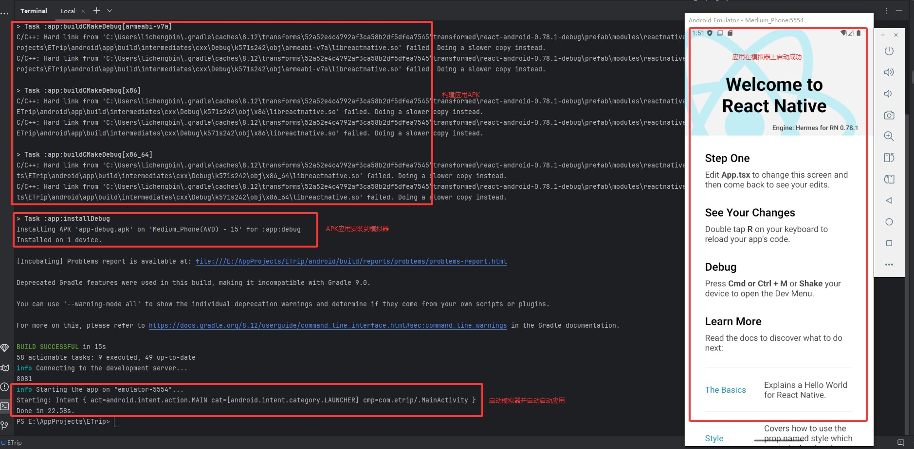

ETrip 应用在模拟器上:


## React Native 学习资源
+ [React Native 中文网](https://reactnative.cn/) `https://reactnative.cn/`
+ [React Native 官网](https://reactnative.dev/) `https://reactnative.dev/`
+ [React Native Directory](https://reactnative.directory/) `https://reactnative.directory/`
+ [React Native 学习指南](https://github.com/reactnativecn/react-native-guide) `https://github.com/reactnativecn/react-native-guide`
+ [React Native 开源案例](https://github.com/ReactNativeNews/React-Native-Apps) `https://github.com/ReactNativeNews/React-Native-Apps`

