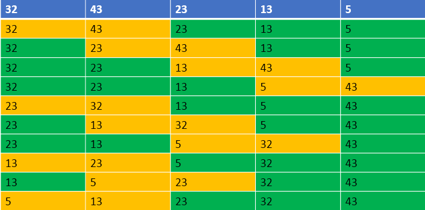

## 1. 简介
冒泡排序是一种交换排序,核心是冒泡, 通过对待排序序列从前向后(从下标较小的元素开始),依次对***相邻两个元素的值进行两两比较***,若发现***逆序则交换***,使值较大的元素逐渐从前移向后部,就如果水底下的气泡一样逐渐向上冒泡

## 2. 算法原理
1. 两两元素相比,前一个比后一个大就交换,直到将最大的元素交换到末尾位置；
2. 将剩余序列中所有元素两两比较,将最大的放在最后面；
3. 一共进行n-1趟这样的交换将可以把所有的元素排好；



## 3. 冒泡排序动图展示


## 4. 代码
```java
/**
 * 排序器接口(策略模式: 将算法封装到具有共同接口的独立的类中使得它们可以相互替换)
 */
public interface Sorter<T extends Comparable<T>> {

    /**
     * 排序
     *
     * @param array 待排序的数组
     */
    default void sort(T[] array) {
    }
}
```

```java
/**
 * 冒泡排序
 */
public class BubbleSorter<T extends Comparable<T>> implements Sorter<T> {

    @Override
    public void sort(T[] array) {
        for (int i = 0, length = array.length; i < length; ++i) {
            //设定一个标记，若为false，则表示此次循环没有进行交换，也就是待排序列已经有序，排序已然完成
            boolean swapped = false;
            for (int j = 0; j < length - i - 1; ++j) {
                if (array[j].compareTo(array[j + 1]) > 0) {
                    T temp = array[j];
                    array[j] = array[j + 1];
                    array[j + 1] = temp;
                    swapped = true;
                }
            }

            if (!swapped) {
                break;
            }
        }
    }
}
```

## 5. 总结
设总的元素个数为n,那么由上边的排序过程可以看出：
+ 总计需要进行(n-1)轮排序,也就是(n-1)次外循环
+ 每轮排序比较的次数逐轮减少
+ 如果发现在某趟排序中,没有发生一次交换, 可以提前结束冒泡排序。
+ 在相邻元素相等时,它们并不会交换位置,所以冒泡排序是***稳定排序***。
+ 在数据完全有序的时候展现出最优时间复杂度,为O(n)。其他情况下,几乎总是O(n^2)。因此,算法在数据基本有序的情况下,性能最好。
