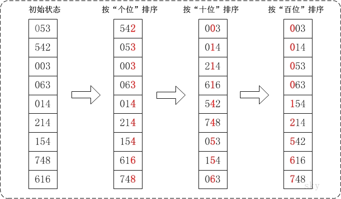

# 基数排序
## 算法原理
基数排序(Radix Sort)是一种非比较型整数排序算法，它的基本思想是：将整数按位数切割成不同的数字，然后按每个位数分别比较；

具体做法是：将所有待比较数值统一为同样的数位长度，数位较短的数前面补零。然后，从最低位开始，依次进行一次排序。这样从最低位排序一直到最高位排序完成以后, 数列就变成一个有序序列；

基数排序按照对位数分组的顺序的不同，可以分为 LSD 基数排序和 MSD 基数排序。

下面举个例子，待排序数组 array = {53, 3, 542, 748, 14, 214, 154, 63, 616}，排序过程如下：

1. 首先将所有待比较树脂统一为统一位数长度，接着从最低位开始，依次进行排序；
2. 按照个位数进行排序；
3. 按照十位数进行排序；
4. 按照百位数进行排序；

排序后，数列就变成了一个有序序列:



### LSD（Least sgnificant digital）基数排序
按照从低位到高位的顺序进行分组排序。例如：1, 2, 3, 4, 5, 6, 7, 8, 9, 10 第一次分组后为 10, 1, 2, 3, 4, 5, 6, 7, 8, 9，适用于位数小的数列

### MSD（Most sgnificant digital）基数排序
按照从高位到低位的顺序进行分组排序。例如：1, 2, 3, 4, 5, 6, 7, 8, 9, 10 第一次分组以后为 1, 10, 2, 3, 4, 5, 6, 7, 8, 9，如果位数多的话，使用 MSD 的效率比 LSD 好

## 基数排序动图展示


## 代码

```java
/**
 * 排序器接口(策略模式: 将算法封装到具有共同接口的独立的类中使得它们可以相互替换)
 */
public interface Sorter<T extends Comparable<T>> {
    /**
     * 基数排序
     *
     * @param array 待排序的数组
     * @param radix 基数
     */
    default void sort(T[] array, int radix) {
    }
}
```

```java
/**
 * 基数排序
 **/
public class RadixSorter<T extends Comparable<T>> implements Sorter<T> {

    /**
     * @param array 待排序数组
     * @param radix 进制基数
     */
    public void sort(T[] array, int radix) {
        int length = array.length;

        // 获取数组中最大的数字用于计算最大位数
        T max = getMax(array);

        int bits = 0; //数组中最大数的位数
        int maxValue = Integer.valueOf(max.toString());
        //获取最大位数
        while (maxValue > 0) {
            maxValue /= 10;
            bits++;
        }

        Object[] buckets = new Object[length];
        int[] count = new int[radix]; // 存放各个桶的数据统计个数

        int rate = 1;
        // 按照从低位到高位的顺序执行排序过程
        for (int b = 0; b < bits; b++) {

            //重置count数组，开始统计下一个关键字
            Arrays.fill(count, 0);

            //计算每个待排序数据的关键字
            for (int i = 0; i < length; i++) {
                int key = Integer.valueOf(array[i].toString());

                int bucketIdx = (key / rate) % radix;
                ++count[bucketIdx];
            }

            // count[i]表示第i个桶的右边界索引
            for (int i = 1; i < radix; ++i) {
                count[i] = count[i] + count[i - 1];
            }

            // 将数据依次装入桶中, 开始从左向右，现在从右向左扫描，保证排序稳定性
            for (int i = length - 1; i >= 0; --i) {
                // 求出待排序元素第b位的数字，如34第2位是3
                int key = Integer.valueOf(array[i].toString());
                int bucketIdx = (key / rate) % radix;

                buckets[count[bucketIdx] - 1] = array[i]; //插入到count[key] - 1位，因为数组下标从0开始
                --count[bucketIdx];
            }
            rate *= radix; //前进一位
            System.out.print("\n 第" + (b + 1) + "次：");

            for (int i = 0; i < length; ++i) {
                array[i] = (T) buckets[i];
            }
            print(array);
        }
    }

    public <T extends Comparable<T>> T getMax(T[] array) {
        T max = array[0];
        for (int i = 1; i < array.length; ++i) {
            if (array[i].compareTo(max) > 0) {
                max = array[i];
            }
        }
        return max;
    }


    //输出数组
    public <T extends Comparable<T>> void print(T[] array) {
        for (int i = 0; i < array.length; i++) {
            System.out.print(array[i].toString() + "\t");
        }
    }
}
```