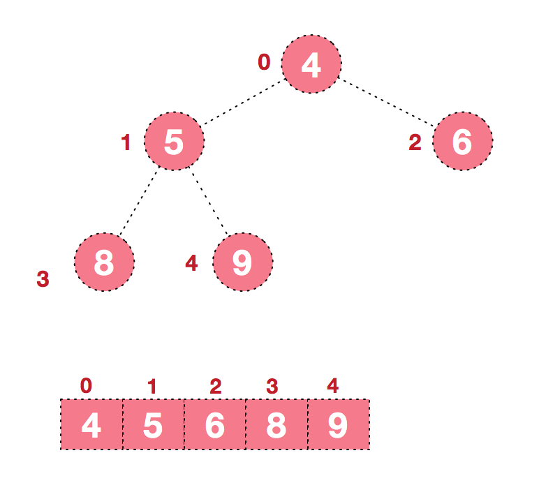

## 1. 算法原理
**堆**是一棵**顺序存储**的**完全二叉树**。

其中每个结点的关键字都**不大于**其孩子结点的关键字，这样的堆称为**小根堆**。

其中每个结点的关键字都**不小于**其孩子结点的关键字，这样的堆称为**大根堆**。


对堆中的结点按层进行编号，将这种逻辑结构映射到数组中如下图:


该数组从逻辑上讲就是一个堆结构，我们用简单的公式来描述一下堆的定义就是：
+ 大顶堆：arr[i] `>=` arr[2i+1] && arr[i] `>=` arr[2i+2]

+ 小顶堆：arr[i] `<=` arr[2i+1] && arr[i] `<=` arr[2i+2]

## 2. 基本思想及步骤
### 2.1 基本思想
堆排序的基本思想是: 将待排序序列构造成一个大顶堆，此时，整个序列的最大值就是堆顶的根节点。 将其与末尾元素进行交换，此时末尾就为最大值。然后将剩余n-1个元素重新构造成一个堆，这样会得到n个元素的次小值。如此反复执行，便能得到一个有序序列

可归纳为:
1. 将无序序列构建成一个堆，根据升序降序需求选择大顶堆或小顶堆;
2. 将堆顶元素与末尾元素交换，将最大元素"沉"到数组末端;
3. 重新调整结构，使其满足堆定义，然后继续交换堆顶元素与当前末尾元素，反复执行调整+交换步骤，直到整个序列有序。

### 2.1 步骤
#### 2.1.1 步骤一(构造初始堆)
将给定无序序列构造成一个大顶堆（一般升序采用大顶堆，降序采用小顶堆)。

1. 假设给定无序序列结构如下:


2. 从最后一个非叶子结点开始（叶结点自然不用调整，第一个非叶子结点 arr.length/2-1=5/2-1=1，也就是下面的6结点），从左至右，从下至上进行调整。


3. 找到第二个非叶节点4，由于[4,9,8]中9元素最大，4和9交换。


4. 这时交换导致了子根[4,5,6]结构混乱，继续调整，[4,5,6]中6最大，交换4和6。


5. 此时就将一个无需序列构造成了一个大顶堆。

#### 2.1.2 步骤二(排序)
将堆顶元素与末尾元素进行交换，使末尾元素最大。然后继续调整堆，再将堆顶元素与末尾元素交换，得到第二大元素。如此反复进行交换、重建、交换。

1. 将堆顶元素9和末尾元素4进行交换


2. 重新调整结构，使其继续满足堆定义


3. 再将堆顶元素8与末尾元素5进行交换，得到第二大元素8.


4. 后续过程，继续进行调整，交换，如此反复进行，最终使得整个序列有序


## 3. 复杂度分析
1. 时间复杂度：堆排序是一种选择排序，整体主要由构建初始堆+交换堆顶元素和末尾元素并重建堆两部分组成。其中构建初始堆经推导复杂度为O(n)，在交换并重建堆的过程中，需交换n-1次，而重建堆的过程中，根据完全二叉树的性质，[log2(n-1),log2(n-2)...1]逐步递减，近似为nlogn。所以堆排序时间复杂度最好和最坏情况下都是O(nlogn)级。
2. 空间复杂度：堆排序不要任何辅助数组，只需要一个辅助变量，所占空间是常数与n无关，所以空间复杂度为O(1)。

## 2. 堆排序动图展示


## 3. 代码

```java
/**
 * 排序器接口(策略模式: 将算法封装到具有共同接口的独立的类中使得它们可以相互替换)
 */
public interface Sorter<T extends Comparable<T>> {

    /**
     * 排序
     *
     * @param array 待排序的数组
     */
    default void sort(T[] array) {
    }
}
```

```java
public class HeapSorter<T extends Comparable<T>> implements Sorter<T> {
    public void buildHeap(T[] array, int length) {
        for (int i = length / 2; i >= 0; i--) {//从最后一个非叶子节点，才能构成adjustHeap操作的目标二叉树
            adjustHeap(array, i, length);
        }
    }

    //这里将i定义为完全二叉树的根
    //将完全二叉树调整为大顶堆,前提是二叉树的根的子树已经为大顶堆。
    public void adjustHeap(T[] array, int curIdx, int size) {
        int lChild = 2 * curIdx + 1; //左孩子
        int rChild = 2 * curIdx + 2; //右孩子

        int k = curIdx;   //临时变量
        if (curIdx < size / 2) { //如果i是叶子节点就结束
            if (lChild < size && array[k].compareTo(array[lChild]) < 0) {
                k = lChild;
            }
            if (rChild < size && array[k].compareTo(array[rChild]) < 0) {
                k = rChild;
            }

            if (k != curIdx) {
                T temp = array[k];
                array[k] = array[curIdx];
                array[curIdx] = temp;
                adjustHeap(array, k, size);
            }
        }
    }

    //将数组分为两部分，一部分为有序区，在数组末尾，另一部分为无序区。堆属于无序区
    public void sort(T[] array) {
        int length = array.length;
        buildHeap(array, length);
        for (int i = length - 1; i > 0; i--) {//i为无序区的长度，经过如下两步，长度递减
            //堆顶即下标为0的元素
            T temp = array[i];
            array[i] = array[0];
            array[0] = temp;
            adjustHeap(array, 0, i);   //2.将无顺区调整为大顶堆，即选择出最大的元素。
        }
    }
}
```