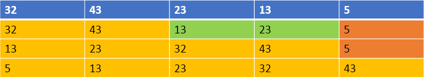

# 归并排序

## 算法原理

归并排序是建立在归并操作上的一种排序算法，采用**分治法（Divide and Conquer）思想**；

将已有序的子序列合并，得到完全有序的序列；即先使每个子序列有序，再使子序列段间有序。若将两个有序表合并成一个有序表，称为**二路归并**。

归并排序思想：
将待排序序列 array[0...n-1]看成是 n 个长度为 1 的有序序列，将相邻的有序表成对归并，得到 n/2 个长度为 2 的有序表；将这些有序序列再次归并，得到 n/4 个长度为 4 的有序序列；如此反复进行下去，最后得到一个长度为 n 的有序序列。

综上可知，归并排序其实要做两件事：
1.“分解”—将序列每次**折半划分**。
2.“合并”—将划分后的序列段**两两合并后排序**。

先来考虑第二步，**如何合并**？
在每次合并过程中，都是对两个有序的序列段进行合并，然后排序；
这两个有序序列段分别为 array1[low,  mid]和 array2[mid+1,  high]；
先将他们合并到一个局部的**暂存数组**tempArray 中，等合并完成后再将 tempArray 复制回 array 中。
每次从 array1、array2 中取出一个记录进行关键字的比较，将较小者放入 tempArray 中。最后将各段中余下的部分直接复制到 tempArray 中。
经过这样的过程，tempArray 已经是一个有序的序列，再将其复制回 array 中，一次合并排序就完成了。

接下来考虑第一步，**如何拆分？**
在某趟归并中，设各子表的长度为**gap**，则归并前 array[0...n-1]中共有**n/gap**个有序的子表：array[0...gap-1], array[gap...2*gap-1], ... , array[(n/gap)*gap ... n-1]。
调用 Merge**将相邻的子表归并**时，若子表个数为奇数，则最后一个子表无须和其他子表归并（即本趟处理轮空）：若子表个数为偶数，则要注意到最后一对子表中后一个子表区间的上限为 n-1。



## 归并排序动图展示


## 代码

```java
/**
 * 排序器接口(策略模式: 将算法封装到具有共同接口的独立的类中使得它们可以相互替换)
 */
public interface Sorter<T extends Comparable<T>> {
    /**
     * 排序
     *
     * @param array 待排序的数组
     * @param start 开始索引
     * @param end   开始索引
     */
    default void sort(T[] array, int start, int end) {
    }
}
```

```java
public class MergeSorter<T extends Comparable<T>> implements Sorter<T> {
    //递归实现二路归并排序（分治法）
    public void sort(T[] array, int start, int end) {
        //二路归并排序，分为二路
        int mid = (start + end) / 2;
        if (start < end) {
            // 递归过程
            sort(array, start, mid);
            sort(array, mid + 1, end);

            //合并
            merge(array, start, mid, end);
        }
    }

    // 归并排序
    public void merge(T[] array, int low, int mid, int high) {
        int l = low; // 左数组第一个元素的索引
        int h = mid + 1; // 右数组第1个元素
        int t = 0; // 临时数组索引

        Object[] temp = new Object[array.length]; // 存放临时序列
        while (l <= mid && h <= high) { // 扫描第一段和第二段序列，直到有一个扫描结束
            // 判断第一段和第二段取出的数哪个更小，将其存入合并序列，并继续向下扫描
            if (array[l].compareTo(array[h]) <= 0) {
                temp[t++] = array[l++];
            } else {
                temp[t++] = array[h++];
            }
        }

        // 若第一段序列还没扫描完，将其全部复制到合并序列
        while (l <= mid) {
            temp[t++] = array[l++];
        }

        // 若第二段序列还没扫描完，将其全部复制到合并序列
        while (h <= high) {
            temp[t++] = array[h++];
        }

        // 将合并后的序列复制到原始序列中
        for (int k = 0, i = low; i <= high; ++i, ++k) {
            array[i] = (T) temp[k];
        }
    }

    // 非递归实现归并
    public void mergeSort(T[] array, int length) {
        //size标记当前各个归并序列的high-low，从1，2，4，8，……，2*size
        int size = 1;
        int low;
        int mid;
        int high;

        while (size <= length - 1) {
            //从第一个元素开始扫描，low代表第一个分割的序列的第一个元素
            low = 0;
            while (low + size <= length - 1) {
                //mid代表第一个分割的序列的最后一个元素
                mid = low + size - 1;

                //high 代表第二个分割的序列的最后一个元素
                high = mid + size;

                // 如果第二个序列个数不足size个
                if (high > length - 1) {
                    //调整 high 为最后一个元素的下标即可
                    high = length - 1;
                }

                // 调用归并方法，进行分割的序列分段排序
                merge(array, low, mid, high);

                //下一次归并时第一序列的第一个元素位置
                low = high + 1;
            }
            size *= 2;
        }
    }
}

```