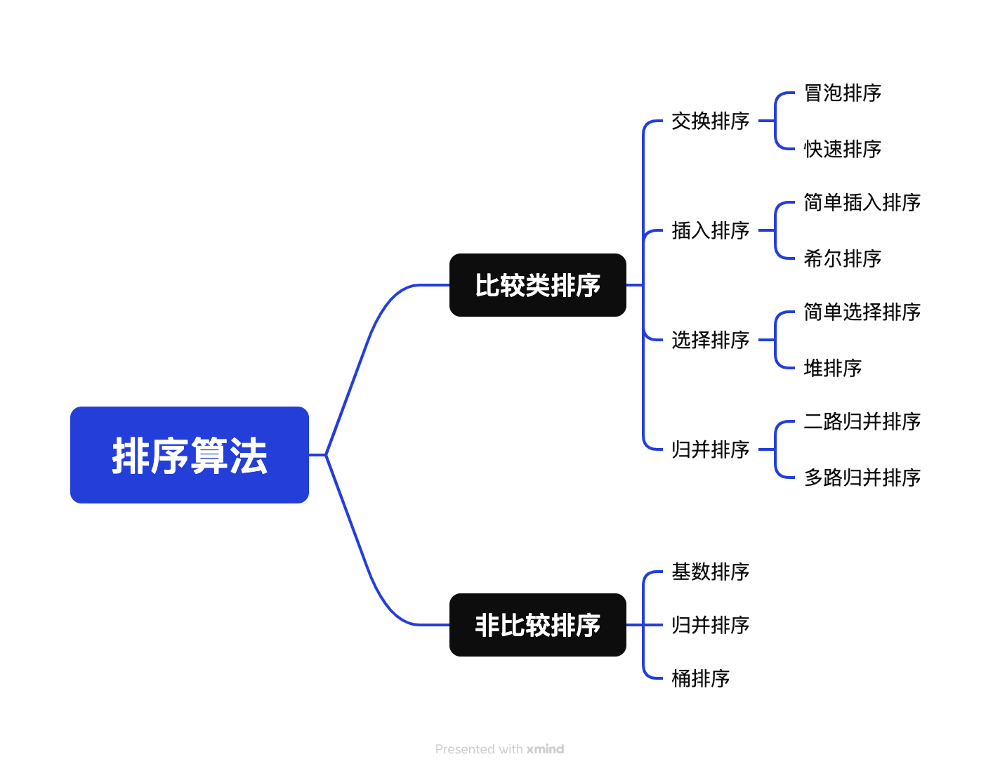

## 1. 简介
常见排序算法可以分为两大类:

+ 比较类排序: 通过比较来决定元素间的相对次序，由于其时间复杂度不能突破O(nlogn)，因此也称为非线性时间比较类排序。
+ 非比较类排序: 不通过比较来决定元素间的相对次序，它可以突破基于比较排序的时间下界，以线性时间运行，因此也称为线性时间非比较类排序。

## 2. 排序算法性能

| 排序算法 | 平均时间复杂度   | 最好         | 最坏         | 空间复杂度    | 排序方式   | 稳定性 |
|------|:----------|------------|------------|----------|--------|-----|
| 冒泡   | O(n²)     | O(n)       | O(n²)      | O(1)     | 占用常数内存 | 稳定  |
| 选择   | O(n²)     | O(n²)      | O(n²)      | O(1)     | 占用常数内存 | 不稳定 |
| 插入   | O(n²)     | O(n)       | O(n²)      | O(1)     | 占用常数内存 | 稳定  |
| 希尔   | O(n logn) | O(n log2n) | O(n log2n) | O(1)     | 占用常数内存 | 不稳定 |
| 快速   | O(n logn) | O(n logn)  | O(n²)      | O(logn)  | 占用常数内存 | 不稳定 |
| 归并   | O(n logn) | O(n logn)  | O(n logn)  | O(n)     | 占用额外内存 | 稳定  |
| 堆排序  | O(n logn) | O(n logn)  | O(n logn)  | O(1)     | 占用常数内存 | 不稳定 |
| 计数排序 | O(n + k)  | O(n + k)   | O(n + k)   | o(k)     | 占用额外内存 | 稳定  |
| 桶排序  | O(n + k)  | O(n + k)   | O(n²)      | O(n + k) | 占用额外内存 | 稳定  |
| 基数排序 | O(n * k)  | O(n * k)   | O(n * k    | O(n + k) | 占用额外内存 | 稳定  |

## 3.相关概念

+ 稳定: 如果a原本在b前面，而a=b，排序之后a仍然在b的前面。
+ 不稳定: 如果a原本在b的前面，而a=b，排序之后 a 可能会出现在 b 的后面。
+ 内排序: 所有排序操作都在内存中完成。
+ 外排序: 通常是由于数据太大，不能同时存放在内存中，根据排序过程的需要而在外存与内存之间 数据传输才能进行。

## 3.1 时间复杂度
时间复杂度是衡量算法执行时间随输入规模增长而增加的度量。它用于分析算法的效率和性能。时间复杂度描述的是算法运行时间与输入规模之间的关系，通常用大O符号（O）表示。

在时间复杂度中，常见的几种表示方式有：

常数时间复杂度（O(1)）：无论输入规模的大小，算法的执行时间都保持不变。例如，访问数组中的一个元素。
线性时间复杂度（O(n)）：算法的执行时间与输入规模成线性关系。例如，对一个包含 n 个元素的数组进行遍历。
对数时间复杂度（O(log n)）：算法的执行时间随着输入规模的增大而增长，但增长速度逐渐减慢。例如，二分查找算法。
平方时间复杂度（O(n^2^)）：算法的执行时间与输入规模的平方成正比。例如，嵌套循环遍历一个二维数组。
时间复杂度为O(n log n)：表示算法的执行时间随着输入规模n的增加而以n log n的速度增长。这种时间复杂度通常出现在分治算法、排序算法和某些二叉树操作等情况下。典型的算法有归并排序（Merge Sort）和快速排序（Quick Sort）。
还有其他更高级的时间复杂度表示方式，如指数时间复杂度（O(2^n^)）和阶乘时间复杂度（O(n!)），它们的增长速度更快，效率更低。

通过分析算法的时间复杂度，可以评估算法的执行效率和性能，选择更优的算法来解决问题。一般情况下，我们希望选择时间复杂度较低的算法，以获得更高效的计算结果。

## 3.2 空间复杂度
空间复杂度是衡量算法在执行过程中所需的额外空间或内存资源的度量。它描述的是算法所需的额外空间与输入规模之间的关系。

在计算空间复杂度时，通常考虑算法使用的额外空间，而不考虑输入数据所占用的空间。空间复杂度可以用大O符号（O）来表示。

常见的空间复杂度表示方式有：

常数空间复杂度（O(1)）：算法所需的额外空间是固定的，与输入规模无关。例如，只需要几个变量来存储中间结果。
线性空间复杂度（O(n)）：算法所需的额外空间随输入规模线性增长。例如，需要创建一个与输入规模相等的数组来存储数据。
对数空间复杂度（O(log n)）：算法所需的额外空间随输入规模的增加而增长，但增长速度逐渐减慢。
平方空间复杂度（O(n^2^)）：算法所需的额外空间与输入规模的平方成正比。例如，需要创建一个二维数组来存储矩阵。
除了以上表示方式外，还有其他更高级的空间复杂度表示方式，如指数空间复杂度（O(2^n)）和阶乘空间复杂度（O(n!)），它们的空间需求随着输入规模的增加呈指数或阶乘增长。

通过分析算法的空间复杂度，可以评估算法所需的内存资源使用情况，选择更合适的算法来解决问题。一般情况下，我们希望选择空间复杂度较低的算法，以节省内存资源并提高算法的效率。