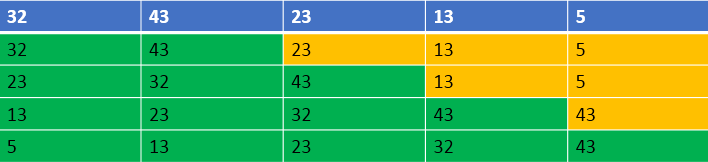

## 1. 算法介绍
将数组分为两个区间: 左侧为有序区间，右侧为无序区间。每趟从无序区间取出一个元素，然后将其插入到有序区间的适当位置。

插入排序在每次插入一个元素时，该元素会在有序区间找到合适的位置，因此每次插入后，有序区间都会保持有序。

## 2. 算法描述
1. 把待排序的数组分成已排序和未排序两部分，初始的时候把第 1 个元素认为是已排好序的。
2. 从第 2 个元素开始，在已排好序的子数组中寻找到该元素合适的位置并插入该位置。
3. 重复上述过程直到最后一个元素被插入有序子数组中。



## 3. 插入排序动图展示


## 4. 代码

```java
/**
 * 排序器接口(策略模式: 将算法封装到具有共同接口的独立的类中使得它们可以相互替换)
 */
public interface Sorter<T extends Comparable<T>> {

    /**
     * 排序
     *
     * @param array 待排序的数组
     */
    default void sort(T[] array) {
    }
}
```

```java
public class InsertSorter<T extends Comparable<T>> implements Sorter<T> {
    public void sort(T[] array) {
        int length = array.length;
        int preIndex;
        T current;

        for (int i = 1; i < length; ++i) {
            // 待插入的数
            current = array[i];

            // 待插入的位置
            preIndex = i - 1;

            while (preIndex >= 0 && current.compareTo(array[preIndex]) < 0) {
                // 从后到前循环，将大于current的数向后移动一格
                array[preIndex + 1] = array[preIndex];
                --preIndex;
            }
            array[preIndex + 1] = current;
        }
    }
}
```

## 5. 总结
1. 由于只需要找到不大于当前数的位置而并不需要交换，因此，直接插入排序是**稳定**的排序方法。
2. 元素集合越接近有序，直接插入排序算法的时间效率越高
3. 时间复杂度：O(N^2)
4. 空间复杂度：O(1)，它是一种稳定的排序算法
