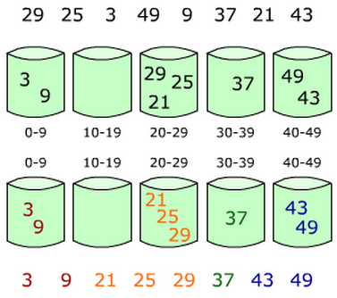

# 桶排序
## 算法原理
桶排序(Bucket Sort)的原理很简单，它是将数组分到有限数量的桶子里。
假设待排序的长度为 length 数组 array 中共有 length 个整数，并且已知数组 array 中数据的范围[0, MAX)，将这个序列划分成长度为 bucketsLen（可为(MAX - 0) / length + 1）个的子区间(桶)。然后基于某种映射函数，将待排序列的关键字 key 映射到第 i 个桶中(即桶数组 buckets 的下标 i)，那么该关键字 key 就作为 buckets[i]中的元素(每个桶 buckets[i]都是一组大小为 length / bucketsLen 的序列)。接着对每个桶 buckets[i]中的所有元素进行比较排序(可以使用快排)。然后依次枚举输出 buckets[0]...buckets[bucketLen]中的全部内容即是一个有序序列。

## 基本流程
1.建立一堆 buckets； 
2.遍历原始数组，并将数据放入到各自的 buckets 当中； 
3.对非空的 buckets 进行排序； 
4.按照顺序遍历这些 buckets 并放回到原始数组中即可构成排序后的数组。

## [关键字—桶]映射函数
bIndex = f(key):其中，bIndex 为桶数组 B 的下标（即第 bIndex 个桶），key 为待排序列的关键字。桶排序之所以能够高效，关键在于这个映射函数，它必须做到：如果关键字 k1 < k2，那么 `f(k1) <= f(k2)`。也就是说 buckets(i)中的最小数据都要小于 buckets(i+1)中最大数据。下面举个例子：
假如待排序列 array = {29,  25,  3,  49,  9,  37,  21,  43}，这些数据全部在 1—50 之间。因此我们定制 5 个桶，然后确定映射函数 f(key) = (key + 1) / 10。则第一个关键字 29 将定位到第 3 个桶中((29 + 1)/10=3)。依次将所有关键字全部堆入桶中，并在每个非空的桶中进行快速排序后得到如下图所示：



对上图只要顺序输出每个 buckets[i]中的数据就可以得到有序序列了。

## 代码
```java
/**
 * 排序器接口(策略模式: 将算法封装到具有共同接口的独立的类中使得它们可以相互替换)
 */
public interface Sorter<T extends Comparable<T>> {

    /**
     * 排序
     *
     * @param array 待排序的数组
     */
    default void sort(T[] array) {
    }
}
```

```java
public class BucketSorter<T extends Comparable<T>> implements Sorter<T> {
    public void sort(T[] array) {
        int length = array.length;

        T maxValue = getMax(array);
        int max = Integer.valueOf(maxValue.toString());

        List<List<T>> buckets = new ArrayList<>();
        for (int i = 0; i < max + 1; ++i) {
            List<T> list = new ArrayList<>();
            buckets.add(list);
        }

        //将每个元素放入桶
        for (int i = 0; i < array.length; ++i) {
            T element = array[i];
            int index = Integer.valueOf(element.toString());

            buckets.get(index).add(element);
        }

        Object[] tempArray = new Object[length];
        for (int i = 0, j = 0; i < buckets.size(); ++i) {
            List<T> list = buckets.get(i);
            Collections.sort(list);
            for (int k = 0; k < list.size(); ++k) {
                T element = list.get(k);
                if (element != null) {
                    tempArray[j++] = element;
                }
            }
        }

        for (int i = 0; i < length; ++i) {
            array[i] = (T) tempArray[i];
        }
    }

    public T getMax(T[] array) {
        T max = array[0];
        for (int i = 1; i < array.length; ++i) {
            if (array[i].compareTo(max) > 0) {
                max = array[i];
            }
        }
        return max;
    }
}
```
