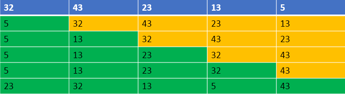

## 1. 算法原理
选择排序是一种交换排序算法，它的工作原理: 首先在未排序序列中找到最小（大）元素，存放到排序序列的起始位置，然后，再从剩余未排序元素中继续寻找最小（大）元素，然后放到已排序序列的末尾。以此类推，直到所有元素均排序完毕。

## 2. 算法描述
n个记录的直接选择排序可经过 n-1 趟直接选择排序得到有序结果。具体算法描述如下:
1. 在未排序序列中找到最小（大）元素，存放到排序序列的起始位置
2. 从剩余未排序元素中继续寻找最小（大）元素，然后放到已排序序列的末尾。
3. 重复第二步，直到所有元素均排序完毕。



## 3. 动图展示


## 4. 代码
```java
/**
 * 排序器接口(策略模式: 将算法封装到具有共同接口的独立的类中使得它们可以相互替换)
 */
public interface Sorter<T extends Comparable<T>> {

    /**
     * 排序
     *
     * @param array 待排序的数组
     */
    default void sort(T[] array) {
    }
}
```

```java
public class SelectSorter<T extends Comparable<T>>  implements Sorter<T> {
    @Override
    public void sort(T[] array) {
        int length = array.length;
        for (int i = 0; i < length; ++i) {
            T min = array[i];
            int minIndex = i;

            for (int j = i + 1; j < length; ++j) {
                //选出最小的值和位置
                if (array[j].compareTo(min) < 0) {
                    min = array[j];
                    minIndex = j;
                }
            }

            array[minIndex] = array[i];
            array[i] = min;
        }
    }
}

```

## 5. 总结
用数组实现的选择排序是不稳定的，用链表实现的选择排序是稳定的。一般提到排序算法时，大家往往会默认是数组实现，所以选择排序是不稳定的。

由于选择排序固有的O(n^2)复杂度，选择排序在海量数据面前显得力不从心。因此，它适用于简单数据排序。