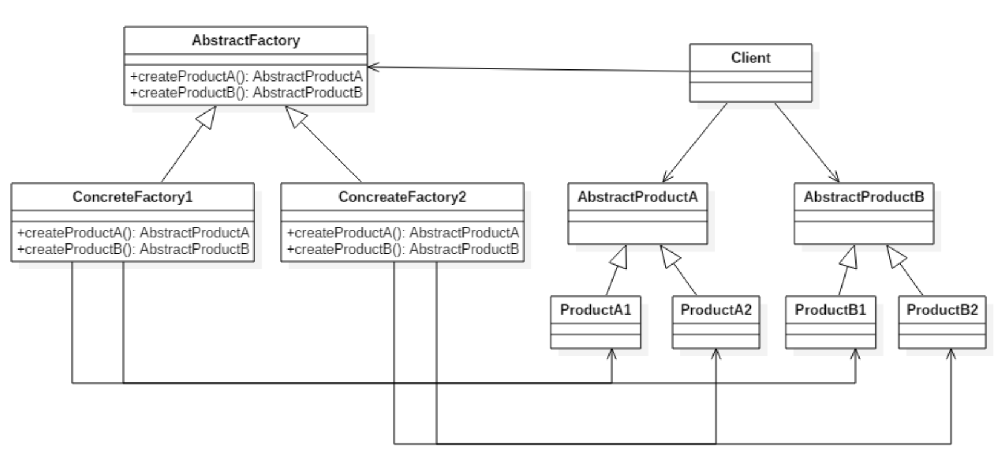

## 定义
抽象工厂模式创建的是对象家族，也就是很多对象而不是一个对象，并且这些对象是相关的，也就是说必须一起创建出来。而工厂方法模式只是用于创建一个对象，这和抽象工厂模式有很大不同。

抽象工厂模式用到了工厂方法模式来创建单一对象，AbstractFactory 中的 createProductA() 和 createProductB() 方法都是让子类来实现，这两个方法单独来看就是在创建一个对象，这符合工厂方法模式的定义。

从高层次来看，抽象工厂使用了组合，即 Cilent 组合了 AbstractFactory，而工厂方法模式使用了继承。

## 结构



### 抽象工厂（Abstract Factory）
提供了创建产品的接口，它包含多个创建产品的方法 newProduct()，可以创建多个不同等级的产品，可以派生出多个具体工厂类。
### 具体工厂（Concrete Factory）
主要是实现抽象工厂中的多个抽象方法，完成具体产品的创建，每个具体工厂类可以创建多个具体产品类的实例
### 抽象产品（Product）
定义了产品的规范，描述了产品的主要特性和功能，抽象工厂模式有多个抽象产品类，每个抽象产品类可以派生出多个具体产品类
### 具体产品（ConcreteProduct）
实现了抽象产品角色所定义的接口，由具体工厂来创建，它 同具体工厂之间是多对一的关系。

## 实现

```java
/**
 * 抽象工厂角色，提供了创建多种产品的接口
 */
public interface IDBFactory {
    IUser createUser();
    IDepartment createDepartment();
}

/**
 * 具体工厂类，实现多种具体对象的创建
 */
public class InformixFactory implements IDBFactory {
    public IUser createUser() {
        return new InformixUser();
    }

    public IDepartment createDepartment() {
        return new InformixDepartment();
    }
}

/**
 * 具体工厂类，实现多种具体对象的创建
 */
public class OracleFactory implements IDBFactory {
    public IUser createUser() {
        return new OracleUser();
    }

    public IDepartment createDepartment() {
        return new OracleDepartment();
    }
}

/**
 * 抽象产品A
 */
public interface IDepartment {
}

/**
 * 具体产品A1角色
 */
public class InformixDepartment implements IDepartment {
    public InformixDepartment() {
        System.out.println("Informix department");
    }
}

/**
 * 具体产品A2角色
 */
public class OracleDepartment implements IDepartment {
    public OracleDepartment() {
        System.out.println("Oracle department");
    }
}

/**
 * 抽象产品B
 */
public interface IUser {
}

/**
 * 具体产品B1角色
 */
public class InformixUser implements IUser {
    public InformixUser() {
        System.out.println("informix中操作user ");
    }
}

/**
 * 具体产品B2角色
 */
public class OracleUser implements IUser {
    public OracleUser() {
        System.out.println("oracle中操作user ");
    }
}

public class AbstractFactoryTest {
    @Test
    public void test() {
        IDBFactory factory = new OracleFactory();
        IUser user = factory.createUser();
        IDepartment department = factory.createDepartment();
    }
}

# 结果
Oracle user 
Oracle department
```
## 小结
和工厂方法模式的区别：
工厂方法模式只有一个抽象产品类，而抽象工厂模式有多个。   
工厂方法模式的具体工厂类只能创建一个具体产品类的实例，而抽象工厂模式可以创建多个。