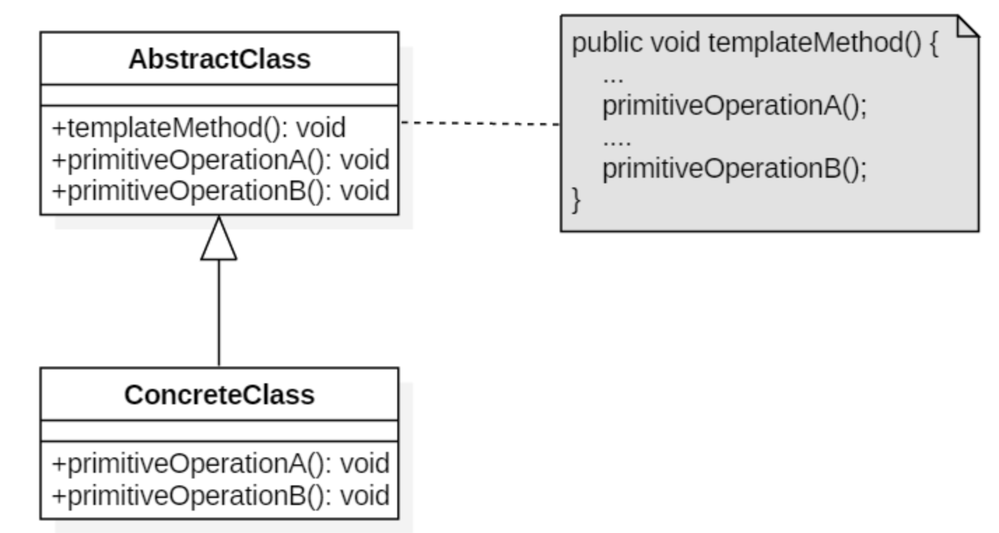

## 概述
在面向对象开发过程中，通常我们会遇到这样的一个问题：我们知道一个算法所需的关键步骤，并确定了这些步骤的执行顺序。但是某些步骤的具体实现是未知的，或者说某些步骤的实现与具体的环境相关。
例子 1：银行业务办理流程
在银行办理业务时，一般都包含几个基本固定步骤:
取号排队->办理具体业务->对银行工作人员进行评分。
取号取号排队和对银行工作人员进行评分业务逻辑是一样的。但是办理具体业务是个不相同的，具体业务可能取款、存款或者转账。

## 定义
模板方法：定义一个操作中的算法的骨架，而将一些步骤延迟到子类中。模板方法使得子类可以不改变一个算法的结构即可重定义该算法的某些特定步骤。
+ 模板方法模式是基于继承的代码复用基本技术，模板方法模式的结构和用法也是面向对象设计的核心之一。在模板方法模式中，可以将相同的代码放在父类中，而将不同的方法实现放在不同的子类中。
+ 在模板方法模式中，我们需要准备一个抽象类，将部分逻辑以具体方法以及具体构造函数的形式实现，然后声明一些抽象方法来让子类实现剩余的逻辑。不同的子类可以以不同的方式实现这些抽象方法，从而对剩余的逻辑有不同的实现，这就是模板方法模式的用意。模板方法模式体现了面向对象的诸多重要思想，是一种使用频率较高的模式。

## 适用性
+ 一次性实现一个算法的不变的部分，并将可变的行为留给子类来实现。
+ 各子类中公共的行为应被提取出来并集中到一个公共父类中以避免代码重复。首先识别现有代码中的不同之处，并且将不同之处分离为新的操作。最后，用一个调用这些新的操作的模板方法来替换这些不同的代码。
+ 控制子类扩展。模板方法只在特定点调用“hook”操作，这样就只允许在这些点进行扩展。

## 结构

### 抽象类（AbstractClass）
定义抽象的原语操作（primitive operation），具体的子类将重定义它们以实现一个算法，实现一个模板方法,定义一个算法的骨架。该模板方法不仅调用原语操作，也调用定义
### 具体子类（ConcreteClass）
实现原语操作以完成算法中与特定子类相关的步骤。

## 实现
```java
/**
 * 提供模板骨架
 */
public abstract class AbstractClass {
    public abstract void primitiveOperation1();
    public abstract void primitiveOperation2();

    public void templateMethod(){
        primitiveOperation1();
        primitiveOperation2();
        System.out.println();
    }
}

/**
 * 具体模板
 */
public class ConcreteClassA extends AbstractClass {
    @Override
    public void primitiveOperation1() {
        System.out.println("具体类A方法1实现");
    }

    @Override
    public void primitiveOperation2() {
        System.out.println("具体类A方法2实现");
    }
}

/**
 * 具体模板
 */
public class ConcreteClassB extends AbstractClass {
    @Override
    public void primitiveOperation1() {
        System.out.println("具体类B方法1实现");
    }

    @Override
    public void primitiveOperation2() {
        System.out.println("具体类B方法2实现");
    }
}

public class TemplateTest {
    @Test
    public void test() {
        AbstractClass abstractClass = new ConcreteClassA();
        abstractClass.templateMethod();

        abstractClass = new ConcreteClassB();
        abstractClass.templateMethod();
    }
}

##结果
具体类A方法1实现
具体类A方法2实现

具体类B方法1实现
具体类B方法2实现
```

## 总结
### 优点
+ 模板方法模式在一个类中形式化地定义算法，而由它的子类实现细节的处理。
+ 模板方法是一种代码复用的基本技术。它们在类库中尤为重要，它们提取了类库中的公共行为。
+ 模板方法模式导致一种反向的控制结构，这种结构有时被称为“好莱坞法则”，即“别找我们，,我们找你”通过一个父类调用其子类的操作(而不是相反的子类调用父类)，通过对子类的扩展增加新的行为，符合“开闭原则”

### 缺点
每个不同的实现都需要定义一个子类，这会导致类的个数增加，系统更加庞大，设计也更加抽象，但是更加符合“单一职责原则”，使得类的内聚性得以提高。

## 模式的扩展
### 模板方法模式与控制反转
在模板方法模式中，子类不显式调用父类的方法，而是通过覆盖父类的方法来实现某些具体的业务逻辑，由父类完全控制着子类的逻辑，子类不需要调用父类，而通过父类来调用子类，子类可以实现父类的可变部份，却继承父类的逻辑,不能改变业务逻辑。
### 模板方法模式符合开闭原则
模板方法模式意图是由抽象父类控制顶级逻辑，并把基本操作的实现推迟到子类去实现,这是通过继承的手段来达到对象的复用，同时也遵守了开闭原则。
父类通过顶级逻辑，它通过定义并提供一个具体方法来实现，我们也称之为模板方法。通常这个模板方法才是外部对象最关心的方法。在上面的银行业务处理例子中，templateMethodProcess 这个方法才是外部对象最关心的方法。所以它必须是 public 的,才能被外部对象所调用。
子类需要继承父类去扩展父类的基本方法，但是它也可以覆写父类的方法。如果子类去覆写了父类的模板方法，从而改变了父类控制的顶级逻辑，这违反了“开闭原则”。我们在使用模板方法模式时，应该总是保证子类有正确的逻辑。所以模板方法应该定义为 final 的。所以 AbstractClass 类的模板方法 templateMethodProcess 方法应该定义为 final。
模板方法模式中,抽象类的模板方法应该声明为 final 的。因为子类不能覆写一个被定义为 final 的方法。从而保证了子类的逻辑永远由父类所控制。
### 模板方法模式与对象的封装性
面向对象的三大特性：继承，封装，多态。
对象有内部状态和外部的行为，封装是为了信息隐藏，通过封装来维护对象内部数据的完整性，使得外部对象不能够直接访问一个对象的内部状态，而必须通过恰当的方法才能访问。
对象属性和方法赋予指定的修改符(public、protected、private)来达到封装的目的，使得数据不被外部对象恶意的访问及方法不被错误调用导造成破坏对象的封装性。
降低方法的访问级别，也就是最大化的降低方法的可见度是一种很重要的封装手段。最大化降低方法的可见度除了可以达到信息隐藏外，还能有效的降低类之间的耦合度,降低一个类的复杂度。还可以减少开发人员发生的的错误调用。
一个类应该只公开外部需要调用的方法。而所有为 public 方法服务的方法都应该声明为 protected 或 private。如是一个方法不是需要对外公开的，但是它需要被子类进行扩展的或调用。那么把它定义为 protected.否则应该为 private。
显而易见，模板方法模式中的声明为 abstract 的基本操作都是需要迫使子类去实现的，它们仅仅是为模板方法服务的。它们不应该被抽象类（AbstractClass）所公开，所以它们应该 protected。
因此模板方法模式中，迫使子类实现的抽象方法应该声明为 protected abstract。