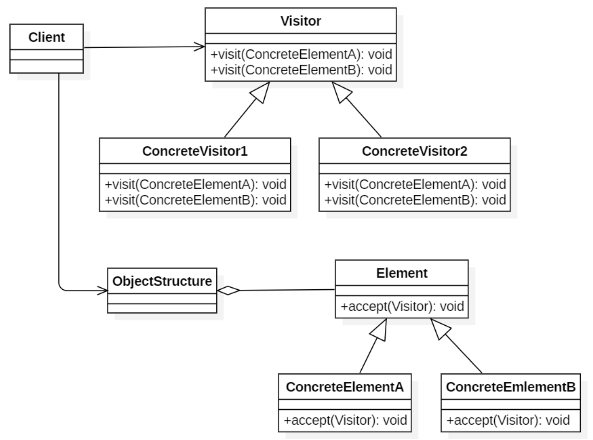

## 概述
在软件开发过程中，对于系统中的某些对象，它们存储在同一个集合 collection 中，且具有不同的类型，而且对于该集合中的对象，可以接受一类称为访问者的对象来访问，而且不同的访问者其访问方式有所不同。
例子 1：顾客在超市中将选择的商品，如苹果、图书等放在购物车中，然后到收银员处付款。在购物过程中，顾客需要对这些商品进行访问，以便确认这些商品的质量，之后收银员计算价格时也需要访问购物车内顾客所选择的商品。
此时，购物车作为一个 Object Structure（对象结构）用于存储各种类型的商品，而顾客和收银员作为访问这些商品的访问者，他们需要对商品进行检查和计价。不同类型的商品其访问形式也可能不同，如苹果需要过秤之后再计价，而图书不需要。
对同一集合对象的操作并不是唯一的，对相同的元素对象可能存在多种不同的操作方式。而且这些操作方式并不稳定，如果对需要增加新的操作，如何满足新的业务需求？

## 定义
访问者模式：表示一个作用于某对象结构中的各元素的操作，它使可以在不改变各元素的类的前提下定义作用于这些元素的新操作。
+ 访问者模式中对象结构存储了不同类型的元素对象，以供不同访问者访问。
+ 访问者模式包括两个层次结构，一个是访问者层次结构，提供了抽象访问者和具体访问者，一个是元素层次结构，提供了抽象元素和具体元素。
相同的访问者可以以不同的方式访问不同的元素，相同的元素可以接受不同访问者以不同访问方式访问。在访问者模式中，增加新的访问者无须修改原有系统，系统具有较好的可扩展性

## 适用性
+ 一个对象结构包含很多类对象，它们有不同的接口，而想对这些对象实施一些依赖于其具体类的操作。
+ 需要对一个对象结构中的对象进行很多不同的并且不相关的操作，而想避免让这些操作“污染”这些对象的类。Visitor 使得可以将相关的操作集中起来定义在一个类中。当该对象结构被很多应用共享时，用 Visitor 模式让每个应用仅包含需要用到的操作。
+ 定义对象结构的类很少改变，但经常需要在此结构上定义新的操作。改变对象结构类需要重定义对所有访问者的接口，这可能需要很大的代价。如果对象结构类经常改变，那么可能还是在这些类中定义这些操作较好。

## 结构



### 抽象访问者（Vistor）
—为该对象结构中 ConcreteElement 的每一个类声明一个 Visit 操作，该操作的名字和特征标识了发送 Visit 请求给该访问者的那个类，这使得访问者可以确定正被访问元素的具体的类，这样访问者就可以通过该元素的特定接口直接访问它。
### 具体访问者（ConcreteVisitor）
—实现每个由 Visitor 声明的操作，每个操作实现本算法的一部分，而该算法片断乃是对应于结构中对象的类。ConcreteVisitor 为该算法提供了上下文并存储它的局部状态，这一状态常常在遍历该结构的过程中累积结果。
### 抽象元素（Element）
定义一个 Accept 操作，它以一个访问者为参数。
### 具体元素（ConcreteElement）
实现 Accept 操作，该操作以一个访问者为参数。
### 对象结构（ObjectStructure）
能枚举它的元素。可以提供一个高层的接口以允许该访问者访问它的元素。可以是一个复合或是一个集合，如一个列表或一个无序集合。

## 实现

```java
/**
 * 访问者接口
 */
public interface Visitor {
    void visitConcreteElementA(ConcreteElementA elementA);

    void visitConcreteElementB(ConcreteElementB elementB);
}

/**
 * 具体的访问者1
 */
public class ConcreteVisitor1 implements Visitor {
    public void visitConcreteElementA(ConcreteElementA elementA) {
        System.out.println(elementA.getName() + " visitd by ConcerteVisitor1");
    }

    public void visitConcreteElementB(ConcreteElementB elementB) {
        System.out.println(elementB.getName() + " visited by ConcerteVisitor1");
    }
}

/**
 * 具体的访问者2
 */
public class ConcreteVisitor2 implements Visitor {
    public void visitConcreteElementA(ConcreteElementA elementA) {
        System.out.println(elementA.getName() + " visitd by ConcerteVisitor2");
    }

    public void visitConcreteElementB(ConcreteElementB elementB) {
        System.out.println(elementB.getName() + " visited by ConcerteVisitor2");
    }
}

/**
 * 抽象元素
 */
public interface Element {
    void accept(Visitor visitor);
}

/**
 * 具体元素A
 */
public class ConcreteElementA implements Element {
    private String name;

    public ConcreteElementA(String name) {
        this.name = name;
    }

    public String getName() {
        return this.getName();
    }

    //接受访问者调用它针对该元素的新方法
    public void accept(Visitor visitor) {
        visitor.visitConcreteElementA(this);
    }
}

/**
 * 具体元素B
 */
public class ConcreteElementB implements Element {
    private String name;

    public ConcreteElementB(String name) {
        this.name = name;
    }


    public String getName() {
        return this.name;
    }

    /**
     * 接受访问者调用它针对该元素的新方法
     *
     * @paramVisitor$visitor
     */
    public void accept(Visitor visitor) {
        visitor.visitConcreteElementB(this);
    }
}

/**
 * 对象结构
 */
public class ObjectStructure {
    private List<Element> collection;

    public ObjectStructure() {
        this.collection = new ArrayList<Element>();
    }

    public void attach(Element element) {
        collection.add(element);
    }

    public void detach(Element element) {
        collection.remove(element);
    }

    public void accept(Visitor visitor) {
        for (Element ele : collection) {
            ele.accept(visitor);
        }
    }
}

public class VisitorTest {
    @Test
    public void test() {
        Element elementA = new ConcreteElementA("ElementA");
        Element elementB = new ConcreteElementB("ElementB");
        Element elementA2 = new ConcreteElementB("ElementA2");

        Visitor visitor1 = new ConcreteVisitor1();
        Visitor visitor2 = new ConcreteVisitor2();

        ObjectStructure objectStructure = new ObjectStructure();
        objectStructure.attach(elementA);
        objectStructure.attach(elementB);
        objectStructure.attach(elementA2);
        objectStructure.detach(elementA);

        objectStructure.accept(visitor1);
        objectStructure.accept(visitor2);
    }
}

## 结果
ElementB visited by ConcerteVisitor1
ElementA2 visited by ConcerteVisitor1
ElementB visited by ConcerteVisitor2
ElementA2 visited by ConcerteVisitor2
```

## 总结
### 优点
+ 使得增加新的访问操作变得很容易，如果一些操作依赖于一个复杂的结构对象的话，那么一般而言，增加新的操作会很复杂，而使用访问者模式，增加新的操作就意味着增加一个新的访问者类，因此，变得很容易。
+ 将有关元素对象的访问行为集中到一个访问者对象中，而不是分散到一个个的元素类中。
+ 访问者模式可以跨过几个类的等级结构访问属于不同的等级结构的成员类。迭代子只能访问属于同一个类型等级结构的成员对象，而不能访问属于不同等级结构的对象。访问者模式可以做到这一点。
+ 让用户能够在不修改现有类层次结构的情况下，定义该类层次结构的操作。

### 缺点
+ 增加新的元素类很困难，在访问者模式中，每增加一个新的元素类都意味着要在抽象访问者角色中增加一个新的抽象操作，并在每一个具体访问者类中增加相应的具体操作，违背了“开闭原则”的要求。
+ 破坏封装。访问者模式要求访问者对象访问并调用每一个元素对象的操作，这意味着元素对象有时候必须暴露一些自己的内部操作和内部状态，否则无法供访问者访问。