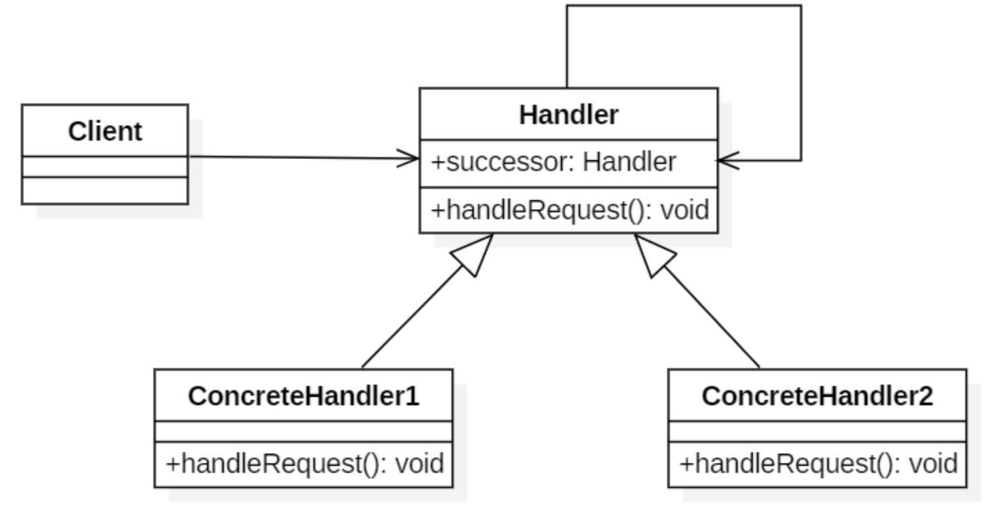

## 概述
如果有多个对象都有可能接受请求，如何避免避免请求发送者与接收者耦合在一起呢？
例子：员工请求加工资，向直属领导提出加工资请求，直属领导审批同意向部门主管申请，部门主管审批同意向经理提出，经理向老板提出。

## 定义
职责链模式(Chain of Responsibility) ：使多个对象都有机会处理请求，从而避免请求的发送者和接收者之间的耦合关系。将这些对象连成一条链，并沿着这条链传递该请求，直到有一个对象处理它为止。
+ 在职责链模式里，很多对象由每一个对象对其下家的引用而连接起来形成一条链。
+ 请求在这条链上传递，直到链上的某一个对象处理此请求为止。
+ 发出这个请求的客户端并不知道链上的哪一个对象最终处理这个请求，这使得系统可以在不影响客户端的情况下动态地重新组织链和分配责任。

## 适用性
+ 有多个的对象可以处理一个请求，哪个对象处理该请求运行时刻自动确定。
+ 不明确指定接收者的情况下，向多个对象中的一个提交一个请求。
+ 可动态指定一组对象处理请求。

## 结构


### 抽象处理者角色(Handler)

定义一个处理请求的接口，和一个后继连接

### 具体处理者角色(ConcreteHandler)

处理它所负责的请求，可以访问后继者，如果可以处理请求则处理，否则将该请求转给他的后继者。

### 客户类(Client)

向一个链上的具体处理者 ConcreteHandler 对象提交请求。

## 实现

```java
/**
 * 定义处理请求的接口，并且实现后继链
 */
public abstract class Handler {
    protected Handler successor;

    public void setSuccessor(Handler handler){
        this.successor = handler;
    }

    public Handler getSuccessor() {
        return successor;
    }

    public abstract void handlerRequest(int request);
}

/**
 * 具体handler
 */
public class ConcreteHandlerA extends Handler {

    @Override
    public void handlerRequest(int request) {
        if (request > 0 && request <= 10){
            System.out.println(this.getClass().getName() + "处理请求:" + request);
        } else if(successor != null){
            successor.handlerRequest(request);
        }
    }
}

/**
 * 具体handler
 */
public class ConcreteHandlerB extends Handler {

    @Override
    public void handlerRequest(int request) {
        if (request > 10 && request <= 20){
            System.out.println(this.getClass().getName() + "处理请求:" + request);
        } else if(successor != null){
            successor.handlerRequest(request);
        }
    }
}

/**
 * 具体handler
 */
public class ConcreteHandlerC extends Handler {

    @Override
    public void handlerRequest(int request) {
        if (request > 20 && request <= 30){
            System.out.println(this.getClass().getName() + "处理请求:" + request);
        } else if(successor != null){
            successor.handlerRequest(request);
        }
    }
}

public class HandlerTest {
    @Test
    public void test() {
        Handler handlerA = new ConcreteHandlerA();
        Handler handlerB = new ConcreteHandlerB();
        Handler handlerC = new ConcreteHandlerC();

        handlerA.setSuccessor(handlerB);
        handlerB.setSuccessor(handlerC);

        int[] reuqests = new int[]{2, 5, 14, 22, 28};

        for (int request : reuqests){
            handlerA.handlerRequest(request);
        }
    }
}

## 结果
ConcreteHandlerA处理请求:2 
ConcreteHandlerA处理请求:5 
ConcreteHandlerB处理请求:14
ConcreteHandlerC处理请求:22
ConcreteHandlerC处理请求:28

```

## 总结

### 优点

+ 降低耦合度：该模式使得一个对象无需知道是其他哪一个对象处理其请求。对象仅需知道该请求会被“正确”地处理。接收者和发送者都没有对方的明确的信息，且链中的对象不需知道链的结构。

+ 职责链可简化对象的相互连接：结果是，职责链可简化对象的相互连接。它们仅需保持一个指向其后继者的引用，而不需保持它所有的候选接受者的引用。

+ 增强了给对象指派职责(Responsibility)的灵活性：当在对象中分派职责时，职责链给更多的灵活性。可以通过在运行时刻对该链进行动态的增加或修改来增加或改变处理一个请求的那些职责。可以将这种机制与静态的特例化处理对象的继承机制结合起来使用。

+ 增加新的请求处理类很方便

### 缺点

+ 不能保证请求一定被接收。既然一个请求没有明确的接收者，那么就不能保证它一定会被处理—该请求可能一直到链的末端都得不到处理。一个请求也可能因该链没有被正确配置而得不到处理。

+ 系统性能将受到一定影响，而且在进行代码调试时不太方便；可能会造成循环调用。

在职责链模式里，很多对象由每一个对象对其下家的引用而连接起来形成一条链。请求在这个链上传递，直到链上的某一个对象决定处理此请求。发出这个请求的客户端并不知道链上的哪一个对象最终处理这个请求，这使得系统可以在不影响客户端的情况下动态地重新组织链和分配责任。

 职责链模式的主要优点在于可以降低系统的耦合度，简化对象的相互连接，同时增强给对象指派职责的灵活性，增加新的请求处理类也很方便；其主要缺点在于不能保证请求一定被接收，且对于比较长的职责链，请求的处理可能涉及到多个处理对象，系统性能将受到一定影响，而且在进行代码调试时不太方便。