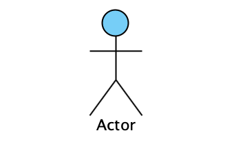
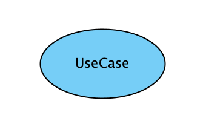
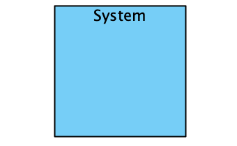
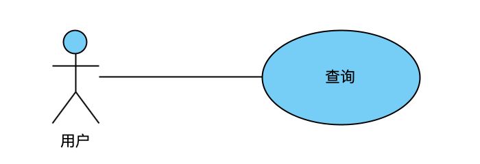
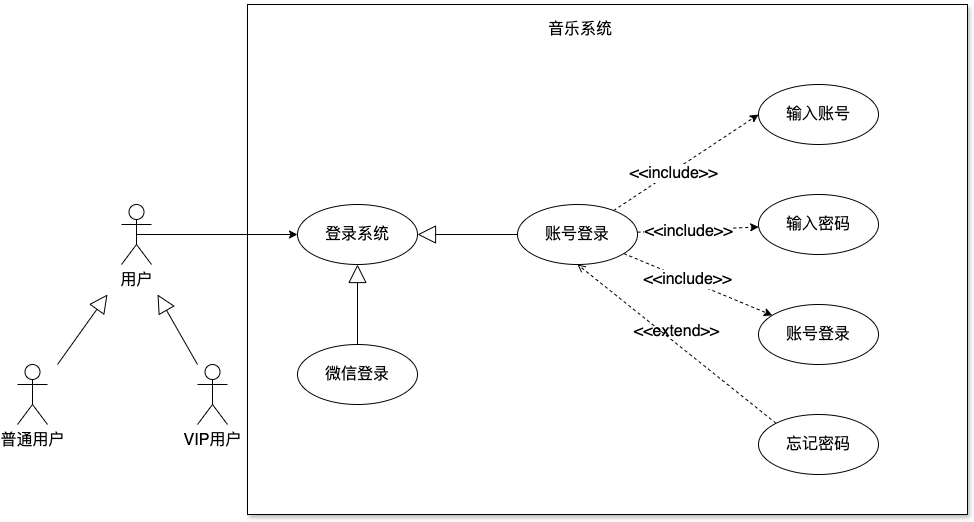
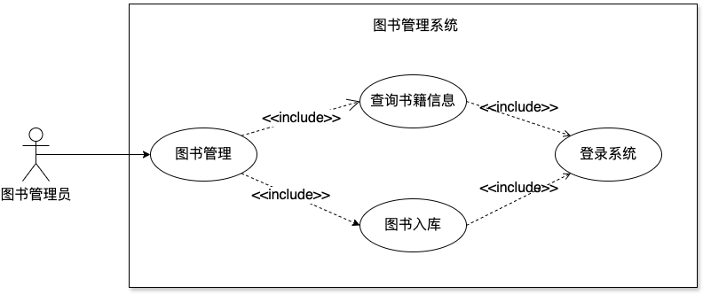
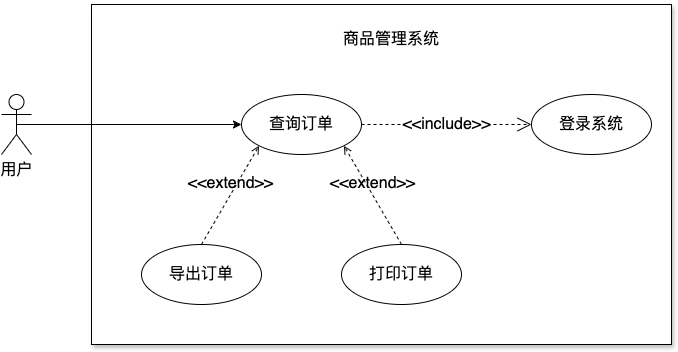
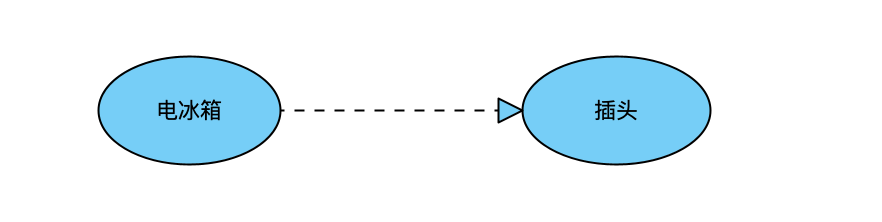

## 1.定义
用例图是指由参与者(Actor)、用例(Use Case)、边界以及它们之间的关系构成的用于描述系统功能的视图。它是外部用户(被称为参与者)所能观察到的系统功能的模型图。

简单来说，用例图的目的是用来收集系统的要求，用于获取系统的外观图，识别外部和内部因素影响系统，显示要求之间的相互作用是参与者。本质是场景化思维和系统思维的体现。

画图的过程，实际上是在锻炼产品经理从用户视角去思考问题，这样更能理解业务、清晰表达需求。

用例图主要用来描述角色以及角色与用例之间的连接关系。说明的是谁要使用系统，以及他们使用该系统可以做些什么。一个用例图包含了多个模型元素，如系统、参与者和用例，并且显示这些元素之间的各种关系，如泛化、关联和依赖。它展示了一个外部用户能够观察到的系统功能模型图。

## 2. 用例图的应用场景
1. 软件开发项目：无论是瀑布式、敏捷还是混合型的软件开发过程，用例图都是需求分析阶段的重要工具。它适用于各类软件系统的开发，包括企业应用、移动应用、Web 应用、嵌入式系统等。

2. 系统升级与重构：在对现有系统进行功能扩展、性能优化或架构调整时，用例图有助于梳理现有功能，识别新需求，以及清晰地呈现系统改造后的功能结构。

3. 产品规划与设计：产品经理在产品规划阶段可以使用用例图来描绘产品的核心功能、用户群体以及他们的交互方式，作为产品路线图和功能列表的基础。

4. 业务流程建模：对于复杂的业务流程或工作流，用例图可以帮助分析人员理解流程中的角色分工、任务流转以及信息系统如何支撑这些流程。

5. 系统集成项目：在多个系统需要协同工作或进行数据交换的场景下，用例图可用于描绘各系统间的交互接口、消息传递和责任划分。

## 3. 用例图的构成要素

用例图由 4 个元素组成：参与者、用例、系统边界、参与者之间的关系组成。

### 3.1 参与者(Actor)
某些具有行为的事物，可以是人（由角色标识），也可以是计算机系统或组织。参与者又分为主动参与者和被动参与者，用例图中一个良好的习惯是将主动参与者放在用例图的左边，而将被动参与者放在用例图的右边。

### 3.2 用例(Use Case)
用例就是外部可见的系统功能，对系统提供的服务进行描述。用椭圆表示。

### 3.3 系统边界
系统边界是指系统与系统之间的界限。参与者是在系统外部，系统边界确定了目标系统的范围。

## 4. 用例图所包含的的关系
用例图中涉及的关系有：关联、泛化、包含、扩展。

### 4.1 关联(Association)

表示参与者与用例之间的通信，任何一方都可发送或接受消息。

[箭头指向]: 无箭头，将参与者与用例相连接，指向消息接收方

### 4.2 泛化(Inheritance)
就是通常理解的继承关系，子用例和父用例相似，但表现出更特别的行为;
子用例将继承父用例的所有结构、行为和关系。
子用例可以使用父用例的一段行为，也可以重载它。
父用例通常是抽象的。
在实际应用中很少使用泛化关系，子用例中的特殊行为都可以作为父用例中的备选流存在。

[箭头指向]: 指向父用例

### 4.3 包含(Include)
当两个或多个用例中共用一组相同的动作，这时可以将这组相同的动作抽出来作为一个独立的用例，供多个基用例所共享。因为子用例被抽出，基用例并非一个完整的用例，所以 include 关系中的基用例必须和子用例一起使用才够完整，
子用例也必然被执行。include 关系在用例图中使用带箭头的虚线表示（在线上标注`<<include>>`），箭头从基用例指向子用例。

例如：业务中，总是存在着维护某某信息的功能，如果将它作为一个用例，那添加、修改以及删除都要在用例详述中描述，过于复杂；如果分成添加用例、修改用例和删除用例，则划分太细。这时包含关系可以用来理清关系。

[箭头指向]: 指向分解出来的功能用例

### 4.4 扩展(Extend)
扩展关系是对基用例的扩展，基用例是一个完整的用例，即使没有子用例的参与，也可以完成一个完整的功能。extend 关系在用例图中使用带箭头的虚线表示（在线上标注`<<extend>>`)，箭头从子用例指向基用例。

对于一个扩展用例，可以在基用例上有几个扩展点。

[箭头指向]: 指向基础用例

### 4.5 依赖(Dependency)

以上 4 种关系，是 UML 定义的标准关系。但 VS2010 的用例模型图中，添加了依赖关系，用带箭头的虚线表示，表示源用例依赖于目标用例。

[箭头指向]: 指向被依赖项

## 5. 包含 (include)、扩展 (extend)、泛化 (Inheritance) 的区别
+ 条件性: 泛化中的子用例和 include 中的被包含的用例会无条件发生，而 extend 中的延伸用例的发生是有条件的；
+ 直接性: 泛化中的子用例和 extend 中的延伸用例为参与者提供直接服务，而 include 中被包含的用例为参与者提供间接服务。

+ 泛化侧重表示子用例间的互斥性；
+ 包含侧重表示被包含用例对 Actor 提供服务的间接性；
+ 扩展侧重表示扩展用例的触发不定性；
另外一点需要提及的是：泛化中的子用例和扩展中的扩展用例均可以作为基本用例事件的备选择流而存在。

