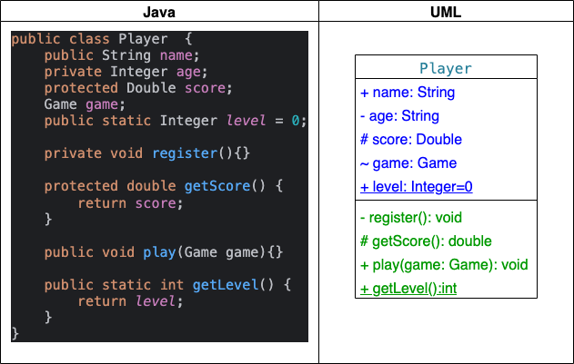
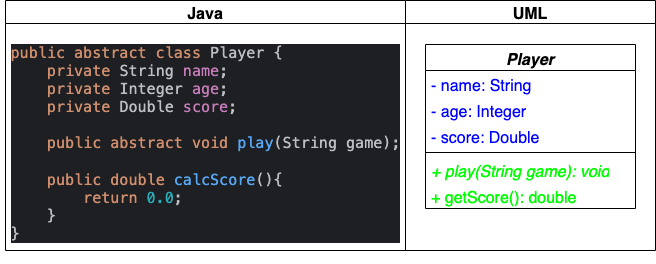
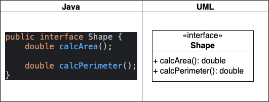
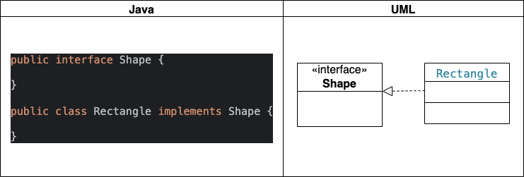
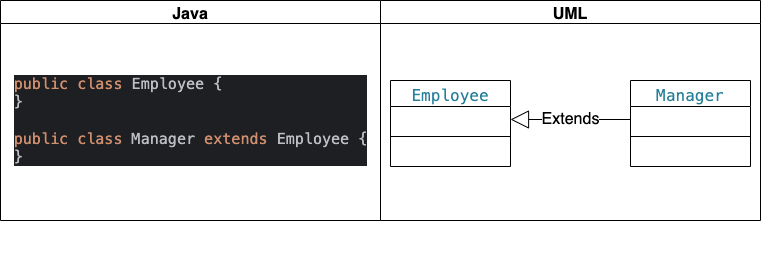
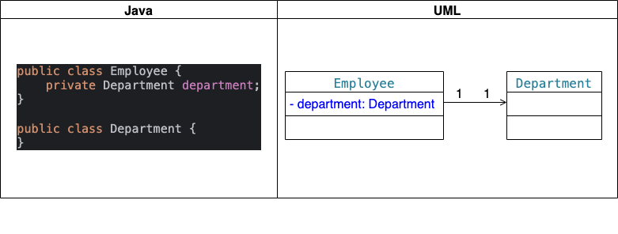
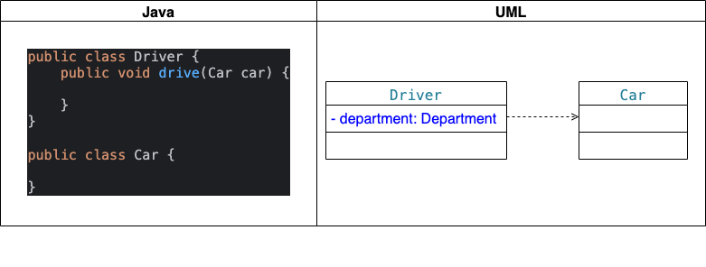
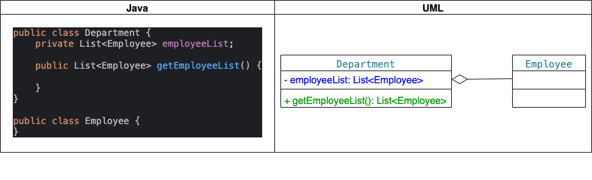
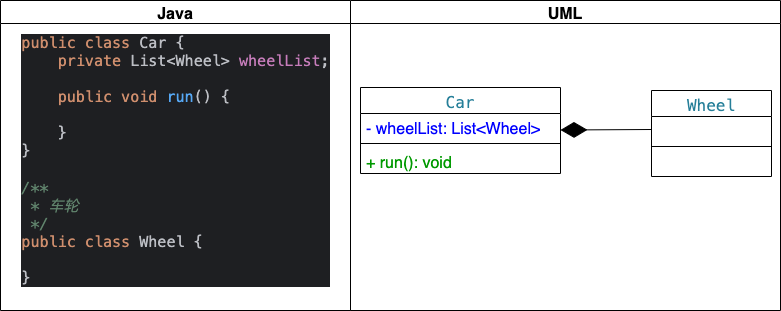

## 1. 概述
UML（Unified Modeling Language，统一建模语言）类图是面向对象建模的重要工具，类图中最基本的元素是类、接口，它是用于显示系统中的类、接口以及它们之间的静态结构和关系的一种静态模型。类图通过展示类、接口及其之间的关系，帮助开发者理解和设计系统。本文将详细介绍类图中的各个元素及其线条和图像。


## 2. 类图种类
在UML中，类使用带有分隔线的矩形表示，它包含名称部分(Name)、属性部分(Attribute)和操作部分(Operation)。

属性表现形式: [可见性] 属性名:类型 [=默认值]。
操作表现形式: [可见性] 名称(参数:参数类型...) : 返回类型。

### 2.1 UML类图表示具体类
具体类在类图中用矩形框表示，矩形框分为三层：第一层是类名字。第二层是类的成员变量；第三层是类的方法。成员变量以及方法前的访问修饰符用符号来表示：
+ `+` 表示 `public`
+ `-` 表示 `private`
+ `#` 表示 `protected`
+ `~` 表示 `default`
+ `_` 表示 `static`




### 2.2 UML类图表示抽象类
抽象类在UML类图中同样用矩形框表示，但是抽象类的类名以及抽象方法的名字都用斜体字表示。


### 2.3 UML类图表示接口
接口在类图中也是用矩形框表示，但是与类的表示法不同的是，接口在类图中的第一层顶端用构造型 `<<interface>>` 表示，下面是接口的名字，第二层是方法。



## 3. 类图表示关系
类和类、类和接口、接口和接口之间存在一定关系，UML类图中一般会有连线指明它们之间的关系。

关系共有六种类型:
+ 实现关系: 带空心的三角箭头的虚线来表示，箭头从实现类指向接口
+ 泛化关系: 带空心三角箭头的实线来表示，箭头由子类指向父类
+ 关联关系: 分为双向关联和单向关联，其中，双向关联可以用带两个箭头或者没有箭头的实线来表示，单向关联用带一个箭头的实线来表示，箭头从使用类指向被关联的类，还可以再关联线的两端标注角色名，补充说明它们的角色
+ 依赖关系: 使用带箭头的虚线表示，箭头从使用类指向被依赖的类
+ 聚合关系: 用带空心菱形的实线表示，菱形指向整体
+ 组合关系: 用带实心菱形的实线来表示，菱形指向整体
  

### 3.1 实现关系
实现关系是指接口及其实现类之间的关系, 表示一个class类实现interface接口（可以是多个）的功能。

在UML类图中，实现关系用空心三角和虚线组成的箭头来表示，从实现类指向接口。

在Java代码中，实现关系可以直接翻译为关键字 implements。



### 3.2 泛化关系
泛化关系(Generalization)表示类与类之间的继承关系，接口与接口之间的继承关系，或类对接口的实现关系。

在Java代码中，对象之间的泛化关系可以直接翻译为关键字 extends。

如果对象A和对象B之间的 `is a` 关系成立，那么二者之间就存在继承关系，对象B是父对象，对象A是子对象。

例如，一个经理(Manager) `is a` 员工(Employee)，很显然经理(Manager)对象和员工(Employee)对象之间存在继承关系，Employee对象是父对象，Manager对象是子对象。

在UML类图中，泛化关系用空心三角和实线组成的箭头表示，从子类指向父类，如下图所示:



### 3.3 关联关系
关联关系（Association）是指对象和对象之间的连接，它使一个对象知道另一个对象的属性和方法。

对于两个相对独立的对象，当一个对象的实例与另一个对象的一些特定实例存在固定的对应关系时，这两个对象之间为关联关系。

在Java中，关联关系的代码表现形式为一个对象含有另一个对象的引用。也就是说，如果一个对象的类代码中，包含有另一个对象的引用，那么这两个对象之间就是关联关系。

关联关系有单向关联和双向关联:
+ 如果两个对象都知道(即可以调用)对方的公共属性和操作，那么二者就是双向关联。
+ 如果只有一个对象知道(即可以调用)另一个对象的公共属性和操作，那么就是单向关联。

在UML图中，***双向关联**关系用***带双箭头的实线***或者***无箭头的实线***表示。***单向关联***用***一个带箭头的实线**表示，***箭头指向被关联的对象***，如下图所示。这就是导航性(Navigatity)。



一个对象可以持有其它对象的数组或者集合。在UML中，通过放置多重性（multipicity）表达式在关联线的末端来表示。多重性表达式可以是一个数字、一段范围或者是它们的组合。多重性允许的表达式示例如下：

+ 数字：精确的数量
+ *或者0..*：表示0到多个
+ 0..1：表示0或者1个，在Java中经常用一个空引用来实现
+ 1..*：表示1到多个

***关联关系又分为依赖关联、聚合关联和组合关联三种类型***

### 3.4 依赖关系
依赖（Dependency）关系是一种弱关联关系。如果对象A用到对象B，但是和B的关系不是太明显的时候，就可以把这种关系看作是依赖关系。如果对象A依赖于对象B，则 A `use a` B。比如驾驶员和汽车的关系，驾驶员使用汽车，二者之间就是依赖关系。

在UML类图中，依赖关系用一个带虚线的箭头表示，由使用方指向被使用方，表示使用方对象持有被使用方对象的引用。



#### 3.4.1 代码表现形式
依赖关系在Java中的具体代码表现形式:
1. B为A的构造器或方法中的局部变量
2. 方法或构造器的参数
3. 方法的返回值
4. A调用B的静态方法

下面我们用代码清单1和代码清单2所示的Java代码来演示对象和对象之间的依赖关系。

以下代码Supplier(供应方)定义了一个成员变量 field，一个普通方法 normalMethod() 和一个静态方法 staticMethod()。

```java
//供应方
public class Supplier {
    //成员变量
    public String field;   

    public void normalMethod() {
        System.println("调用Supplier的方法normalMethod");
    }

    //静态方法
    public static void staticMethod() {                 
        System.out.println("调用Supplier的静态方法staticMethod");
    }
}
```

以下代码Client(使用者)类依赖于Supplier(供应方)类，在Client类中定义了四个方法，分别演示四种依赖形式。

```java
/*
Client依赖于Supplier
*/
public class Client {

    //A依赖于B的第一种表现形式: B为A的局部变量
    public void localVariable() {
        Supplier supplier = new Supplier();
        supplier.normalMethod();
    }

    //A依赖于B的第二种表现形式: 调用B的静态方法
    public void callStaticMethod() {
        Supplier.staticMethod();
    }

    //A依赖于B的第三种表现形式: B作为A的方法参数
    public void arguments(Supplier supplier)  {
        String field = supplier.field;
    }

    //A依赖于B的第四种表现形式: B作为A的方法的返回值
    public Supplier returnValue() {
        return new Supplier();
    }
}
```

### 3.5 聚合关系
聚合(Aggregation)是关联关系的一种特例，它体现的是整体与部分的拥有关系，即 `has a` 的关系。

聚合(Aggregation)关系中整体与部分之间是可分离的，它们可以具有各自的生命周期，部分可以属于多个整体对象，也可以为多个整体对象共享，所以聚合关系也常称为共享关系。例如，公司部门与员工的关系，一个员工可以属于多个部门，一个部门撤消了，员工可以转到其它部门。

在UML图中，聚合关系用空心菱形加实线箭头表示，空心菱形在整体一方，箭头指向部分一方，如下图所示:


### 3.6 组合关系
组合(Composition)也是关联关系的一种特例，它同样体现整体与部分间的包含关系，即 `contains a` 的关系。

组合(Composition)关系中整体与部分是不可分的，部分也不能给其它整体共享，作为整体的对象负责部分的对象的生命周期。这种关系比聚合更强，也称为强聚合。如果A组合B，则A需要知道B的生存周期，即可能A负责生成或者释放B，或者A通过某种途径知道B的生成和释放。

例如，人包含头、躯干、四肢，它们的生命周期一致。当人出生时，头、躯干、四肢同时诞生。当人死亡时，作为人体组成部分的头、躯干、四肢同时死亡。

在UML图中，组合关系用实心菱形加实线箭头表示，实心菱形在整体一方，箭头指向部分一方，如下图所示:


在Java代码形式上，聚合和组合关系中的部分对象是整体对象的一个成员变量。但是，在实际应用开发时，两个对象之间的关系到底是聚合还是组合，有时候很难区别。

在Java中，仅从类代码本身是区分不了聚合和组合的。如果一定要区分，那么如果在删除整体对象的时候，必须删掉部分对象，那么就是组合关系，否则可能就是聚合关系。

从业务角度上来看，如果作为整体的对象必须要部分对象的参与，才能完成自己的职责，那么二者之间就是组合关系，否则就是聚合关系。

例如，汽车与轮胎，汽车作为整体，轮胎作为部分。

如果用在二手车销售业务环境下，二者之间就是聚合关系。因为轮胎作为汽车的一个组成部分，它和汽车可以分别生产以后装配起来使用，但汽车可以换新轮胎，轮胎也可以卸下来给其它汽车使用。

如果用在驾驶系统业务环境上，汽车如果没有轮胎，就无法完成行驶任务，二者之间就是一个组合关系。

再比如网上书店业务中的订单和订单项之间的关系，如果订单没有订单项，也就无法完成订单的业务，所以二者之间是组合关系。

而购物车和商品之间的关系，因为商品的生命周期并不被购物车控制，商品可以被多个购物车共享，因此，二者之间是聚合关系。

